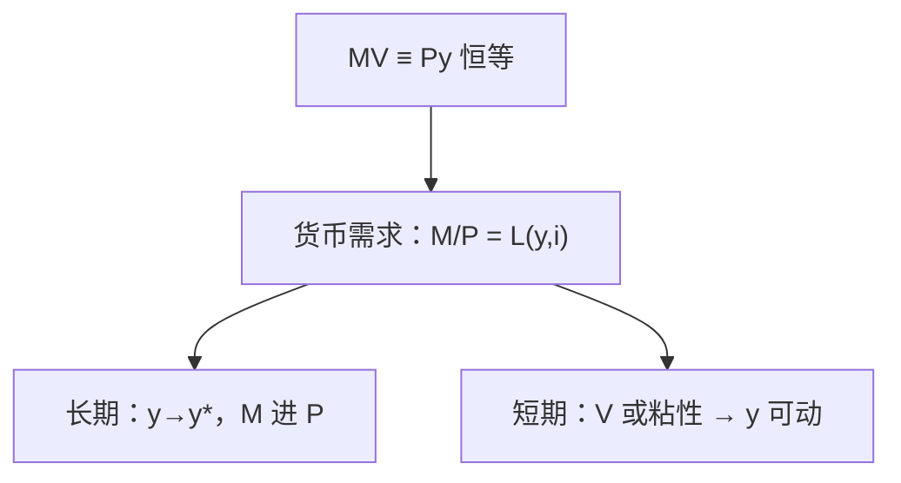

# 数量方程与货币中性

数量方程先是交易的会计：货币存量乘周转次数，对着名义支出；把它读成「货币决定物价」，已经加入了速度与产出的行为假设。

<footer>—— Fisher, The Purchasing Power of Money；Friedman, The Quantity Theory of Money: A Restatement, 1956</footer>

[上一课](/econ/money-as-medium)把 $M$ 钉成支付层次，而不是财富清单。本课的缺口是：$M$ 与已经缩减过的 $y$、价格指数 $P$ 如何写成一句话，以及这句话在什么条件下变成**长期中性**。Friedman 的重述把数量方程从恒等推进到货币需求；自然率课已经说过 $u^*$ 不受名义水平支配，本课把同一逻辑写到 $P$ 上。铸币税是下一课对「谁从 $M$ 增长里抽税」的缺口。

## 问题

交易需要支付。若每笔支出都用货币结清，可以写

$$
MV \equiv Py,
$$

$V$ 为流通速度，$y$ 为实际交易或实际产出（口径必须声明）。等号在定义 $V=Py/M$ 时是恒等。理论从恒等变成数量**论**，当且仅当再假设：$V$ 由支付习惯与利率稳定地决定，$y$ 在充分就业路径上由实物因素决定。那时 $M$ 的永久增加主要抬 $P$。

Friedman（1956）把这改写成货币需求：实际余额 $M/P$ 是 $y$ 与机会成本（名义利率）的函数。中性说的是：$M$ 的水平不改变稳态的相对价格与 $y^*$；它不否认过渡期 $y$ 会动。Lucas 后来把预期写进这条短期缺口。

古典二分：名义变量定绝对价格，实物变量定 $y$ 与相对价格。超中性更强：连 $M$ 的**增长率**也不影响实物稳态。有限现金、通胀税会打破超中性，那是铸币税课。

## 方法

会计形式先写开。$P$ 用[平减或 CPI](/econ/price-index-real)，$y$ 用实际产出或交易量。$V$ 随支付技术上升（更快的清算），也随名义利率上升（持币机会成本高则少持、周转加快）。Friedman 的需求函数把 $V$ 的稳定写成经验命题，不是恒真。

长期：在 $u^*$、$y^*$ 上，$M$ 的一次水平平移使 $P$ 同比例平移，名义利率的费雪成分 $\mathrm{i}\approx r+\pi^e$ 里，$r$ 由实物与时间偏好决定。短期：$V$ 或价格粘性使 $M$ 变动先打到 $y$，这是后课 IS–LM 与新凯恩斯的入口，本课只划界。

货币存量规则（Friedman 的 $k$%）是把中性当成政策纪律：不要用 $M$ 去钉住失业。规则是否时间一致，是更后的课。

### 中性不是「货币无用」

中性否定的是用名义工具永久改变 $y^*$。支付系统仍能改变 $V$ 与福利（持币成本）。汇率与开放在蒙代尔课才出现；本课封闭。也不要把数量方程写成加密资产的恒真预言：$M$ 的口径一变，$V$ 就吸收误差。

## 机制

若价格完全灵活、预期正确、市场出清，多出来的 $M$ 只是更高的单位价格：相对价格和配置回到原实物均衡。这是与[瓦尔拉斯](/econ/walrasian-equilibrium)同一逻辑的名义加层。若有人暂时误读一般物价为相对价格变动，就业可以偏离 $u^*$——Friedman（1968）与 Lucas 的岛屿模型走的就是这条预期缺口，细节在菲利普斯课。

速度崩溃（持币骤增）时，同样的 $M$ 对不上原来的 $Py$：名义支出掉下来。这是恒等仍成立、数量论的稳定 $V$ 暂时失效。后课零下限会再遇到「想持有货币而利率无法再降」。

$i$ 是持币的机会成本：$i$ 升则 $L$ 降、$V$ 升。把 $V$ 当技术常数，会在利率大幅变动时误读 $M$ 与 $P$。层次选错会把替代当成「数量论失败」——回到上一课声明 $M$ 是哪一层。

超中性：改变 $M$ 的增长率也不影响实际变量。通胀税会改变实际余额与资本积累，超中性往往失败。本课钉中性，超中性留给铸币税。

## 边界

数量方程不是通胀的唯一理论：相对价格冲击、间接税、汇率转嫁都会动 $P$。本课主张的是长期里持续的通胀要有 $M$ 增长配合，不是每一季的 CPI 都能从 $M2$ 读出。也不要把公司现金管理写成宏观 $V$。外汇 CIP 在[量化栏](/quant/irp)，不是 $MV=Py$ 的开放版。

后课默认：谈通胀趋势时，$M$ 与 $P$ 同方向；谈 $y^*$ 时货币水平中性。下一课问政府能否靠印钞征税。

## 小结

- $MV=Py$ 先是定义 $V$ 的会计；数量论加上 $V$、$y$ 的行为。
- 长期中性：$M$ 定 $P$，不定 $y^*$。
- 超中性可被通胀税打破。
- $V$ 随 $i$ 与支付技术而变，不是自然常数。
- 短期非中性留给粘性与预期。
- 出处：Fisher《货币的购买力》；Friedman 1956 重述；中性与自然率见 Friedman, AER 1968。
