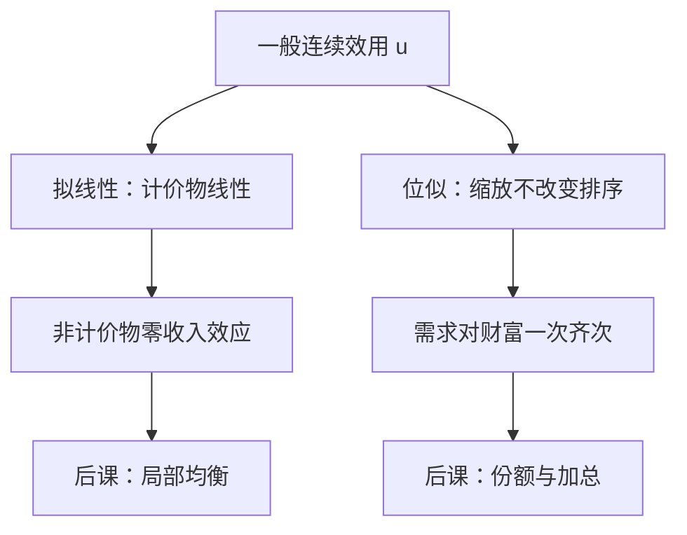

# 拟线性与位似

一般效用的需求既不必对财富一次齐次，也不必把收入效应赶到一种商品上。拟线性与位似是后课为了算得动才加的结构。

<footer>—— 据 Varian, Microeconomic Analysis；Mas-Colell, Whinston and Green, Microeconomic Theory 第 3 章整理</footer>

上一课[效用函数何时存在](/econ/utility-representation)给出了连续表示 $u$：序数、不唯一、没有基数含义。本课不重讲 Debreu 条件，也不把闭优集再写一遍。缺口是：一般 $u$ 的需求没有齐次，也没有零收入效应。后课局部均衡、份额语言、斯勒茨基里「收入项与 $x$ 成比例」，都要额外形状。拟线性与位似是加在 $u$ 上的结构，不是表示定理的推论。

## 问题

有了 $u$，就可以写 $\arg\max u$。不写预算也能看出：一般的 $u$ 对缩放没有意见，$u(tx)$ 与 $u(x)$ 的排序不必一致；对财富的导数，各种商品都可以带着收入效应。后课若直接假定「需求与收入成正比」或「涨工资只影响计价物」，那是偷运了本课才出场的公理。

拟线性：$u(x_0,x)=x_0+\varphi(x)$，计价物 $x_0$ 进入时线性。位似：$x\succsim y$ 当且仅当 $tx\succsim ty$ 对一切 $t>0$；表示可取成一次齐次函数（再作严格递增变换）。二者都比「连续理性」窄得多。本课的任务是钉死它们各买来哪一条需求性质，而不是再证一遍 $u$ 存在。

### 结构是刀，不是默认

教科书爱用 Cobb–Douglas、拟线性，因为算得开。那是表示的特例。一般消费者理论不默认它们；后课局部均衡用拟线性，是刻意把收入效应关掉，不是世界如此。

Cobb–Douglas 同时位似（份额恒定）且对数可加，但不是拟线性。三种形状不要混成「同一条效用」。

## 方法

拟线性且计价物内点时，非计价物的一阶条件是 $\nabla\varphi(x)=p$（计价物价为 $1$），与财富无关。马歇尔需求在这些坐标上收入效应为零，希克斯需求与马歇尔需求重合。财富全由 $x_0$ 吸收；若财富太低，角点把线性结构咬断，零收入效应只在计价物仍为正时成立。

位似使收入扩张路径是从原点出发的射线：$x(p,w)=w\,x(p,1)$（需求对 $w$ 一次齐次）。支出份额只依赖价格。斯勒茨基收入项与 $x$ 成比例，马歇尔交叉弹性更好认。它不消灭收入效应，只强迫所有商品的收入弹性相同（均为一）。

Gorman 型、拟位似是更宽的加总条件，本课不展开。只要记住：拟线性给局部均衡一把刀，位似给宏观份额一把刀，一般 $u$ 两把都没有。也不要把齐次效用函数与位似偏好写成同一句话：位似允许严格递增变换，变换后的 $u$ 不必仍齐次；需求跟的是偏好，不是某一个齐次代表。上一课已经强调序数性，本课不退回基数。

## 机制

拟线性把「钱的边际效用」钉成常数（计价物内点）。福利变化可以直接用消费者剩余积分，因为收入效应不污染非计价物的需求曲线。这是后课税收、局部均衡常用的借口；一般均衡里每人一种拟线性、同一计价物，才能把部分均衡嵌进去。计价物一旦触到零，这条刀断：财富太低时非计价物也会出现收入效应，角点把线性结构咬掉。

位似把无差异图做成可缩放的一层层。相对价格决定结构，财富只决定规模。加总时若每人同位似且相同，市场需求仍像一个消费者。偏好不同或非位似，Gorman 条件失败，市场需求不必满足个人需求的性质。

拟线性一般不正位似：收入全进计价物，扩张路径平行于计价物轴，不是过原点的射线。

## 边界

两种结构都脆。拟线性在计价物角点失效，也排除对计价物的收入敏感——「钱本身也是普通商品」时不能用。位似排除恩格尔曲线弯曲：奢侈品与必需品的分野需要非位似。经验上份额随收入变，主干仍保留一般 $u$，只在算例里才切到这两刀。

CES、Cobb–Douglas 都在位似族里；Stone–Geary 是平移后的位似（拟位似），恩格尔曲线仿射但不过原点。拟线性与位似几乎不相交：一条扩张平行于计价物轴，一条过原点。后课见到 CES 先问是不是位似，见到 $x_0+\varphi(x)$ 再问计价物有没有触角点。

后课默认：见到拟线性，就把收入效应赶到计价物；见到位似，就把 $x(p,w)$ 写成 $w$ 乘一条只依赖 $p$ 的射线。一般情形两件事都不做。

## 小结

- 连续 $u$ 不蕴含零收入效应，也不蕴含对财富齐次。
- 拟线性：非计价物的马歇尔需求与财富无关（计价物内点）。
- 位似：需求对 $w$ 一次齐次，份额只靠价格。
- 二者是后课加的刀，不是表示定理的内容。
- 出处：Varian, *Microeconomic Analysis*；Mas-Colell, Whinston and Green 第 3 章。
