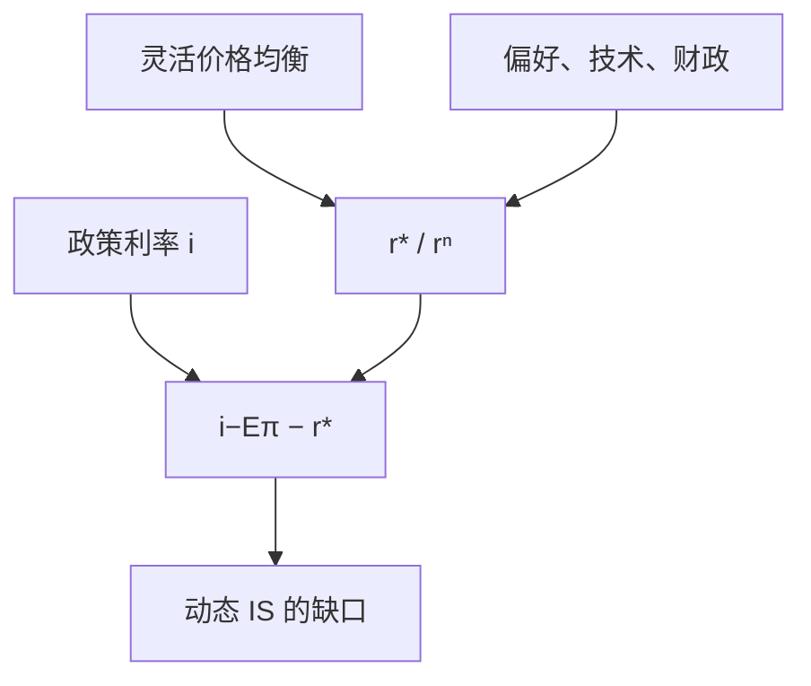

# 自然利率 r*

自然利率是灵活价格下使储蓄与投资一致、物价既不加速也不减速的实际利率；政策利率相对它的位置，才是松紧。

<footer>—— Wicksell, Geldzins und Güterpreise, 1898；Woodford 把同一对象写成新凯恩斯的 $r^n$</footer>

[上一课](/econ/lucas-critique)禁止用旧简化式模拟新政。要写一条利率规则，必须先有一个**不随名义规则漂移的**实际基准：灵活价格均衡的实际利率。本课的缺口是把这个对象叫 $r^*$（或 Woodford 的 $r^n$），并声明它可被真实冲击移动。泰勒规则是下一课才把 $i$ 写成对 $\pi$ 与缺口的反馈。

## 问题

动态 IS 已经把需求写成 $i-\mathbb{E}\pi$ 对 $r^n$ 的差。若把 $r^n$ 当常数，任何 $i$ 的下降都像宽松。Wicksell 的缺口是：信贷利率低于自然利率时，物价累积上升；高于则下降。自然利率由实物侧的储蓄、投资、生产率决定，不是央行印出来的。卢卡斯批判在此具体化：用旧样本估一个「中性基金利率」再拿去模拟新政，等于把当时增长、偏好与规则压缩进一个数字。

没有这个对象，泰勒规则的截距没有结构含义，NKPC 上的缺口也没有对照。本课结束周期课序里「自然率」这一侧：灵活价格均衡的实际利率。测量对照只点 Laubach–Williams 一句——滤波不是定义。

教学上 $r^*$ 可当慢变常数。结构上它随趋势增长、人口、财政、风险溢价而变。Laubach 与 Williams 的滤波是测量对照，不是定义：定义仍是灵活价格均衡实际利率。

## 方法

在已经学过的装置里，$r^*$ 是把 $\theta\to 0$（或 Calvo 频率无限）后，欧拉与资源约束解出的实际利率路径。稳态附近它近似 $\rho+g/\sigma$ 一类：时间偏好加消费增长。周期上，正的政府购买或正的偏好冲击会暂时抬高 $r^n$，技术冲击的符号取决于收入与替代。政策要稳定 $\tilde{y}$，必须让 $i-\mathbb{E}\pi$ 跟踪 $r^n$，而不是跟踪某个历史均值。

Wicksell 原著是累积过程，没有 Calvo。Woodford 的翻译是：利率主义不需要外生 $M$，但需要一个自然利率作为参照。数量论仍描述长期 $P$；短松紧是实际利率相对 $r^*$。

### 不可观测不是不可定义

$r^*$ 与自然产出一样不能直接读出。这不把对象取消，只要求：规则与估计必须声明结构。把基金利率的 HP 滤波当 $r^*$，会把政策自己的历史写进「自然」。批判再次适用。

## 机制

$i-\mathbb{E}\pi\lt r^*$ 时，动态 IS 给出正缺口，NKPC 上 $\pi$ 升；反向为紧。长期中性：$\tilde{y}=0$，$i=\pi^*+r^*$。铸币税与 $\pi^*$ 的选择改变名义锚，不永久改变 $r^*$——除非通胀税扭曲了资本积累，那是超中性，要单独声明。

真实冲击移动 $r^*$ 时，「按兵不动」的名义利率已经是政策变化。这正是规则必须写成对状态的反应、而不是钉死 $i$ 的原因。RBC 对照里全部周期都是 $r^*$ 与自然产出在动；NK 则还允许 $i-\mathbb{E}\pi$ 偏离 $r^*$。泰勒规则把 $r^*$ 当截距：截距估错，整条反应看起来永远偏松或偏紧，批判针对的就是把截距当不变结构。

开放经济下世界 $r^*$ 与本国 $r^*$ 可以分开，资本流动把二者往一起拉。本课封闭。CIP 与套息不是 $r^*$ 的定义，见 `/quant/irp`。

## 边界

本课不估计 HLW 曲线，不把自然利率写成金融条件指数。也不把 $r^*$ 等同于黄金律资本的边际产出：后者是稳态计划者对象，前者是每个时点的灵活价格均衡利率，可以含风险与各种冲击。量化栏没有宏观 $r^*$。期限溢价、CIP 基差是资产价格，不是灵活价格均衡的 $r^n$；需要时链到 `/quant/irp`。

Wicksell 的累积过程没有 Calvo，也没有泰勒原理。本课用它当定义来源，机制已经换成欧拉 + 灵活价格出清。测量文献把 $r^*$ 滤成慢变趋势，是对照，不是把定义改成滤波。泰勒规则下一课才把 $r^*$ 当截距写进反馈；本课结束的是周期课序里这个对象本身。

后课默认：谈松紧，先说 $i-\mathbb{E}\pi$ 相对 $r^*$。下一课把政策写成对通胀与缺口的反应函数，并以 $r^*$ 当截距。

## 小结

- $r^*$ 是灵活价格均衡实际利率，Wicksell 的自然利率。
- 政策松紧是 $i-\mathbb{E}\pi-r^*$，不是 $i$ 的绝对水平。
- $r^*$ 随真实冲击而动；当常数是教学。
- 用旧样本估中性利率去模拟新政，再犯卢卡斯批判。
- 黄金律资本的边际产出不是同一个对象。
- 出处：Wicksell 1898；Woodford 的 $r^n$；Laubach–Williams 仅作测量对照。
