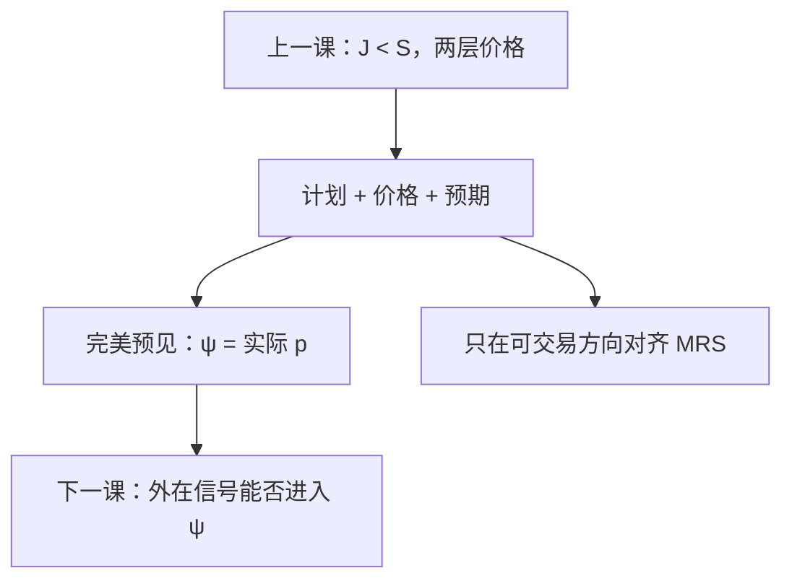

# Radner 均衡

市场按日期与事件依次开；每人选一份或有计划，并对未到市场的价格有预期；均衡要求计划最优、现货出清，且预期被实现。

<footer>—— Radner, Existence of Equilibrium of Plans, Prices, and Price Expectations in a Sequence of Markets, Econometrica, 1972</footer>

[上一课](/econ/incomplete-markets-gei)（不完全市场 GEI）。把两期、张成不足写成资产列与现货两层价格，并指出均衡不必帕累托、名义资产可不定。本课不重写 $\mathrm{span}(A)$ 与约束无效。缺口是把那套对象收成 Radner 的原定义：序贯市场里的**计划、价格与价格预期**。GEI 是这个语言在有限树上的特化；太阳黑子下一课要动的，正是预期那一项。

## 问题

Arrow–Debreu：0 期把所有日期–状态商品一次卖完。Radner：每个日期–事件开现货（及有限几种证券），不能把未来商品在今天一次交割完。行为人 $i$ 的对象是计划 $\sigma^i$：在每个信息集上准备买什么、持有什么资产；以及预期函数 $\psi^i$，把未到节点上的价格猜出来。最优：给定 $\psi^i$ 与当前价格，计划在序贯预算下最大效用。均衡：每个节点现货与证券出清，并且 $\psi^i$ 等于实际将实现的价格（完美预见）。缺口不是再定义一次 GEI 预算，而是：**缺列时，对齐的是计划的可交易方向上的 MRS，不是所有状态的 Arrow 价格。**

完全市场可以在树上复现 Arrow–Debreu 配置（动态完备）。不完全时，计划无法对缺的方向保险，第一定理失败——上一课已经得到，本课把「计划」两个字钉进均衡名称。

### 预期是均衡的一部分

瓦尔拉斯 $p^*$ 是数字。Radner 的 $p$ 是定义在整棵事件树上的价格过程，每人的 $\psi^i$ 必须与它重合。错误预期可以让计划事后后悔，那就不是这个均衡概念。太阳黑子把与基本面无关的信号写进 $\psi$，下一课才问这种 $\psi$ 能否自洽。

Radner 1972 的存在性比 Arrow–Debreu 脆：卖空无界、收益矩阵掉秩，要对计划截断。上一课已说存在不是 GEI 的主干目标；本课只认：均衡对象里必须有预期。

## 方法

事件树 $t=0,\ldots,T$，节点上开现货与 $J$ 种资产。预算按节点写：现货支出等于禀赋加资产收益。计划是每个节点上的需求与持仓。完美预见均衡是一组价格过程、一组计划，使出清与最优同时成立。资产张成随节点变（实资产收益可依赖当时现货价），内生张成上一课已作边界。

与 Negishi 的关系：完全市场上可用加权规划一次解出 Arrow 配置，再分权到序贯交易。不完全时没有单一无约束帕累托规划对应所有 Radner 均衡，约束有效的加权问题一般也对不齐——上一课的金钱外部性。存在性要对卖空截断，本课不把截断当主干。

每个节点仍是瓦尔拉斯式价格接受：给定该节点的 $p$ 与预期，选计划，市场出清。

## 机制

序贯预算的机制是：钱不能跨缺的市场搬运，除非持有一种在该节点有收益的资产。MRS 只在资产列张成的方向上被同一状态价格对齐；正交方向上各人可以留下不同的状态间边际。完美预见的机制是：若 $\psi$ 与实际 $p$ 不同，有人会在能交易的方向上改计划，出清失败。故均衡把预期钉死，不是附加的理性假设口号。

与 Arrow–Debreu 的对照：一次开市把所有预算收成一条；Radner 把同一条预算拆到树上，信息与可交易性决定能拆多细。动态完备时两套均衡配置重合；否则 Radner 配置落在更小的可行集里。

两期教具：0 期只买证券，1 期各 $s$ 开现货。计划是 $(\phi,x_0,(x_s))$，预期是对 $(p_s)$ 的猜。完美预见要求猜中的 $p_s$ 正好出清 $s$ 的现货。这就是上一课 GEI 的对象；Radner 的贡献是把「预期」写进均衡定义，而不是当成外生参数。

「计划」包括或有：若到了节点 $\xi$ 则买 $x(\xi)$。这不是宏观的中央计划。每人自己的 $\sigma^i$ 是策略，价格预期是对他人行为加总的猜想。

## 边界

信息分割越粗，计划越不能细化，缺的保险方向越多。

学习、适应性预期不在本定义里：一旦 $\psi$ 可以系统偏离实现值，就要另做理性预期的放松。默认、破产、内生保证金改有效列。无限期要另做贴现与横截。下一课在缺保险的方向上放入太阳黑子：基本面不变，$\psi$ 仍可随外在信号变。

后课默认：Radner 均衡是序贯市场上的计划出清加完美预见；不完全时只在张成方向上对齐，配置相对完全市场一般无效。

本课不把计划写成中央计划。

## 小结

- 均衡对象是计划、树上的价格、以及被实现的价格预期。
- 完美预见把 $\psi$ 钉成实际过程；缺列则 MRS 不能全对齐。
- GEI 是这一框架的两期写法。
- 下一课：与基本面无关的信号能否进入这些预期。
- 出处：Radner, *Econometrica*, 1972。
