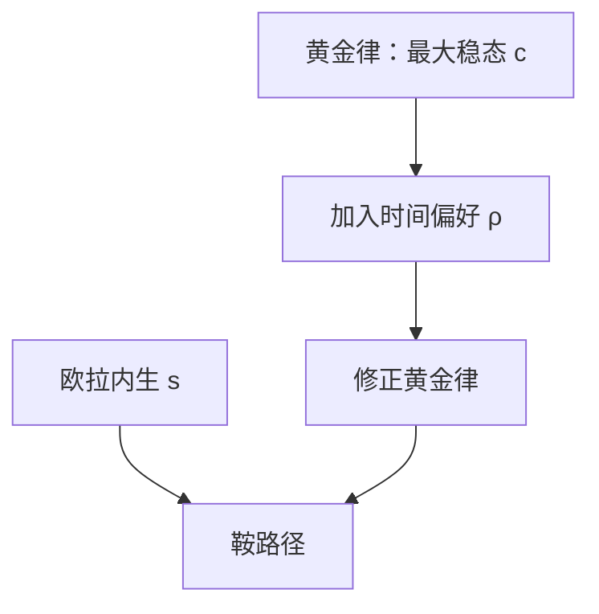

# Ramsey–Cass–Koopmans

一旦储蓄服从欧拉，稳态资本就停在修正黄金律：净边际产出对齐时间偏好，而不是对齐使消费最大的那条切线。

<footer>—— Ramsey, A Mathematical Theory of Saving, EJ 1928；Cass, RES 1965；Koopmans, 1965</footer>

[上一课](/econ/golden-rule)在外生 $s$ 下给出 $f'(k_{\mathrm{gold}})=n+g+\delta$，并指出 Ramsey 会用 $\rho$ 修正黄金律、无限寿命通常不会过度积累。本课的缺口就是把 $s$ 换成最优消费路径：内生储蓄如何决定过渡动态，以及修正黄金律与黄金律差在 $\rho$。叠代能否真正动态无效率，是下一课；本课先把无限寿命计划者（或完备市场的代表性家庭）写完。$g$ 仍然外生。

## 问题

黄金律最大化的是稳态 $c^*$，不最大化从当前 $k_0$ 出发的贴现效用。家庭若能在资本上跨期转移，就不会为了某一个 $s$ 把消费路径锁死。缺口不是再画索洛的 $sf(k)$ 与摊薄线，而是：欧拉与资源约束如何共同决定 $\dot{c}$ 与 $\dot{k}$，使 $s$ 成为结果而不是参数。

Ramsey（1928）提出最优储蓄；Cass 与 Koopmans（1965）把问题写成带人口与技术增长的现代形式。本课用这条 Ramsey–Cass–Koopmans（RCK）骨架。Hall 的随机欧拉是更后的消费课。

修正黄金律：$f'(k^*)=\rho+\theta g+\delta$（CRRA 的 $\theta$ 随写法而定）。$k^*<k_{\mathrm{gold}}$，因为没有耐心把消费全部留给稳态的陌生人——即便那些陌生人是未来的自己。

## 方法

资源约束与索洛相同：$\dot{k}=f(k)-c-(n+g+\delta)k$。偏好为贴现效用 $\int e^{-(\rho-n)t}u(c)\,dt$ 一类。一阶条件给出

$$
\frac{\dot{c}}{c}=\frac{1}{\theta}\bigl(f'(k)-\delta-\rho-\theta g\bigr).
$$

$\dot{c}=0$ 且 $\dot{k}=0$ 的交点即修正黄金律稳态。相位图上鞍路径唯一：从 $k_0$ 出发只有一条 $c(0)$ 收敛。$s=1-c/f(k)$ 沿路径变动，不再是常数。

政策：一次总付税不改欧拉，只改资源；资本税改净回报，从而改 $k^*$。本课不展开最优税制。过渡期提高耐心（降 $\rho$）会提高 $k^*$，增长率在过渡期加快，稳态人均增长仍等于外生 $g$——与索洛同一句，只是水平由 $\rho$ 而不由外生 $s$ 决定。

### 为何通常动态有效

在修正黄金律，$f'(k^*)-\delta=\rho+\theta g>n+g$ 在常见参数下成立，于是 $k^*<k_{\mathrm{gold}}$，不满足黄金律课的过度积累判据。无限寿命主体把未来消费内部化，不会自愿把回报压到低于增长所需。能够压过去的，是有限寿命且不关心后代的叠代。

## 机制

欧拉要求：推迟一单位消费，边际效用损失必须被净资本回报补偿。稳态时回报被钉在时间偏好（加增长修正）上，于是 $k$ 不能自由飘到黄金律另一侧。过渡期：$k<k^*$ 时回报高，$\dot{c}>0$，消费向上爬、资本积累；这是最优路径，不是外生 $s$ 的机械积分。

分散经济在完备市场、无扭曲时复制计划者。资本税、不完全年金会插入楔子，$k^*$ 再动。那些楔子仍通常把经济留在动态有效区；真正的无效率过度积累要等 Diamond。

与索洛的对照要写死：索洛的过渡动态由外生 $s$ 积分；RCK 的过渡动态是鞍路径上 $c$ 与 $k$ 联立。提高耐心或降低资本税，都会抬 $k^*$，过渡期增长加快，稳态 $g$ 不变。把过渡期增长率当成新的长期 $g$，是索洛课已经拒绝过的误读，在内生 $s$ 下同样成立。时间偏好 $\rho$ 不是「政策按钮」：它是偏好，政策最多改变净回报楔子。

Inada 与凹性保证鞍点。若 $f$ 是 AK，欧拉给出内生增长，修正黄金律变成对增长率的条件。那是内生增长课，本课保持递减报酬。

## 边界

RCK 不管失业、货币与异质代理人。代表性主体藏掉分配与约束家庭。公司资本结构不是这里的单一 $K$。也不要把欧拉里的 $r$ 写成限价簿利率。确定性模型没有风险溢价；随机增长留给资产定价与 RBC。

后课默认：谈到「最优增长」或内生 $s$，默认修正黄金律与鞍路径；黄金律只作对照。下一课放开无限寿命，看叠代能否停在动态无效率区。确定性模型没有风险；随机增长与 Hall 的消费检验是更后的课。外生 $g$ 仍然决定人均消费的长期增长率，与索洛同一句。

资本税改净回报从而改 $k^*$，一次总付税不改欧拉。

## 小结

- 黄金律选稳态 $c$；RCK 用欧拉选从 $k_0$ 出发的贴现效用。
- 储蓄内生；稳态在修正黄金律，$k$ 低于黄金律。
- 人均长期增长仍靠外生 $g$；$s$ 不再是永久增长引擎。
- 无限寿命通常动态有效；叠代是下一课的缺口。
- 出处：Ramsey, EJ 1928；Cass, RES 1965；Koopmans 1965。
