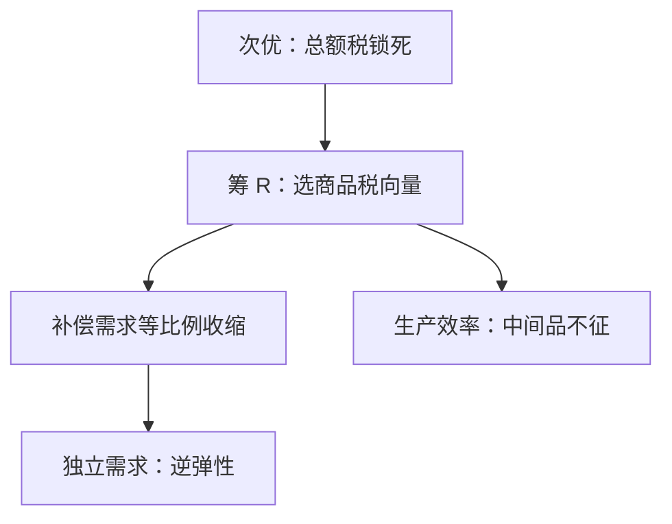

# 拉姆齐商品税

若不能对个人做一次总付，筹一笔收入的商品税应使各税基的需求按等比例收缩；可分需求下这就是逆弹性法则。

<footer>—— Ramsey, A Contribution to the Theory of Taxation, Economic Journal, 1927</footer>

[上一课](/econ/theory-of-second-best)证明：一条切条件锁死，其余第一最佳条件一般不再可欲，并点名 Ramsey 但不写公式。缺口是这个约束最优的解：计划者仍要筹收入 $R$，[总额税](/econ/welfare-theorems)不可用，只能在商品上钉楔子，楔子应如何分布？本课钉逆弹性法则，不重写次优的拉格朗日存在性。

## 问题

代表性消费者，生产线性（边际成本恒定），政府要 $\sum_i t_i x_i\ge R$，不能对人征 lump-sum。目标是消费者剩余（或间接效用）最大。Ramsey 的一阶条件说：在最优处，各商品的**补偿需求**应大致等比例下降。若需求相互独立，翻译成

$$
\frac{t_i}{1+t_i}\propto\frac{1}{\varepsilon_i},
$$

$\varepsilon_i$ 为需求弹性绝对值。无弹性的税基税率更高：同样收入，$\Delta q$ 更小，[无谓损失](/econ/deadweight-loss)的 $t^2$ 项更省。这不是「每个市场自己算自己的税」——交叉弹性在时，要用替代矩阵，上一课已经警告过。

### 逆弹性不是公平判断

必需品往往无弹性。逆弹性会加重对它们的税，恰恰可能伤穷人。Ramsey 原问题是代表性消费者的效率；Diamond 1975 加上异质与福利权重后，公式多一项分配特征。本课先钉效率特解，不把逆弹性读成规范口号。

Ramsey 原文用的是「无穷小税使各需求等比例减少」，不是先写 $1/\varepsilon$。独立需求时二者等价。有闲暇时，闲暇不能直接征税，Corlett–Hague 说：对与闲暇互补的商品多征，以间接税闲暇。

## 方法

对象：拟线性或代表性消费者、无纯利润（或利润被税尽）、商品税线性。规划：$\max v(q)$ s.t. $(q-p)\cdot x(q)\ge R$，其中 $q$ 是消费者价，$p$ 是生产者价。一阶条件给出 Ramsey 规则。Diamond–Mirrlees 1971：生产效率仍应保持，中间品不征——扭曲留给最终消费。

本课不把公式写成「每个市场的 Harberger 三角单独最小化」。三角之间通过替代相连，最优是约束下的一组相对楔子。

## 机制

为什么等比例收缩：公共资金的边际成本 $\lambda$ 进入每种商品的边际。最优时，多征一单位税造成的边际 DWL，应在各税基上对齐。独立需求下，DWL 的边际与 $t\varepsilon$ 成正比，对齐就得到逆弹性。交叉需求时，征 $i$ 会移动 $j$ 的税基，对齐必须在矩阵上做。

这与上一课的 $\mu\nabla g$ 是同一修正项：锁死的是「不能对人做总额税」，$g$ 是政府预算。庇古税遇上 Ramsey，最优税率不是单独的 $\mathrm{MD}$，还要叠筹款动机。公共品的萨缪尔森条件也要乘上公共资金边际成本，不能直接套第一最佳的 $\sum\mathrm{MRS}=\mathrm{MRT}$。

### 可分偏好可以取消商品税

Atkinson–Stiglitz：若非线性所得税可用，且商品与闲暇弱可分，最优商品税为零——再扭曲商品只叠加伤害。Ramsey 公式的舞台是「所得税工具不够」或「可分失败」。次优的政策清单随可用工具变，不是一张永恒的逆弹性表。

均匀从价税在劳动供给弹性进入后，等价于对工资征税，一般不是 Ramsey 最优。最优要相对价格结构，不是「所有税率相等」的口号。例外是需求的位似加可分。

## 边界

异质消费者、逃税、国际贸易（关税当 Ramsey 税）都会改公式。政治约束「某税率为零」本身是又一条 $g(x)$，应写进规划，而不是先算完再删。也不要把 Ramsey 写成宏观的资本所得税 Chamley–Judd；那是另一条最优税课序。

市场失灵课序的计划者工具到此：外部性有庇古，公共品有萨缪尔森加 Ramsey 融资。下一课问这个计划者的目标 $W$ 本身能否从个人序数偏好加总出来。

后课默认：不能一次总付时，商品税按 Ramsey 规则钉相对楔子；独立需求才写成逆弹性；生产效率另保。

## 小结

- 总额税不可用时，商品税应使补偿需求大致等比例收缩。
- 独立需求下即逆弹性：无弹性税基税率更高。
- 交叉弹性用替代矩阵，不是各市场各自为政。
- 可分加非线性所得税时，商品税可以多余。
- 出处：Ramsey, *Economic Journal*, 1927；Diamond and Mirrlees, *AER*, 1971；Corlett and Hague, *RES*, 1953。
