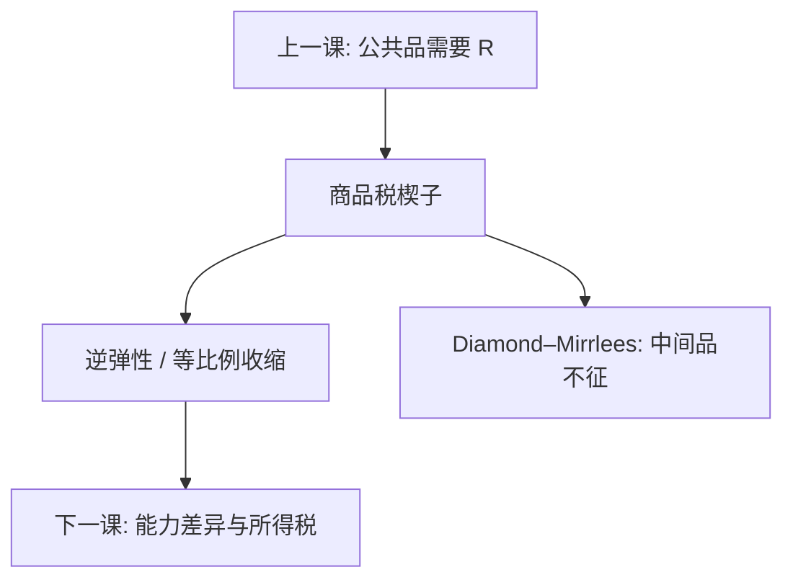

# 最优商品税 Ramsey

一次总付不可用时，筹固定收入的商品税应使补偿需求大致等比例收缩；独立需求下这就是逆弹性。效率公式不是对穷人征税的许可证。

<footer>—— Ramsey, A Contribution to the Theory of Taxation, Economic Journal 1927；Diamond and Mirrlees, AER 1971；对照 Atkinson and Stiglitz；主干课拉姆齐商品税</footer>

[上一课](/econ/public-goods-free-rider)给出必须用公共预算提供 $G$ 的理由。本课缺口是筹资楔子：总额税若不可用（能力不可观察、或政治约束），只能在商品上钉 $t$，如何分布损失最小。主干[拉姆齐商品税](/econ/ramsey-commodity-tax)已写逆弹性。公共财政续课把它接到：公共品的 $R$、生产效率（中间品不征）、以及下一课所得税为何还要另开一刀。

## 问题

代表性消费者，政府要 $\sum t_i x_i\ge R$。Ramsey：最优处各补偿需求下降比例相近；需求独立则 $t_i/(1+t_i)\propto 1/\varepsilon_i$。无弹性税基上税率更高，同样 $R$ 造成的产量收缩更小，无谓损失的二次项更省。缺口是把这句话从教科书特解收回财政：上一课的 $G$ 决定 $R$ 的一部分；Diamond–Mirrlees：生产应保持有效，扭曲留在最终消费，中间品不征——否则公共生产与私人生产的边界被税搞乱。

交叉弹性在时，不能逐市场套 $1/\varepsilon$。有闲暇且闲暇不能直接征税时，Corlett–Hague：对与闲暇互补的商品多征，等于间接税闲暇。

### 逆弹性不是公平命令

必需品往往无弹性。效率特解会加重对它们的税，伤害穷人。Ramsey 原问题是代表性消费者；Diamond 1975 加上异质与福利权重后，公式多一项分配特征。本课先钉效率，下一课用所得税处理能力差异。把逆弹性写成「所以应该对粮食重税」，是把次优公式读成规范口号。

Atkinson–Stiglitz：若有非线性所得税且偏好对商品弱可分，商品税可能多余。续课要记住：Ramsey 公式的前提是「只能征商品税」；工具集一变，公式就变。

## 方法

规划：$\max v(q)$ s.t. $(q-p)\cdot x(q)\ge R$。一阶条件给出 Ramsey 规则。公共品：把 $G$ 与 $R$ 联立，萨缪尔森条件在次优下要加扭曲的边际成本——提供 $G$ 的边际公共资金不再是 1。自然垄断的 Ramsey 定价（主干另一课）是同一数学、不同故事：那里是覆盖固定成本的价，这里是覆盖财政 $R$ 的税。

不要把关税当 Ramsey 商品税的应用就停：关税还有贸易条件与保护，对象是边境，不是同一套内部 $t$。

## 机制

机制是在不可观察的一次总付约束下，用弹性分配扭曲。无谓损失随税率二次上升，应把楔子放在「数量不太动」的基上。交叉项把商品连成系统，单独看 $\varepsilon_{ii}$ 会误导——与 IO 里不能只看自价格弹性是同一几何。生产效率：对中间品征税会在厂商之间造成不同的边际转换，像无故破坏第一最佳生产，Diamond–Mirrlees 把它排除。

边际公共资金：多抽一元 $R$ 的社会成本大于一元，因为扭曲。上一课的 $G$ 应提供到 $\sum\mathrm{MRS}=$ 被这个因子放大后的 MRT，而不是第一最佳的 $\sum\mathrm{MRS}=\mathrm{MRT}$。

Ramsey 1927 的原话是无穷小税使需求等比例减少。独立需求时才等于逆弹性口诀。写应用时先问交叉与闲暇。

## 边界

本课不把增值税税率表写成最优解，不重写次优定理的全部拉格朗日。所得税、非线性劳动楔子是下一课。量化栏没有「Ramsey 交易税」要在此对接。后课默认：筹 $R$ 的商品税按 Ramsey–Diamond–Mirrlees 语言来读；分配目标另用所得税或福利权重修正，不把逆弹性当公平。

## 小结

- 总额税不可用时，商品税按等比例收缩 / 逆弹性分配扭曲。
- 逆弹性是效率特解，不是对穷人征税的理由。
- Diamond–Mirrlees：保持生产效率，中间品不征。
- 公共品的次优萨缪尔森条件含边际公共资金。
- 出处：Ramsey 1927；Diamond and Mirrlees 1971；Atkinson and Stiglitz。
