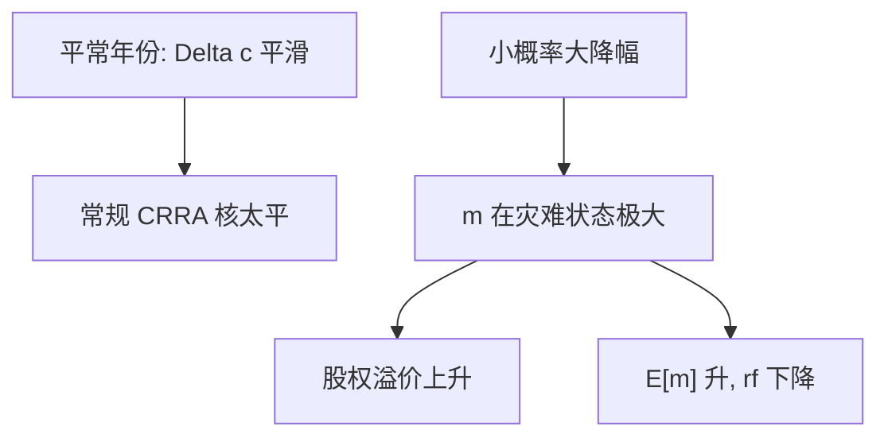

# 稀有灾难

样本里看不见的崩溃，仍可以进入定价核：很小的概率乘上消费的巨幅下降，足以抬高股权溢价，而不必把平常年份的 $\gamma$ 拧到两位数。

<footer>—— Rietz, The Equity Risk Premium: A Solution, Journal of Monetary Economics, 1988；Barro, Rare Disasters and Asset Markets in the Twentieth Century, Quarterly Journal of Economics, 2006</footer>

[上一课](/econ/long-run-risk)用持久增长新闻造续值波动。并列的第三条路是尾部：平常年份的 $\Delta c$ 仍平滑，但存在低概率的灾难状态。本课缺口是 Rietz 的提议与 Barro 的历史校准。不重做 Bansal–Yaron 的 $x_t$，不把灾难写成期权隐含面的交易策略。

## 问题

Mehra–Prescott 的马尔可夫消费取自和平时期的美国增长，几乎没有战争、瘟疫、政治崩溃那一档的下降。Rietz（1988）指出：若加入一个小概率、大降幅的状态，CRRA 核在该状态极高，$m$ 的均值与协方差可以同时抬溢价、并帮助 $r_f$。批评是：所要的崩溃是否大到离谱。Barro（2006）用二十世纪多国的真实灾难（战争、革命）重新定量：降幅与频率不必像讽刺漫画那么极端，也可以进入资产定价的量级。

缺口是把「样本低估了 $\sigma(m)$ 的尾」写成一种修补，而不是宣布股市永远便宜。习惯与长期风险改的是平常年份的 $m$；灾难改的是支撑的测度。

灾难是消费（或产出、股利）的大幅、持久或至少数年的下降，不是一日的股市回撤。用股价自己定义灾难，会把要解释的对象放进解释项。

## 方法

在消费过程上加一个跳跃或一个低频马尔可夫状态：以 $p$ 掉到 $1-\Delta$ 的消费水平。CRRA 下该状态的 $m$ 为 $\beta(1-\Delta)^{-\gamma}$，即使 $p$ 很小，$\mathrm{E}[m R^e]$ 也可以被这一项主导——股票在灾难里恰好大亏，国债相对好。Weil 的 $r_f$ 也会被 $\mathrm{E}[m]$ 拉低；是否同时舒服，仍取决于 $p$、$\Delta$、$\gamma$ 与是否允许违约。

本课不审 Barro 表格里的百分点。只要钉：两谜可以是**未观察到的状态**问题，而不只是偏好函数形式问题。EZ 与灾难可叠加（对尾部的态度由 $\gamma$ 管）；习惯可让灾难附近的 surplus 更糟。并列，不互吞。

### 样本选择不是抬杠

战后美国消费路径条件于「没有发生那些灾难」。用这条路径估 $\sigma(\Delta c)$，再要求 $\gamma\sigma(\Delta c)$ 匹配无条件溢价，是用条件矩去配无条件风险价格。Rietz–Barro 的逻辑是把无条件支撑补上。生存偏差、事前溢价是否等于事后均值，会改变量级，不取消这道逻辑。

## 机制

机制是跨状态的保险价格。股权是对总消费的要求权，灾难里赔钱，必须在平常年份提供溢价，作为持有该风险的补偿。国债若在灾难里相对兑现，其溢价低、价格高、收益率低。若主权债也会在同一灾难里违约，国债就不再是好的对冲，利率之谜的解变窄——Barro 后文讨论过这一点，本课标明边界即可。

HJ 仍成立：无条件 $\sigma(m)$ 可以很大，即使条件于和平样本的 $\sigma(\Delta c)$ 很小。有效市场分层不因此改写：灾难风险被定价，不是「市场无效所以买股票」。

Rietz, *JME* 1988；Barro, *QJE* 2006。不要发明 arXiv。灾难概率可以从期权或跨国频率来谈，那是测量，本课不把隐含面写成定理。

## 边界

不要把本课写成「所以应该永远满仓股票」——溢价是对灾难的补偿，实现路径可以很久没有灾难。也不要把尾部因子、低波异象在此排序。下一课回到 [消费 CAPM](/econ/ccapm) 的 beta 语言：修补链到此收束，Breeden 仍用消费当充分统计，实证薄弱换栏。

后课默认：稀有灾难可以在不抬平常 $\gamma$ 的情况下抬 $\sigma(m)$。习惯改参照，长期风险改谱，灾难改支撑；三者都是对时间可分和平样本 CRRA 的修补。

期权隐含灾难、跨境灾难保险的交易协议不进限价簿课。本栏停在 $m$ 的形状。

主权债若在同一灾难里违约，国债不再是好的对冲，$r_f$ 之谜不能靠 $\mathrm{E}[m]$ 单独关掉。股权与国债在尾部的相对表现，是这条修补的识别，不是「股票永远涨」。

## 小结

- Rietz：小概率消费崩溃可解股权溢价；Barro 用跨国历史把量级写回可讨论区。
- 和平样本的 $\sigma(\Delta c)$ 低估无条件 $\sigma(m)$ 的尾。
- 与习惯、长期风险并列，不互相替代，也不否证存在 $m$。
- 股权在灾难里赔钱才要求平常年份的溢价；「永远满仓」不是推论。
- 下一课消费 CAPM 把同一核写成 beta，截面弱斜率换栏。
- 用股价自己定义灾难，会把要解释的对象放进解释项。
- 国债若在同一灾难里违约，利率之谜的解变窄。
- 期权隐含面是测量，本课不把隐含灾难写成定理。
- 出处：Rietz, *JME* 1988；Barro, *QJE* 2006。
