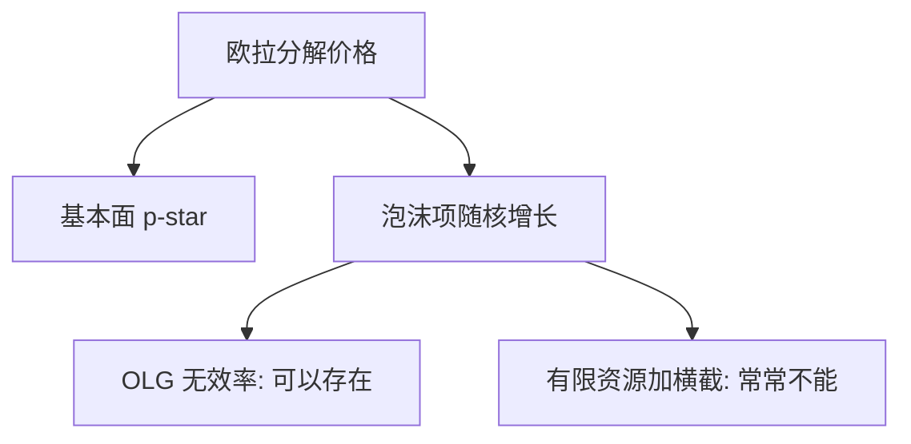

# 理性泡沫

价格可以等于基本面加上一项爆炸的期望项；每个人都知道它是泡沫，只要能在破裂前卖给下一个人，持有仍然理性。

<footer>—— Blanchard and Watson, 1982；Tirole, Asset Bubbles and Overlapping Generations, Econometrica 1985；Santos and Woodford, Econometrica 1997</footer>

[上一课](/econ/scheinkman-xiong)的泡沫靠分歧。本课缺口是共同信念：欧拉 $p_t=E_t[m_{t+1}(p_{t+1}+d_{t+1})]$ 的解可以含泡沫项 $B_t$，只要 $B_t=E_t[m_{t+1}B_{t+1}]$。不重写转售期权，不重推 [SDF](/econ/stochastic-discount-factor)。

## 问题

无泡沫解把价格写成贴现股息的和。齐次方程允许 $B_t$，期望按 $1/m$ 增长。Blanchard 与 Watson 的随机泡沫以正概率破裂。Tirole（1985）在 OLG 里给出存在条件：泡沫可以在动态无效率经济里改善配置，吸收过度储蓄。Santos 与 Woodford（1997）在有限代理人、有限资源下给出否定性结果：许多标准经济里泡沫无法存在。缺口是标明「理性、共同信念」这一支，对照行为泡沫，而不是重讲欧拉。

横截条件 $\lim E[m_{0,T}p_T]=0$ 关掉泡沫。无限期代表主体加非蓬齐通常施加这一条。OLG 没有代表主体的横截，门缝打开。

## 方法

从资产欧拉分解 $p=p^*+B$。讨论何时 $B\equiv 0$ 是唯一解：正净供给的资产在有效经济、债务约束、横截。何时可正：OLG 无效率、某些不完全市场。破裂风险把泡沫收益率抬高，补偿爆破。本课不估计哪一次历史是 $B$。

## 机制

机制是自我实现的期望。人愿意付 $B$ 是因为别人明天愿意付 $B/m$ 的期望。没有人被骗，也没有过度自信。换手不是必需品——与 SX 对照。配置上，泡沫作为金字塔资产与实物资本竞争：Tirole 的福利含义依赖经济是否已经过度积累。这与宏观 OLG 课衔接，不重写 Diamond 模型。

与套利限制：理性泡沫要求有人愿意在破裂风险下持有 $B$。无限资本的套利者若能卖空泡沫资产，会压 $B$。存在性因此对卖空与入场极敏感——Abreu–Brunnermeier 下一课把「何时卖空」变成同步问题。

横截条件把代表主体经济里的 $B$ 关掉；OLG 没有这条横截，动态无效率时泡沫可改善配置。Santos–Woodford 提醒：有限资源加债务约束，许多看起来能存在的 $B$ 其实不能。可检验性弱于 SX：理性泡沫不承诺高换手。本课不把「价格高」命名为 $B$。欧拉分解不重推 SDF，只引用已有核。

## 边界

可检验性弱：任何价格路径都可以被写成某种 $B$ 加上某种 $p^*$。本课不把「价格高」叫成理性泡沫。行为泡沫给出换手、分歧、盈余路径等额外符号，识别更富。也不把比特币写进正文。

后课默认：即使人人知道价格太高，同步失败仍能让泡沫继续——那是攻击时机，不是欧拉齐次项。

欧拉齐次项 $B$ 在共同信念下仍可能；人愿意付 $B$ 是因为别人明天愿意付。

横截关掉代表主体经济里的泡沫；OLG 无效率打开门。可检验性弱于换手–分歧故事。

可检验性弱于换手–分歧故事；存在性对卖空与横截极敏感。

## 小结

- 理性泡沫是欧拉齐次解，共同信念下仍可能。
- Tirole：OLG 无效率打开存在之门；Santos–Woodford 收紧。
- 与 SX 对照：不需要分歧与换手，但可检验性更弱。
- 破裂风险要求更高的持有收益。
- 「价格高」不能直接命名为 $B$。
- 出处：Blanchard and Watson 1982；Tirole, *Econometrica* 1985；Santos and Woodford, *Econometrica* 1997。
