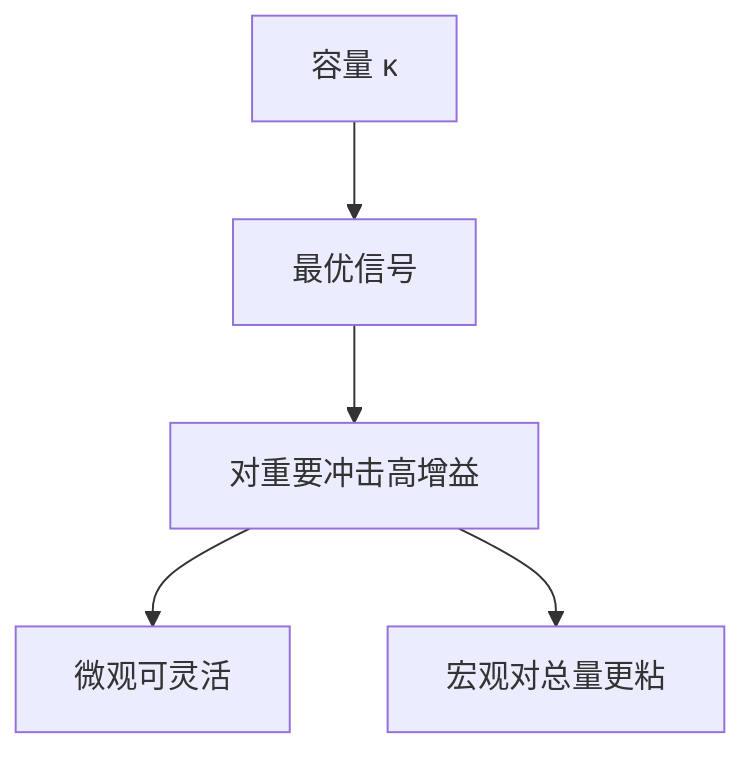

# 理性疏忽

注意力是有限信道；最优编码使人对重要、易变的变量反应更灵敏，对其余变量近乎不更新。

<footer>—— Sims, Implications of Rational Inattention, JME 2003；Maćkowiak and Wiederholt, Optimal Sticky Prices under Rational Inattention, AER 2009</footer>

[上一课](/econ/sticky-information)的 $\lambda$ 是外生更新率。本课缺口是**内生注意力**：Shannon 容量下的最优信号。不把 $\lambda$ 再估一遍，不写神经网络注意力层。

## 问题

Sims：人不是每期免费看见状态，而是选择一个关于状态的信号，互信息受容量约束。结果：对小的、不重要的冲击几乎不反应，对大的冲击反应；预测误差与宏观惯性内生。Maćkowiak–Wiederholt：企业把有限注意力在总需求与特异需求之间分配，加总价格对货币更粘、对特异更灵活——与微观价格频繁改动、宏观通胀惯性可并存。缺口是把粘性信息的外生 $\lambda$ 换成最优信道，而不是再写一次 vintage 加权。

Sims, *JME* 2003。Maćkowiak and Wiederholt, *AER* 2009。Woodford 的不完全信息定价。Caplin、Dean、Angeletos 等后续。Shannon 是常用的tractable 约束，不是唯一认知模型。

## 方法

代理人最大化效用减注意力成本（或受 $I(X;S)\le\kappa$）。高斯二次时线性信号最优，Kalman 增益由容量决定。宏观：容量 $\kappa$ 校准到调查误差或 IRF。政策：更嘈杂的政策规则浪费容量，透明规则节省注意力——接到沟通课。与 HANK：穷人可能把容量全用在流动性，不跟踪利率路径，直接欧拉通道更弱。

与学习：疏忽是每期最优压缩；学习是参数递推。与诊断性：疏忽是噪声，诊断性是偏误（后课）。

## 机制

机制是稀缺注意力的配置。价格系统若已充分统计，本可节省注意力（Hayek）；一旦价格嘈杂或策略互补强（美容竞赛），每人仍须浪费容量猜别人——Angeletos–La’O、Morris–Shin 的高阶信念接口。本课程不重写[美容竞赛](/econ/beauty-contest-higher-order)全文，只借用：疏忽加策略互补 ⇒ 更大惯性。

容量随激励变：高通胀时人更跟踪 CPI（经验上预期更「解锚」前的更新），这是后课锚定的微观基础之一。

本课不把信息论当宏观的第一性原理重讲。互信息是约束的方便写法。

## 边界

本课不定 $\kappa$ 的生理值。不把菜单成本与疏忽混成一个参数。资产定价里的疏忽（对新闻反应不足）可点名，不估计横截面。Transformer 与机器学习注意力禁止写入本栏。

后课默认：更新率可以是最优注意力配置的结果。下一课：偏差不是噪声，而是对新闻的过度反应——诊断性预期。

## 小结

- 理性疏忽：容量约束下的最优信号。
- 可同时解释微观灵活与宏观惯性。
- 与外生 $\lambda$、与学习、与认知偏差分列。
- 出处：Sims, *JME* 2003；Maćkowiak and Wiederholt, *AER* 2009。
