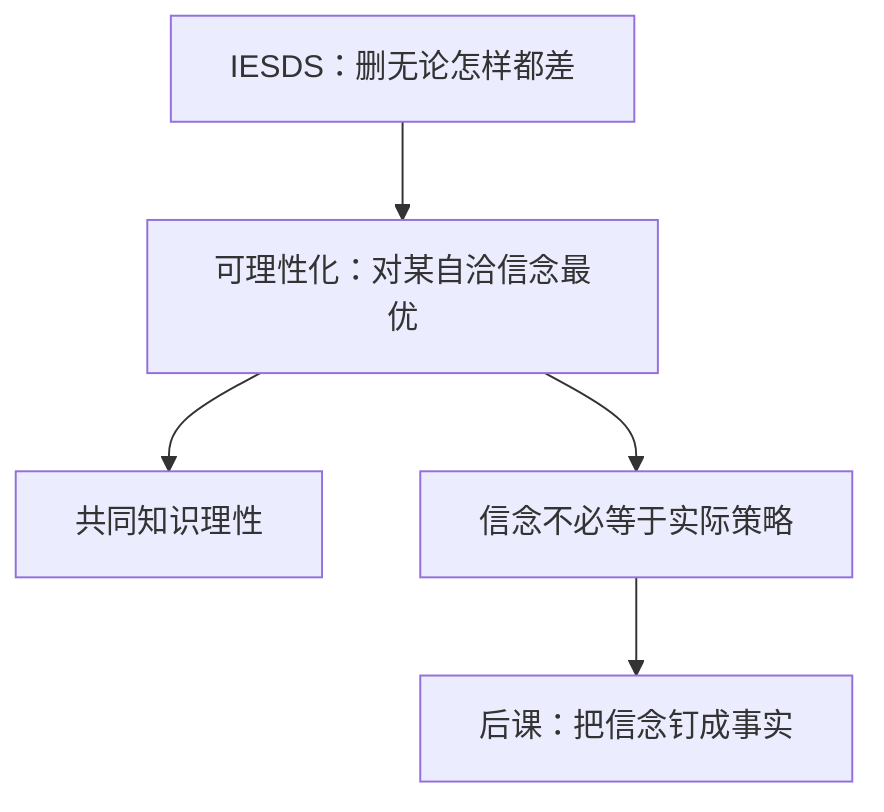

# 可理性化

共同知识理性所允许的，是那些对「别人也只使用可理性化策略」的某种信念而言的最优反应；它不必已经是相互正确的预期。

<footer>—— Bernheim, Rationalizable Strategic Behavior, Econometrica, 1984；Pearce, Econometrica, 1984</footer>

[上一课](/econ/dominance-iesds)用 IESDS 删掉「无论别人怎样都差」的招。缺口是正面刻画：若每人最优化，且这是共同知识，但不必已经猜中别人那一个点，还能玩哪些策略？Bernheim 与 Pearce 的可理性化回答这一问。相互最优反应仍不出场。

## 问题

信念 $\mu_i$ 是对 $s_{-i}$ 的概率。策略 $s_i$ 是对 $\mu_i$ 的最优反应，若它在支撑 $\mu_i$ 的那些 $s_{-i}$ 上不差于任何替代。可理性化集 $R=\prod_i R_i$ 是满足下列闭包的最大集合：每个 $s_i\in R_i$ 都是对某个支撑落在 $R_{-i}$ 上的信念的最优反应。也就是说，存在一个无限的「我以为你以为」链条，每层都在优化，从不走出 $R$。

两人有限博弈：可理性化 = 相对混合策略的 IESDS。$n$ 人：若允许对对手行动的**相关**猜想，仍与（混合）IESDS 基本重合；若强制独立猜想，集合更瘦。本课主钉允许相关猜想的 Bernheim–Pearce 版本。

### 共同知识理性不是已经猜中

猜硬币：两个纯策略都是对「对方出另一面」的最优反应，因而都可理性化；但双方同时猜中并互相最优，纯策略做不到。可理性化允许「我以为你出正面」，哪怕你其实在出反面——只要这个以为在链条上自洽。后课的纳什把「以为」钉成事实。

迭代算法：先删对任何信念都不是最优反应的策略（即被混合严格劣势），再在留下的集合上重复。两人情形与上一课 IESDS 是同一把刀的正反面。$n$ 人相关猜想时，信念可以让对手行动相关，不必是乘积分布。

## 方法

对象：有限策略式、vNM 支付。计算：迭代删「当前集合上从不最佳应答」的纯策略，直到不动。留下的每个纯策略，都要能指出一个支撑在留下集合里的信念。

协调博弈：两个纯策略都可理性化，混合也可以。囚徒困境：合作第一轮就不是对任何信念的最优反应（招供严格占优），可理性化只剩招供。这与 IESDS 一致，本课不多给新例子，只改刻画。

## 机制

共同知识理性限制的是支持最优反应的信念层级，不是实现哪一个策略组合。链条的每一步都合法，并不强迫所有人的链条接到同一点。因此可理性化集通常是矩形（各人一个策略子集的乘积），里面许多组合「一起发生」时并不相互最优——它们只是各自都能被某段故事说圆。

与上一课的衔接：严格劣策略对任何信念都不是最优反应，故不可理性化。反复剔除正是在拆那些已经说不圆的层级。可理性化把「还说得圆的」收成一个最大不动集。

### $n$ 人相关猜想不是合作

允许对手行动相关，只是说「我以为他们之间有相关」，不是我们在签可执行合约。相关可以来自我未观察的公共过往。后课相关均衡会把公共随机装置写进解概念；本课的相关只活在某个人的头脑里，还不是大家都服从的信号。

Pearce 同时讨论了「可理性化 + 不使用弱劣」的更小集合。本课用弱版：共同知识理性本身对应严格劣势迭代。弱劣涉及「平手时怎么办」，超出 CKR 的最小含义。

## 边界

无限策略、不连续支付，可理性化可以空或难算。不完全信息要先写成类型，再对类型依存策略做可理性化，那是贝叶斯化之后的事。实验里「可理性化预测太宽」是常事：理论给的是逻辑上界，不是选择规则。

「从不是最优反应」（never a best response）比严格劣势略宽：$n$ 人独立猜想时，有的策略对任何乘积信念都不是最优，却不是被一个混合严格压住。本课允许相关猜想，二者重新对齐，算法才与上一课 IESDS 是同一把刀。

后课把「信念等于别人真正使用的策略」加成相互最优反应，集合将变瘦，并且不必再是矩形——均衡组合是点（或混合点），不是每人一个子集的乘积。

后课默认：共同知识理性对应可理性化（两人即 IESDS）；要相互正确预期，才进入纳什。

## 小结

- 可理性化是共同知识理性允许的最大策略集。
- 每个留下的策略都是对「别人也在该集里」的某信念的最优反应。
- 两人与 IESDS 重合；$n$ 人相关猜想保持这一对应。
- 信念自洽不必等于信念为真；纳什还在后课。
- 出处：Bernheim, *Econometrica*, 1984；Pearce, *Econometrica*, 1984。
