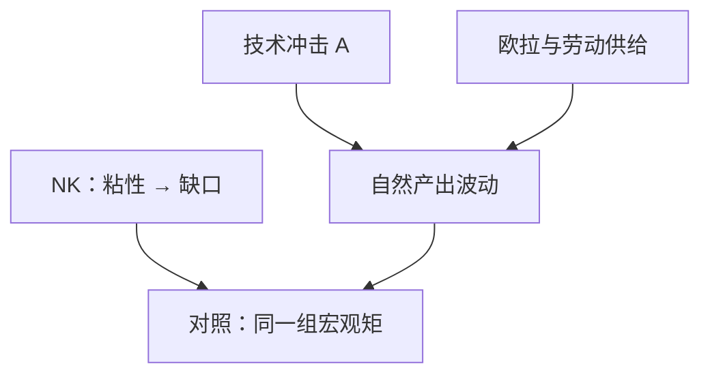

# 真实经济周期对照

若价格灵活、市场出清，周期也可以是对技术与偏好冲击的最优反应；货币在其中不是驱动项。

<footer>—— Kydland and Prescott, Time to Build and Aggregate Fluctuations, Econometrica 1982；对照 Lucas 的均衡周期</footer>

[上一课](/econ/new-keynesian)让名义刚性把利率政策接到缺口。本课的对照是：把刚性拿掉，周期还剩什么。Kydland 与 Prescott（1982）把索洛的 $A$ 写成随机过程，用可计算的 Ramsey 均衡去匹配产出、消费、投资、工时的二阶矩。卢卡斯批判的下一课会问：这些矩对政策是否结构；本课先把 RBC 的主张钉住。

## 问题

新凯恩斯把 $\tilde{y}$ 读成需求不足或过度。RBC 的缺口是：同样的 $y$ 波动，可以是自然产出自己在动——技术冲击改变 $F(K,AL)$，家庭沿欧拉与劳动供给最优地响应。没有未出清的商品市场，也没有未预期到的通胀菜单。问题不是「周期是否存在」，而是：有多少波动必须用粘性来解释，多少在灵活价格下已经能复制。

Lucas 更早把周期写成均衡中的信息混淆。RBC 把信息问题换成可观测的技术与跨期替代。两者都拒绝把 IS–LM 的静态乘数当结构。

索洛残差在此被当成外生技术冲击的代理。发展核算里 $A$ 是水平残差；RBC 的 $A$ 是时间上的随机趋势或平稳冲击。测量误差和要素囤积会污染残差，这是对照的边界。

## 方法

代表性家庭、完全市场、灵活价格。冲击主要是 $A_t$（也可加政府购买、偏好）。决策：消费欧拉、劳动–闲暇、资本积累。均衡配置即计划者配置（无外部性时）。校准：选参数使稳态匹配长期份额，再看模型矩与数据矩。

与 NK 的差别不在欧拉——两边都用——而在 Phillips：$κ\to\infty$ 时 $\pi$ 不携带独立的名义需求故事，货币中性在周期频率上也近似成立。经验上货币与产出的同期相关，RBC 必须用反向因果或无关的共同因子解释，或承认需要名义刚性。

### 校准不是估计因果

匹配二阶矩不等于识别了冲击。把索洛残差当 $A$，等于把模型解释不了的产出都叫技术。NK 可以把同一残差拆成技术加 markup 加需求。本课的用处是对照：拒绝「没有粘性就没有周期」。

Kydland–Prescott 用建设时间让投资冲击变成持续产出动态。劳动供给弹性必须够大才能匹配工时矩——这是后来转向劳动市场摩擦的经验压力，不是把乘数请回来。

## 机制

正技术冲击提高劳动边际产出，工资与就业、消费、投资一起升（投资往往更剧烈，因为资本要调到新的合意水平）。这是跨期替代，不是失业者被「需求创造」出来。自然率 $u^*$ 仍可为正（摩擦），但周期性 $\tilde{u}$ 在纯 RBC 里主要是自愿的工时变动——这正是最受批评的一点：失业看上去不像闲暇。

增长课的稳态仍在：RBC 是稳态附近的随机扰动，不是另一套索洛。内生增长可以把 $A$ 的趋势内生化，周期模型通常仍把高频冲击外生。建设时间（time to build）让投资冲击变成持续的产出动态，这是 1982 年标题里的机制，不是把乘数请回来。

若市场完整、冲击真是技术、无外部性，用需求管理去抹平 $y$ 可能降低福利——波动是最优反应。一旦存在粘性或市场外失业，同样冲击的传播改变，稳定政策可以有空间。本课不裁定福利，只标前提。

HP 滤波把增长与周期切开。滤波选择会改变矩，这是方法的一部分。把滤波后的「周期」直接叫成 NK 缺口，是把两种分解混用。

## 边界

RBC 不解释滞胀里通胀与失业同升的名义面，也不给铸币税角色。工时波动过大、失业的非自愿性，是转向 NK 与劳动市场摩擦的理由。本栏仍不把周期写成限价簿上的订单流。大萧条式的持续大规模失业，除非把 $A$ 写成离奇的负技术，否则纯 RBC 吃力。

后课默认：灵活价格下已有真实驱动的波动；名义刚性解释的是额外的缺口与货币非中性。下一课：无论 RBC 还是 NK，用历史简化式做政策评估都会翻车。

## 小结

- 灵活价格下，技术等真实冲击足以产生周期矩的一部分。
- 欧拉共用；差别在价格是否出清、货币是否中性到周期频率。
- 索洛残差当冲击有测量污染；滤波选择会改矩。
- 稳定政策的福利取决于摩擦是否存在。
- 政策评估不能靠未对规则变化做结构的回归——卢卡斯批判。
- 出处：Kydland and Prescott, Econometrica 1982；Lucas 的均衡周期传统。
