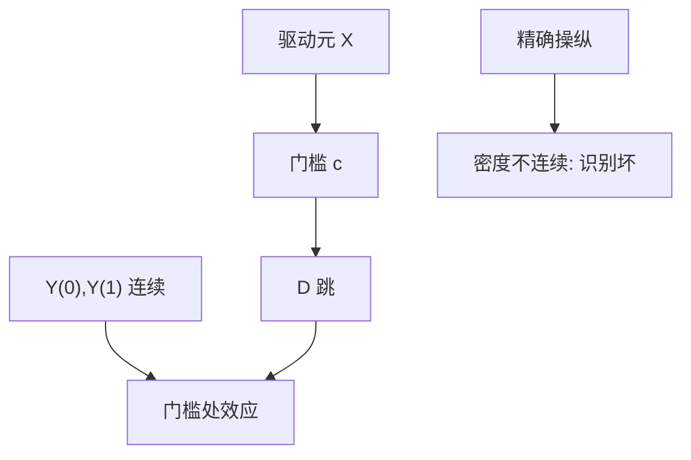

# 断点回归

资格由连续变量是否越过门槛决定时，门槛两侧的人几乎一样，处理却跳一下；跳的是局部因果，不是全局 ATE。

<footer>—— Thistlethwaite and Campbell, Regression-Discontinuity Analysis, 1960；Hahn, Todd and van der Klaauw, Econometrica 2001；Imbens and Lemieux, J. Econometrics 2008</footer>

[上一课](/econ/staggered-did)在时间维度上拆 TWFE 加权。本课换截面设计：断点回归（RDD）。合成控制下一课对付「一个处理单位、没有门槛」。本课只钉清晰与模糊断点、局部识别。

## 问题

分数 $X$ 过 $c$ 则录取、则补贴、则受监管。$D=\mathbf{1}\{X\ge c\}$（清晰断点）。Hahn–Todd–van der Klaauw：若潜在结果的条件期望在 $c$ 连续，而处理概率跳，则

$$
\tau_{\mathrm{SRD}}=\frac{\lim_{x\downarrow c}\mathbb{E}[Y\mid X=x]-\lim_{x\uparrow c}\mathbb{E}[Y\mid X=x]}{\lim_{x\downarrow c}\mathbb{E}[D\mid X=x]-\lim_{x\uparrow c}\mathbb{E}[D\mid X=x]}
$$

清晰时分母为 1，$\tau$ 是门槛处的 ATE（在 $X=c$ 的子总体）。缺口不是再讲教育回报，而是：识别是**局部**的，外推到远离 $c$ 的人要另加假设。模糊断点（过门槛只提高处理概率）把 RDD 收成局部 IV，LATE 在门槛编译器上。

McCrary 密度检验：若人能精确操纵 $X$（报税、成绩修改），密度在 $c$ 处不连续，连续性假设失败。Lee：不完全操纵下仍可能局部随机。

## 方法

局部多项式在 $c$ 两侧分别拟合，带宽用 Imbens–Kalyanaraman 或 Calonico–Cattaneo–Titiunik（CCT）的稳健偏误校正。不要用全局高阶多项式「穿过」整个 $X$ 支持——Gelman–Imbens 警告过拟合与假断点。协变量应在 $c$ 连续（安慰剂）；结果在 $c$ 跳才是效应。标准误用 CCT 稳健或偏差校正后的。

模糊：第一阶段是 $D$ 在 $c$ 的跳，排除是「门槛只通过 $D$ 进 $Y$」。弱第一阶段同样适用上一课弱工具逻辑。

## 机制

机制是局部随机：在 $c$ 的一个小邻域，谁略高谁略低像抛硬币——若不能精确操纵。DiD 用时间平行；RDD 用驱动元连续。两者都是用设计逼近随机化，而不是用更长的控制清单。

与 IV：模糊 RDD 就是门槛工具。排除失败的例子：门槛同时触发另一项政策（打包改革）。那是复合处理，不是 $\tau$ 对单一 $D$。

离散驱动元（整数分数）时，局部随机化思路（Cattaneo 等）比连续密度更贴：比较 $c-1$ 与 $c$ 两个质量点。

## 边界

本课不把某个奖学金断点的估计外推成全国教育政策乘数。带宽选择有偏误–方差权衡；报告对带宽的敏感是设计的一部分。多门槛、多驱动元是延伸。下一课合成控制：没有 $c$，只有一个处理地区和一群候选对照。

后课默认：RDD 的参数是 $X=c$ 处（清晰）或门槛编译器（模糊）；连续性加不可精确操纵。全局多项式不是默认。

## 小结

- 清晰 RDD：门槛处 ATE，靠 $Y(d)$ 连续、$D$ 跳。
- 模糊 RDD：局部 IV；分母是处理概率的跳。
- 操纵密度、打包政策，都会毁掉排除或连续性。
- 局部多项式 + 稳健带宽，避免全局高阶拟合。
- 出处：Thistlethwaite and Campbell 1960；Hahn, Todd and van der Klaauw 2001；Imbens and Lemieux 2008；Calonico, Cattaneo and Titiunik。
