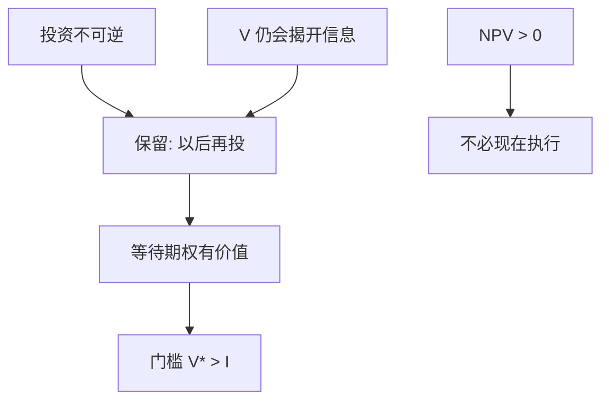

# 实物期权

投资一旦沉没不可逆，等待新信息本身是有价值的选择权；净现值大于零不再等于现在就投。

<footer>—— 据 Dixit and Pindyck, Investment under Uncertainty, 1994；McDonald and Siegel, The Value of Waiting to Invest, Quarterly Journal of Economics 1986 整理</footer>

定位：[上一课](/econ/control-rights)。剩余控制权已经指定谁能决定投或不投。本课缺口是时机：在不可逆与不确定下，拥有控制权的人还有一个等待期权。不是把 Black–Scholes 公式搬到工厂上做校准，也不估计隐含波动率。

## 问题

标准 NPV：贴现期望现金流减去投资成本，为正就投。它把「现在投」和「永远不投」当成仅有的选项，漏掉第三项——现在不投、保留以后再投的权利。若支出大部分不可逆，信息会随时间到来，等待的边际价值可以大到使 NPV 为正的项目仍被搁置。McDonald–Siegel 与 Dixit–Pindyck 把这项权利写成实物期权。

缺口不是再讲控制权归谁，而是：权威已经在手时，执行投资的门槛为何高于「NPV=0」。公司金融单元到此仍不需要二级市场的期权微笑；需要的是不可逆、不确定与可延迟三项同时成立。

金融期权的标的是可交易证券；实物期权的标的是项目现金流，通常不可交易。复制组合不必存在，定价用的是均衡折现或或有要求权语言，不是交易所里的隐含波动。

## 方法

把项目投资写成美式看涨：执行价格是沉没的投资成本 $I$，标的是项目价值 $V$（未来现金流的现值）。$V$ 随机游走或几何布朗。一旦执行，$V-I$ 到手，等待期权作废。最优政策是阈值 $V^\ast\gt I$：只有当 $V$ 涨过 $V^\ast$ 才投。$V^\ast-I$ 是期权溢价，来自等待中信息的价值。

比较静态与金融期权同方向，解释不同。波动率上升提高等待价值，门槛更高——不是因为经理更「风险厌恶」，而是坏消息到来时尚未沉没的 $I$ 被省下。不可逆越强（$I$ 能回收的越少），门槛越高。利率上升既提高折现也提高等待的机会成本，净效应要拆，本课不校准。

与 Jensen 的对照：FCF 代理是筛子已空还在投；实物期权是筛子可能为正却故意不投。过度投资与延迟投资可以并存于不同项目，不要合成「投资总是错」。

## 机制

机制是信息的机会成本。现在执行，等于放弃「看到 $V$ 下跌就不付 $I$」的保险。保险在波动大时更值钱，所以执行要额外的溢价。这与[沉没成本](/econ/sunk-cost)课的方向衔接：沉没使过去的支出不应进入现在的决策；实物期权说的是**尚未沉没**的支出应当被期权价值保护。两者不矛盾：已经付的忽略，还没付的比较期权。

控制权在此是期权的持有人。若债权人在近违约时接管，执行权可能被用来赌大（资产替代）或被冻结（债务积压）。实物期权的门槛会被资本结构移动——这是权衡间接成本的另一写法，本课不重拆直接律师费。

### 不是 Black–Scholes 实证

把 Dixit–Pindyck 读成「用 BS 公式估一座矿的隐含波动并做交易」，是把实物期权当成衍生品课。本栏要的是投资规则：NPV=0 的马歇尔触发在不可逆下不是最优。公式细节、数值方法、商品便利收益，都不在主干展开。可交易复制若存在，项目价值可以用无套利定价；多数实物资产不能，只能回到均衡 $m$。$m$ 在下一单元才成为对象。

竞争会侵蚀等待：若别人先投就占领市场，独占的等待期权变薄，门槛向 NPV=0 靠拢。Dixit–Pindyck 的基准常常是独占或外生 $V$。

## 边界

不要把一切「观望」都叫实物期权：流动性约束、经理卸责、许可拖延，不是等待的信息价值。也不要把 R&amp;D、专利、扩建做成期权产品清单——那是应用菜单，会把本课写成词条。

公司金融主干在此结束。下一课换对象：这些项目要求权的**价格**是否已经把信息写进去——[有效市场](/econ/emh)。不要在 EMH 课里用实物期权重写投资。

后课默认：不可逆加不确定使最优投资门槛高于 $I$；NPV>0 不是立即执行。等待价值随波动上升。不是衍生品校准课。

马歇尔触发（NPV=0）忽略了被执行掉的期权。门槛缺口就是那项期权的价值。

控制权指定谁持有期权；本课指定何时执行。两课不要并成一句「治理好就会投资」。

## 小结

- 不可逆、不确定、可延迟 ⇒ 等待是有价值的期权。
- 最优门槛 $V^\ast\gt I$；波动与不可逆提高门槛。
- 本栏不把项目写成可交易期权的校准对象。
- 出处：Dixit and Pindyck, *Investment under Uncertainty*；McDonald and Siegel, *QJE* 1986。
