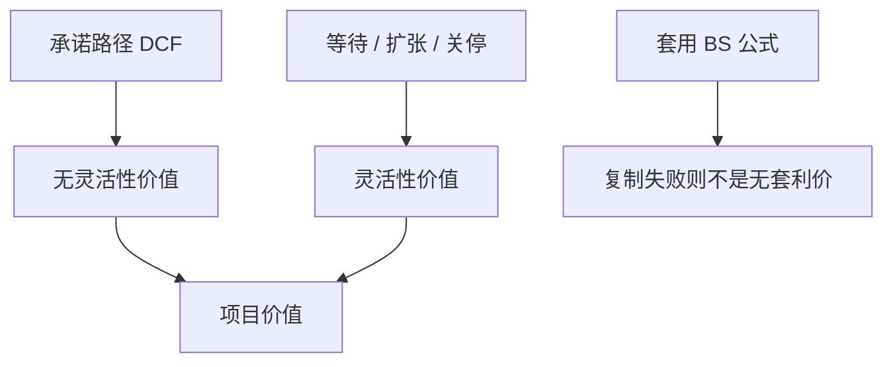

# 实物期权估值

    
资本预算把等待、扩张、关停写成期权时，要用或有要求权或决策树把门槛抬到 NPV=0 之上；套一个 Black–Scholes 公式不是估值已经完成。

    <footer>—— Dixit and Pindyck, Investment under Uncertainty, 1994；Myers, Determinants of Corporate Borrowing, Journal of Financial Economics 1977 中的增长期权；对照 McDonald and Siegel, QJE 1986</footer>

[上一课](/econ/eva-residual-income)把 DCF 与剩余收益收成等价。主干里[实物期权](/econ/real-options-theory)已经给出门槛 $V^\ast\gt I$。本课缺口是进阶操作：在 NPV 表上如何把扩张、分阶段、关停、转换写成增量价值，而不把 Dixit–Pindyck 重推一遍，也不把交易所隐含波动当成工厂的输入。

## 问题

标准 DCF 把政策当成「现在投或永远不投」。增长期权（Myers 1977 已把企业写成期权组合）、分阶段投资、关停与转产，都是后续决策。静态 NPV 漏掉这些决策的价值，会拒绝「今天 NPV 略负、但买到了明天扩张权」的项目，也会接受「今天 NPV 为正、但锁死了关停灵活性」的项目。缺口是估值加法：灵活性的价值 = 有期权的项目价值 − 承诺路径的 DCF。

不可交易的项目没有唯一的无套利价。许可证仍是：能复制则用风险中性；不能则用均衡 $r_U$ 调漂移，或把决策树里的概率改成确定性等价。Brealey–Myers 强调：期权思维先于公式。

分阶段：第一期小额投出，买到第二期是否续投的看涨。这与风险投资后课的 staging 同构，本课站在产业项目，不写 VC 合同条款。

## 方法

先画树：节点是可观测的市场或需求，行动是投、等、扩、关。每条承诺路径用上一课口径做 DCF；在决策节点取最大化。连续时间：McDonald–Siegel 阈值；扩张期权像看涨，关停像看跌（残值是执行价）。波动率应来自项目价值 $V$ 的驱动变量（产出价格），不是本公司股票历史波动——股票含杠杆与其他业务。

与 APV：融资灵活性（延迟发债、补贴到期）也可以是期权，但优先放进债务路径，不要把税盾再写成一个 BS。与 WACC：折现率在期权里随有效杠杆和风险变；决策树用风险中性或确定性等价，比每枝一个 WACC 更不易混。

Tirole：不可逆投资加不完全市场，等待有价值，但融资约束会强迫提前执行——实物期权价值被债务积压或现金短缺削掉。估值要声明：灵活性是否真的在经理与债权人的合同里可执行。

## 机制

机制仍是信息的机会成本：现在执行放弃保险。进阶课要补的是叠加。扩张期权的标的是后续项目的 $V$，而 $V$ 本身可能已含更下一层期权，容易重复计算终值增长。纪律：终值用竞争均衡 ROIC，增长期权只放在树的决策节点，不在 Gordon 的 $g$ 里再加一次。

债务与期权：股权是资产的看涨，债权人持有安全债减空头看跌（Merton）。项目层面的关停期权若由股东执行，可能损害债（资产替代或提前清算纠纷）。APV 副作用与实物期权会打架；资本预算须标明为谁估值。

### 不是把 NPV 调过关的第三套 IRR

给负 NPV 项目标一个巨大的「战略期权」却不写执行政策、波动与成本，等于取消接受规则。实物期权估值必须能指出：何种价格或需求下执行、放弃的是什么。

复制：产出可对冲（商品、货币）时，期权部分可用衍生品课的技术；需求不可交易时，回到 CAPM 调整的漂移。本栏不进入限价簿上的期权做市。

## 边界

不要重写主干实物期权课的 $V^\ast$ 推导。本课只补估值加法与和 DCF/终值的边界。下一课租赁：租赁是放弃残值与灵活性的合同，本身像卖出一份资产期权。

后课默认：灵活性价值 = 有决策的价值 − 承诺 DCF；波动来自项目驱动变量；不与终值 $g$ 重复计算。复制不存在则不是无套利价格。

## 小结

- 灵活性是对承诺路径 DCF 的增量；门槛仍高于 NPV=0。
- 决策树或或有要求权；不要用公司股价波动套 BS 交差。
- 增长期权不要与 Gordon 终值加两次。
- 出处：Dixit and Pindyck 1994；Myers, *JFE* 1977；McDonald and Siegel, *QJE* 1986；Brealey, Myers and Allen。
