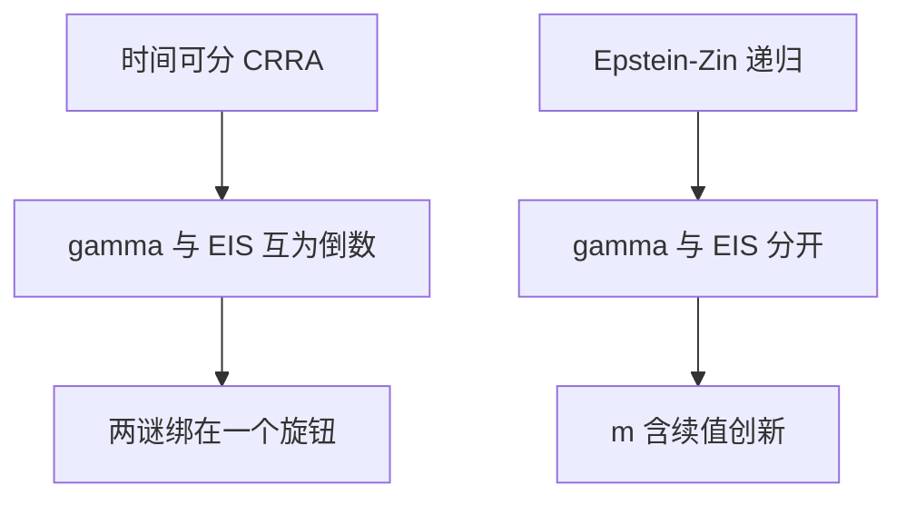

# 递归效用 Epstein–Zin

风险厌恶管的是对给定消费彩票的态度，跨期替代管的是确定路径上的早晚；时间可分期望效用把二者锁成互为倒数，递归效用把锁打开。

<footer>—— Epstein and Zin, Substitution, Risk Aversion, and the Temporal Behavior of Consumption and Asset Returns, Econometrica, 1989</footer>

[上一课](/econ/risk-free-rate-puzzle)表明：CRRA 用同一个 $\gamma$ 配溢价会搞坏 $r_f$。Weil 已经暗示拆开 EIS。本课缺口是 Epstein–Zin 的递归效用：让 $\gamma$ 与 EIS 成为两个参数。不重做两谜的校准表，不把递归效用写成解决所有资产定价问题的开关。

## 问题

时间可分期望效用 $E\sum\beta^t u(c_t)$ 对确定性的跨期替换与对无时风险的厌恶共用 $u$ 的曲率。股权溢价要大曲率，无风险利率要另一套曲率——上一课把冲突写成谜。Epstein 与 Zin（1989）用 Kreps–Porteus 时间偏好，把终身效用写成当期消费与「未来效用的确定等价」的 CES 聚合：EIS 由聚合的替代弹性给出，$\gamma$ 由确定等价的风险态度给出，二者不必互为倒数。

缺口是把这套偏好接到已经学过的 $m$，而不是从公理再讲一遍。后课习惯与长期风险会用这个装置；本课只钉分离本身。

EIS 高：确定的消费增长变动时，愿意大幅调整储蓄。$\gamma$ 高：同期消费彩票要大补偿。CRRA 强迫 EIS$=1/\gamma$；EZ 允许例如高 $\gamma$、高 EIS 同时出现。

## 方法

递归

$$
V_t=\Bigl[(1-\beta)c_t^{1-\rho}+\beta\bigl(\mathrm{E}_t[V_{t+1}^{1-\gamma}]\bigr)^{\frac{1-\rho}{1-\gamma}}\Bigr]^{\frac{1}{1-\rho}},
$$

EIS $=1/\rho$，$\gamma$ 为相对风险厌恶。定价核不再只是消费增长的幂，还含财富（或续值）的创新：对长期消息的态度进入 $m$。$\gamma=\rho$ 时退回时间可分 CRRA。

分离是必要不是充分。高 $\gamma$ 加高 EIS 可以让预防性项与增长项重新搭配，减轻 Weil 的 $r_f$ 压力，但总量消费仍然平滑——溢价还可以不够。长期风险课会给续值一个持久的消费增长因子；本课不预支 Bansal–Yaron 的校准。

### $m$ 多了一项

EZ 的欧拉对财富回报有暴露。市场组合（或总财富）的创新进入定价，即便当期 $\Delta c$ 不动。这与下一课习惯（让当期 $c$ 相对习惯更敏感）是不同技术：一个改对新闻的态度，一个改对哪一段消费敏感。

## 机制

机制是时间偏好的递归结构。今天的效用取决于今天的 $c$ 和对明天 $V$ 的风险调整。不愿跨期替代的人，可以并不特别厌恶静态彩票，反之亦然。资产若在续值差的时候赔钱，即令当期消费还没动，也会要求溢价——因为 $V$ 已经差了。这为「新闻溢价」准备了语言，本课只把语言接到 SDF，不估计新闻回归。

两谜：$\gamma$ 可以专管 $\sigma(m)$ 里与风险有关的部分，$\rho$ 专管 $r_f$ 对增长的敏感。能否同时匹配仍是定量问题；Weil 自己稍后也讨论过递归偏好下谜是否还在。本课禁止宣布「EZ 已经关掉两谜」。

Epstein and Zin, *Econometrica* 1989；实证资产定价常用的另一篇是 1991 年 *JPE*。不要发明 arXiv。Kreps–Porteus 是时间偏好公理，本课不重证。

## 边界

不要把 EZ 写成 EMH 或写成因子模型。截面仍可能要可交易因子，见量化栏；本栏只改 $m$ 的形状。下一课 [习惯形成](/econ/habit-formation)用另一条路让风险厌恶随状态变，不必靠续值新闻。两者是并列修补，不是互相引理。

后课默认：EIS 与 $\gamma$ 可以分开；定价核可含财富/续值创新。时间可分 CRRA 是 $\gamma=\rho$ 的特例。两谜的定量解决不在本课宣布。

偏好参数仍受微观证据约束。拆开不是许可证把 $\gamma$ 放到任意大。

若 EIS$<1$，长期好消息可以压低资产价格（收入效应主导），长期风险课的符号会翻。本课必须先允许 EIS 自由，后课才谈「通常要 EIS$>1$」。习惯形成不需要这条符号，它改的是 surplus，不是续值对增长新闻的加载。

截面上用财富回报当第二因子，看起来像 ICAPM。那是后课与量化栏的映射，不是 Epstein–Zin 颁发的可交易组合名单。

## 小结

- Epstein–Zin：递归聚合拆开相对风险厌恶与 EIS。
- 定价核除消费增长外，可对续值（财富）创新暴露。
- 拆开是对付 Weil 孪生之谜的必要步骤，不是自动的充分解。
- 出处：Epstein and Zin, *Econometrica* 1989。
