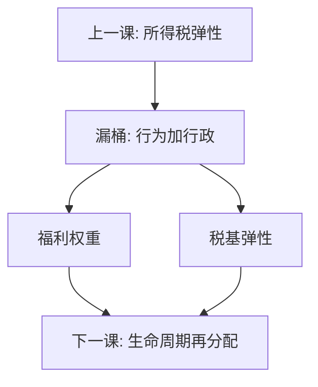

# 再分配与效率代价

把一美元从高能力转到低能力，桶会漏：漏的是劳动与税基的行为反应，不是转运本身不道德。代价由弹性决定，不能用「再分配无用」把权重设掉。

<footer>—— Okun, Equality and Efficiency: The Big Tradeoff, 1975；Atkinson and Stiglitz, Lectures on Public Economics；对照 Mirrlees 与 Saez 的充分统计</footer>

[上一课](/econ/income-tax-incentives)给出激励相容所得税的弹性语言。本课缺口是把那条弹性收成规范权衡：社会福利函数要对齐谁，漏桶漏多少。不重推 Mirrlees 一阶条件。后课社会保障把再分配从当期收入换到生命周期；本课先钉静态的效率代价。

## 问题

Okun 的漏桶：转移一元，到穷人手上不足一元，差额是行政成本与激励。现代公共财政把「激励」写成上一课的税基弹性：边际税提高，机械增益被行为损失抵消一部分。缺口不是再讲一次平均—边际，而是：**福利权重与弹性是两件东西**。权重来自规范（Atkinson 的不平等厌恶、功利、罗尔斯）；弹性来自行为。把弹性估大，用来论证权重应为零，是类别错误；把权重设高，用来否认弹性，同样错误。

次优已经贯穿 Ramsey：没有一次总付，再分配必须走扭曲工具。第一最佳的福利定理在此本来就不适用——不是市场「突然失效」，是工具集受限。

### 效率代价不是再分配无用

「漏了所以别转」漏掉了：目标函数里一元对低收入的权重可以大于一元对高收入。桶漏 20%，若权重比大于 $1/0.8$，转移仍可提高福利。争论应落在权重与弹性的数字，而不是落在「有漏就停」。行政成本是漏的另一截，与激励不是同一导数，但同进桶。

Atkinson–Stiglitz 把最优税写成社会福利函数对激励约束。本课用漏桶作翻译，避免把讲义里的 $\lambda$ 只当成拉格朗日符号。

## 方法

充分统计：小幅提高某段边际税的福利效应 $=($机械转移 $\times$ 权重差$)-($税基收缩 $\times$ 边际公共资金$)$。经验工作估弹性与税率，规范工作选权重；两者分开报告。不平等测度（基尼、Atkinson 指数）是结果指标，不是工具；工具仍是 $T(y)$ 与转移。与公共品：提供 $G$ 也花漏桶里的钱，萨缪尔森条件里的边际公共资金正是这里的漏。标签效应（EITC 对工时、转移对消费）会改变漏的位置，充分统计要写在具体工具上，不能写在「再分配」三个字上。

不要用税前基尼下降直接当成功：税前收入已含行为，循环论证。看税后分配与行为调整后的福利。行政成本（申报、稽查、欺诈）是漏的另一截，弹性公式常常省略它；把行政成本当零，会高估给定税率下的净转移。Atkinson 的不平等厌恶参数把权重写成可讨论的数字，避免「公平」停在形容词。

## 机制

机制是受限工具集下的帕累托边界。再分配沿着激励相容集移动，每一步用弹性标出可行方向的斜率。权重决定沿这条边界停在哪一点。没有弹性，边界是第一最佳的 45° 转移；弹性把边界弯回去。Ramsey 商品税是同一边界在另一组工具上的投影；所得税通常更对准能力，漏可以更小——这是 Atkinson–Stiglitz 弱可分结果的直觉。

政治约束（税率上限、不可对某群征税）把可行集再切一刀，漏桶更漏。那是政治经济学，本课只承认它会改变弹性有效值（避税通道）。动态上，资本与人力资本的积累把静态漏换成增长路径上的另一条代价，本课不把增长理论写完，只禁止用静态漏桶否定一切跨期再分配，或用增长口号取消弹性。

Okun 1975 的隐喻先于充分统计最优税文献，但方向一致：代价是技术性的漏，不是把平等从目标函数里删掉。

## 边界

本课不选定一个国家的最优基尼。不把增长理论里的再分配与资本积累写完。动态一致性、资本税留给宏观。下一课：强制年金与社会保障，把再分配从截面换到寿命与收入风险。后课默认：主张或反对某项转移时，同时写权重与弹性；只写其中一项，论证不完整。现金转移与实物转移的漏不同：后者限制用途，代理成本换方向，弹性公式要另写，本课不展开菜单。

## 小结

- 再分配走扭曲工具，漏桶的漏是弹性与行政成本。
- 福利权重与行为弹性是两类对象，不能互相取消。
- 有漏仍可能提高福利，若权重差大于漏的倒数。
- 边际公共资金把漏接到公共品提供。
- 行政成本是漏的另一截，与劳动弹性不是同一导数。
- 出处：Okun 1975；Atkinson and Stiglitz；Mirrlees；Saez。
