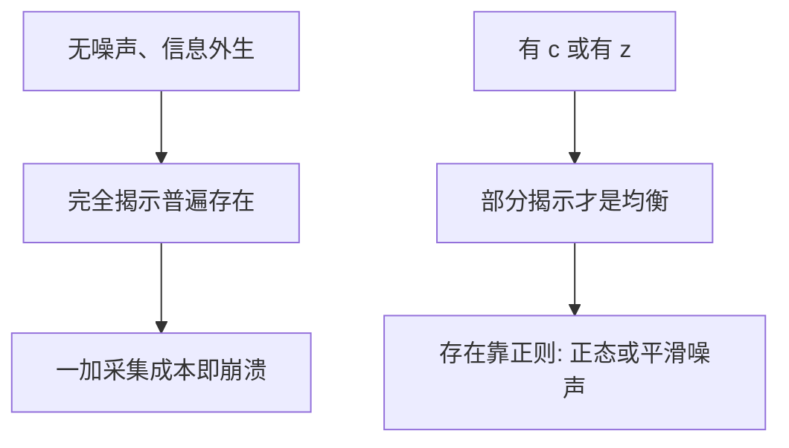

# REE 的存在与揭示

完全揭示的理性预期均衡在状态空间足够丰富时可以普遍存在；噪声一进来，普遍的是部分揭示，完全揭示变成刀刃。

<footer>—— 据 Radner, Econometrica 1979；Allen, Econometrica 1981；对照 Grossman–Stiglitz 的部分揭示</footer>

[上一课](/econ/admati-multi-asset-ree)在正态线性里把价格向量写成 $A\theta+Bz$。本课缺口是离开函数形式：REE 作为一种对应，何时存在、价格映射何时一对一。不重做矩阵求逆，不估计揭示度。

## 问题

Radner（1979）的「完全沟通均衡」：现货价格作为信号，若不同的基本面状态给出不同的价格，看见 $p$ 就等于看见状态，未持有私人信号的人也知情。在平滑偏好与紧致状态空间上，完全揭示的 REE **普遍**存在——因为把价格映射微扰一下就能分开状态，而需求在完全信息下已经定义好。这与 GS 不打架：Radner 的世界里信息是禀赋，没有采集成本 $c$，也没有故意加入的 $z$。

Allen（1981）等指出：一旦允许价格不分开状态（部分揭示），存在性立刻变难。信念依赖 $p$，需求作为 $p$ 的函数可能不连续——状态被价格聚成原子时，条件期望会跳。线性正态靠联合连续分布躲过跳跃；一般模型需要额外结构（噪声、凸性、或只找近似均衡）。

缺口是把「存在」与「揭示」拆开：有均衡不等于完全揭示；完全揭示在无噪声、无成本时普遍，在有 $c$ 或有 $z$ 时不是均衡或不是普遍。

Jordan、Radner 以及后续的「普遍完全揭示」文献，对象是抽象状态空间上的价格函数，不是某一组美股的 $R^2$。

## 方法

把 REE 写成不动点：猜测一个从状态（含信号、噪声）到价格的映射 $\phi$，诱导出每人的条件信念，再要求在这些信念下的超额需求在 $\phi(\omega)$ 处为零。完全揭示：$\phi$ 在基本面上可逆（差一个与偏好无关的标签）。部分揭示：$\phi$ 把不同基本面打到同一 $p$，条件信念是那个原子上的后验。

GS / Hellwig / Admati 是部分揭示的参数化构造。Radner 是完全揭示的普遍性定理。两者的前提不同：有没有残差不确定性、有没有采集成本。本课禁止用其中一篇否证另一篇。

[状态价格](/econ/state-prices)在完全信息、完全市场上给出唯一 $q$。REE 讨论的是 $q$ 或 $p$ **作为信号**还携带多少别人不知道的东西。两套对象：一套是或有商品的竞争价格，一套是信息加总。完全揭示的 REE 把第二套压进第一套；部分揭示让第二套永远残缺。

## 机制

完全揭示的机制是分离：若两个状态还并在同一价格上，而两人在这两个状态里的需求不同，那么把价格稍微标出差异，超额需求会把映射推开——普遍性来自这种可分离。部分揭示的机制是混淆必要：要么有人必须被补偿才生产信息，要么总量噪声与基本面绑死。存在性的机制是需求对信念连续：噪声把原子摊成密度，线性正态是最省事的摊法。

战略操纵（有限人影响 $p$）会破坏价格接受，存在性要换成博弈的贝叶斯纳什，后课 Kyle 对照。本课仍停在竞争。

「几乎完全揭示」：噪声方差趋于零时，价格收敛到完全信息价格，但任意小噪声下采集激励仍可保留。GS 的极限与 Radner 的普遍性在极限点相遇，在任何正噪声处分开。

## 边界

不要把「普遍存在」读成「现实价格完全揭示」。普遍性是在无噪声模型的拓扑意义上。也不要把不存在定理写成市场崩盘：那是某个函数空间里找不到不动点，不是交易停止。本课不讨论限价簿上因离散档位导致的「价格不能分开状态」——档位是协议，见量化栏。

下一课让信号重新变成选择：采集的策略替代与策略互补。存在与揭示假定信号已在手里；获取把 $\lambda$ 或精度变成均衡对象。

后课默认：无噪声时完全揭示普遍；有成本或有噪声时工作均衡是部分揭示；线性正态是构造，不是定义。

## 小结

- Radner：信息外生、无噪声时，完全揭示 REE 普遍存在。
- 有 $c$ 或 $z$ 时，完全揭示不是工作均衡；部分揭示的存在需要正则。
- 价格作为信号，与状态价格作为或有商品，是两套对象。
- 出处：Radner, *Econometrica* 1979；Allen, *Econometrica* 1981；对照 Grossman–Stiglitz 1980。
