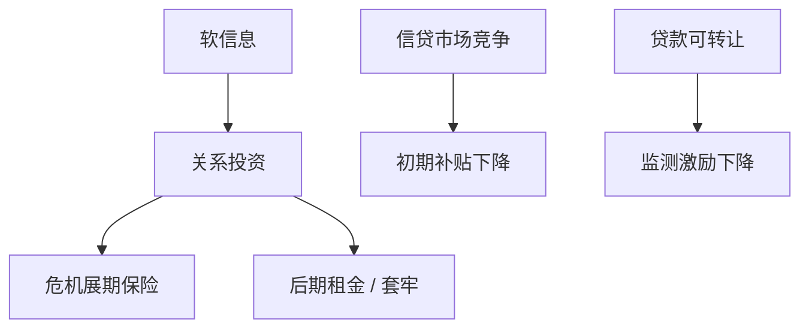

# 关系借贷

    
跨期的银行关系用软信息换取危机时的保险：平时可能付更高利息或接受套牢，换的是可验证条款写不尽的那次展期。

    <footer>—— Petersen and Rajan, The Benefits of Lending Relationships, Journal of Finance 1994；Boot, Relationship Banking, Journal of Financial Intermediation 2000</footer>

[上一课](/econ/bank-vs-public-debt)给出套牢与监督的权衡。本课缺口是跨期：关系如何生产软信息、如何在周期里平滑，以及竞争如何削弱关系。不重推 Diamond 的声誉毕业，不写银行挤兑。

## 问题

公开债与交易贷款依赖可验证信息。中小企业、创新项目的信息是软的（判断、过程），难以转卖。Petersen–Rajan（1994）：关系降低中小企业的信贷约束，早期可能付较高成本，后期随信息积累改善。Boot：关系是含糊合同，状态不可写尽时用权威与声誉执行。缺口是把上一课的「银行」分成关系型与交易型，并标明竞争、可转让贷款如何把关系拆掉。

软信息难以在组织内传递，所以关系常绑定信贷员与分支——这是银行内部组织，本课只取对借款企业的含义：换银行会损失信息资本。

## 方法

跨期补贴：初期贷款 NPV 对银行可为负（投资于信息），靠后期信息租金收回。竞争加剧则后期租金消失，银行不愿付初期补贴——Petersen–Rajan 强调市场力量对关系的非单调影响。可转让与证券化把贷款卖出，监测激励下降，下一课发起–分销会写极端。

对企业：单一关系加深信息、加重套牢；多银行减轻套牢、稀释信息投资。与期限：关系使短债的展期更像保险而不是挤兑；失去关系之后，同一短债结构变成 Diamond 的流动性风险。

资本预算：有关系的企业，APV 里展期失败概率低于公开市场模型。没有关系却按关系假设去折现，会低估流动性副作用。

## 机制

机制是不可转让的信息资本与隐含合同。双方用未来生意约束今天的机会主义：企业不把银行当一次性拍卖，银行不在第一次坏消息时逼债。宏观冲击若大到银行自己资本不足，隐含合同破裂——关系不是国家风险保险。Rajan 套牢是关系的阴暗面：信息资本提高退出成本，利率可以高于竞争水平。

与优序：关系债信息敏感度低于公开股、也常低于公开债，排在内部资金之后、公募之前，是优序的银行版。柠檬在关系里被监测缓解，不是消失。

### 关系不是「非经济的人情」

租金与保险都可以写进 Tirole 的融资合同：不可验证努力靠长期博弈。人情叙事不增加机制。本课禁止把关系写成与利率无关的偏好。

Sharpe、Rajan 的套牢模型与 Petersen–Rajan 的实证对象（美国中小企业）应分开读：机制是信息租金，度量是信贷可得性与利率，不是「有没有一起吃过饭」。

## 边界

不要把本课写成中小企业政策。下一课评级机构：公开债用可验证的第三方意见替代关系软信息，另一套代理（发行方付费）随之出现。

后课默认：关系用软信息换展期保险，竞争与可转让削弱它；套牢与保险并存。展期风险依赖是否真有关系，不能只看期限。

## 小结

- 关系借贷投资于软信息，跨期补贴换危机保险，也产生退出成本。
- 竞争可能减少关系投资；贷款转卖削弱监测。
- 对企业资本结构：关系债介于内部资金与公开债之间。
- 出处：Petersen and Rajan, *JF* 1994；Boot, *JFI* 2000；Rajan, *JF* 1992。
