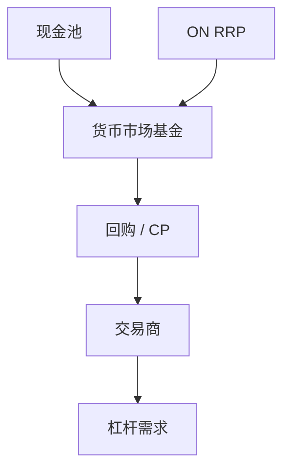

# 回购市场与货币市场基金

隔夜回购是抵押短债的批发市场；货币市场基金是其负债端的零售与公司现金池。两者同时停，就是影子挤兑的交易层。

<footer>—— 对照 Duffie 对回购与 CCP 的讨论；Kacperczyk and Schnabl 的 MMF 风险承担</footer>

[上一课](/econ/central-bank-balance-sheet)把 ON RRP 写进央行负债。缺口是私人侧：谁在做回购、谁持有 MMF。本课钉交易层，CBDC 下一课才谈零售负债替代。不重写 haircut 公式。

## 问题

双边与三方回购把国债/MBS 变成现金。MMF 稳定净值的承诺，使份额像存款却没有同等保险（2008 年 Reserve Primary）。2019 年回购利率尖峰说明：即使「安全」抵押，中介资产负债表空间也可以突然变贵。缺口是把短债生态连成一张图，而不是分别讲「货基」和「回购」两个词条。

Copeland, Martin and Walker 的三方回购。Infante 对抵押品再利用。SEC 2014/2023 MMF 改革是制度，本课只取其改变了哪些激励。

## 方法

画资金链：现金池 → MMF → 回购/CP → 交易商 → 对冲基金/抵押再质押。压力测试：国债供给、准备金、杠杆基金保证金同时变。政策：ON RRP 给 MMF 一个央行对手方，等于给影子负债一个地板；CCP 与保证金缓回购传染。与 GK：交易商净值是 $\phi$ 的微观对应。

## 机制

稳定净值 + 可日赎 = 隐性看跌。资产稍一盯市，赎回加速，基金抛 CP/回购，利率跳升。回购侧：抵押品价格与 haircut 正反馈，与影子课同一机制，只是合约名不同。

## 边界

不写清算所默认基金的法律细节。下一课 CBDC 是公共零售负债，可能改写现金池要不要经过 MMF。不把 2019 尖峰写成唯一校准。

## 小结

- 回购与 MMF 是影子短债的交易层与零售层。
- ON RRP 把部分货基接到央行地板。
- 出处：Gorton–Metrick 回购；Kacperczyk–Schnabl MMF；Duffie 市场结构讨论。
