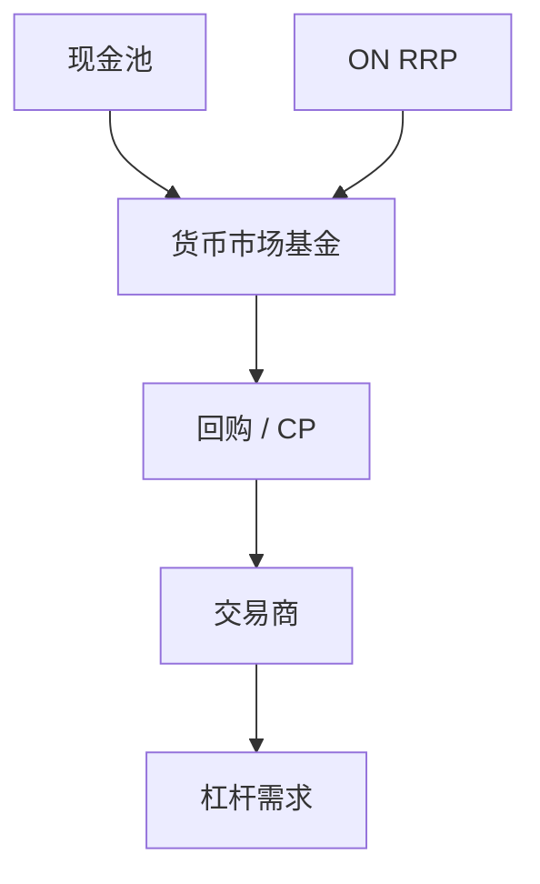

# 回购市场与货币市场基金

隔夜回购是抵押短债的批发市场；货币市场基金是其负债端的零售与公司现金池。两者同时停，就是影子挤兑的交易层。

<footer>—— 对照 Duffie 对回购与 CCP 的讨论；Kacperczyk and Schnabl 的 MMF 风险承担</footer>

[上一课](/econ/central-bank-balance-sheet)把 ON RRP 写进央行负债。缺口是私人侧：谁在做回购、谁持有 MMF。本课钉交易层，CBDC 下一课才谈零售负债替代。不重写 haircut 公式。

## 问题

双边与三方回购把国债/MBS 变成现金。MMF 稳定净值的承诺，使份额像存款却没有同等保险（2008 年 Reserve Primary）。2019 年 9 月的回购利率尖峰说明：即使抵押全是国债，中介的资产负债表空间也可以突然变贵。缺口是把短债生态连成一张图——现金池在左、杠杆在右——看谁在什么约束下向谁供给隔夜资金，而不是分别讲「货基」和「回购」两个词条。

Copeland, Martin and Walker 的三方回购：清算银行日内垫资，交易商实际上把日内敞口滚成隔夜——改革动的是这条腿。Infante 对抵押品再利用。SEC 2014/2023 MMF 改革是制度，本课只取其改变了哪些激励。

## 方法

画资金链：现金池 → MMF → 回购/CP → 交易商 → 对冲基金/抵押再质押。压力测试：国债供给、准备金、杠杆基金保证金同时变。政策：ON RRP 给 MMF 一个央行对手方，等于给影子负债一个地板；CCP 与保证金缓回购传染。与 GK：交易商净值是 $\phi$ 的微观对应——做市与融资都要过交易商自己的风险预算，预算收紧时全市场的隔夜价格一起动。

```mermaid
flowchart TD
  CASH["现金池"] --> MMF["货币市场基金"]
  MMF --> REPO["回购 / CP"]
  REPO --> DL["交易商"]
  DL --> HF["杠杆需求"]
  ONRRP["ON RRP"] --> MMF
```

## 机制

稳定净值 + 可日赎 = 隐性看跌。2008 年 9 月 15 日 Lehman 破产，次日历史最老的 Reserve Primary Fund——1970 年发明货基产品的那只——因持有 7.85 亿美元 Lehman 商业票据，净值记到 0.97 美元。约束与动作要写全：机构现金池面对先到先得的赎回，于是赎回变成竞速，两周内约 3,000 亿美元流出优先级基金、涌进政府型基金；基金被迫抛 CP 回血，CP 利差跳升，连没碰过 Lehman 的好企业也发不出票。反事实由政策补齐：财政部临时担保份额、AMLF 接手货基手里的 ABCP、CPFF 直接下场买 CP，链路才重新接通。Kacperczyk and Schnabl 的解释在事前：机构型基金为留住现金池客户承担了更多风险，事前卖隐性保险；事后发起人自掏腰包补净值，证明隐担保是真期权——免费，直到不再免费。

回购侧同一挤兑换了对手方。2019 年 9 月 16–17 日，公司缴税日撞上国债缴款日，财政部把银行准备金抽薄；杠杆基金与做市商受内部风险预算约束不再抬价接券，货基又在季末前收缩回购盘口。隔夜利率于是脱锚：SOFR 一夜从 2.2% 跳到 5.25%，有效联邦基金利率冲出目标区间上沿。反事实写在央行的回应里：隔夜与定期正回购先顶住，随后按月购入短期国库券，把准备金补回「充足」带；当时 ON RRP 几乎无人使用，说明问题不是地板太低，而是准备金落到了需求曲线的陡峭段。地板系统要靠量垫着——先修[准备金利息与走廊](/econ/ior-corridor-floor)的几何在此兑现：锚没坏，量不够。

赎回螺旋的微观是时间一致性问题：份额按面值赎回、资产按市价变现，先赎的人拿走整块面值，损失留给没走的——稳定净值没有消除银行挤兑的先动优势，只把它藏进电子转账。MMF 侧是挤提，回购侧是配给，两侧在交易商的资产负债表上相遇，与影子课同一机制，只是合约名不同；所以政策也分两路，落在份额端（担保）与抵押端（便利与购券）。

## 边界

不写清算所默认基金的法律细节。下一课 CBDC 是公共零售负债，可能改写现金池要不要经过 MMF。不把 2019 尖峰写成唯一校准：缴税与缴款的日历错位每年都有，脱锚只发生在准备金最薄的那一次。

## 小结

- 回购与 MMF 是影子短债的交易层与零售层。
- Reserve Primary 破净把隐性看跌兑成显性挤兑；担保与便利把链路接回。
- 2019 尖峰：地板系统下量不够，隔夜利率照样脱锚。
- ON RRP 把部分货基接到央行地板。
- 出处：Gorton–Metrick 回购；Kacperczyk–Schnabl MMF；Copeland, Martin and Walker 三方回购；Duffie 市场结构讨论。
