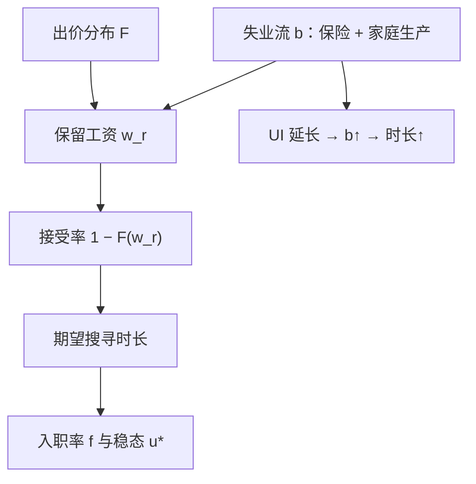

# 保留工资与搜寻时长

最优求职策略简单得像一道门槛：低于它的出价一律拒绝，高于它的当即接受；门槛随失业期间的资产价值移动，搜寻时长随之改变。

<footer>—— McCall, Economics of Information and Job Search, QJE 1970</footer>

[上一课](/econ/unemployment-stock-flow)把失业写成流量水位：入职率 $f$ 是爬岸的速度，且美国周期的波动主要出在这一侧。本课的缺口是 $f$ 的工人侧：失业者面对的是一条到来的出价流，每个出价要决定接受还是再等。宏观的[失业保险课](/econ/ui-moral-hazard)已给出 Baily–Chetty 的最优替代率，但把持续时间弹性当外生输入；本课给这个弹性一个结构来源——保留工资。市场侧的接触率由[搜寻匹配](/econ/search-matching-dmp)的匹配函数给出，本课不再写。

## 问题

搜寻是有成本的信息采集：每期花成本、抽一个来自分布 $F$ 的出价 $w$，接受则就业，拒绝拿失业流 $b$（失业保险加家庭生产的价值）、下期再抽。逐个比较「这个出价好还是等下一个好」会陷入无穷回归。McCall 的做法是把决策压成一个数：保留工资 $w_r$，定义为「接受」与「再等一期」的无差异点：

$$
w_r \;=\; b \;+\; \frac{\beta}{1-\beta}\int_{w_r}^{\infty}\bigl(w-w_r\bigr)\,dF(w).
$$

右端第二项是「再等」的期权价值：它收出价分布的上尾。于是规则只是一道门槛：$w \geq w_r$ 接受，否则拒绝。比较静态跟着写下：$b$ 上升（给付更高）、出价分布一阶改善、贴现更耐心，$w_r$ 上升；搜寻成本上升，$w_r$ 下降。

若每期恰有一次出价机会，期望搜寻时长是 $1/(1-F(w_r))$：门槛抬一点，时长不是线性地长，而是按门槛处的密度倒数放大——上尾薄的市场里，$w_r$ 的微小移动就画出很长的失业。

## 方法

把上一课的 $f$ 拆开：入职率 $=$ 接触率 $\times$ 接受率 $1-F(w_r)$。失业保险改的是第二项。模型预言给付更高、期限更长，实证要回答量级与机制。Meyer 1990 用行政数据发现：退出失业的风险率在给付用尽前几周骤升、用尽后回落——激励是真实起作用的，而尖峰位置钉在制度参数上。Katz–Meyer 1990 把尖峰的一部分归给召回预期，量级要打折。准实验侧：Card–Levine 2000 用新泽西的延付改革，大衰退中 Rothstein 2011 评估大规模延长——方向都是正的（延长给付拉长时长），但量级温和：潜在期限大幅延长，平均时长只多出几周。

分歧在解释。一类读法是道德风险：补贴让等待变便宜，是福利损失。另一类是[失业保险课](/econ/ui-moral-hazard)引的 Chetty 2008：有资产的失业者时长更长，一部分是流动性放松后的最优等待，不一定是浪费——「更长」可以是买到了更好的匹配。区分二者要资产数据，不是时长回归能给的。

术语翻译：「风险率」就是「撑到这一周还没找到工作的人，在这一周内找到工作的概率」。Meyer 的发现读出来就是：临近救济金用尽，这个概率骤然抬升、用尽后又回落——制度日历直接写进了个体行为，激励是真实的。

## 机制

模型把时长只写在一根管道上：拒绝更多出价。真实失业者还有第二根：搜寻努力（投多少简历、跑几场面试）本身不可观测，也会随给付下降。保留工资管道在 McCall 里可测可算，努力管道才是道德风险的真正藏身处；两根管道对政策的反应不同——延长期限主要动前者，替代率主要动后者，混着读会得出「给付无关紧要」的错误归因。

模型还预言 $w_r$ 随失业累积而降（技能折旧、资格耗尽），实测的保留工资却降得慢、且报告值普遍偏高——被访者报的是「可接受」而非「最优门槛」。这提醒：保留工资是模型里的决策变量，不是可直接读的测量。错在哪：拿模型参数直接当问卷条目，或反过来拿问卷否定模型——两者都把决策变量与测量当同一件东西。与上一课合起来：制度（给付水平与期限）改 $w_r$，$w_r$ 改接受率，接受率改 $f$，$f$ 改稳态水位——这就是「失业、搜寻与制度」这个单元的因果链，后面的买方垄断与最低工资都在这条链上加环节。

## 边界

基准假设出价分布 $F$ 不随个人状态移动；衰退里 $F$ 整体左移，$w_r$ 的比较静态不能照搬，否则会把「好岗变少」误算成「工人变挑」。模型还假设出价是独立抽取，忽略搜寻的定向与配对——那是 DMP 的对象。本课不做最优保险的福利计算，Baily–Chetty 的权衡与充分统计公式已在[保险课](/econ/ui-moral-hazard)给出，这里只供给它的行为参数。长期失业对 $w_r$ 的反馈（折旧、污名）也只点到为止。

## 小结

- McCall 把序贯搜寻压成门槛规则：$w_r = b + \frac{\beta}{1-\beta}\int (w-w_r)\,dF$。
- 失业保险抬高 $w_r$、拉长时长；给付用尽前的风险尖峰说明激励真实。
- 延长的量级温和（Rothstein 2011）；道德风险与流动性要分开（Chetty 2008）。
- $w_r$ 决定接受率，从而接入上一课的 $f$ 与稳态水位。
- 出处：McCall, QJE 1970；Meyer, Econometrica 1990；Katz–Meyer 1990；Card–Levine 2000；Rothstein, BPEA 2011。
