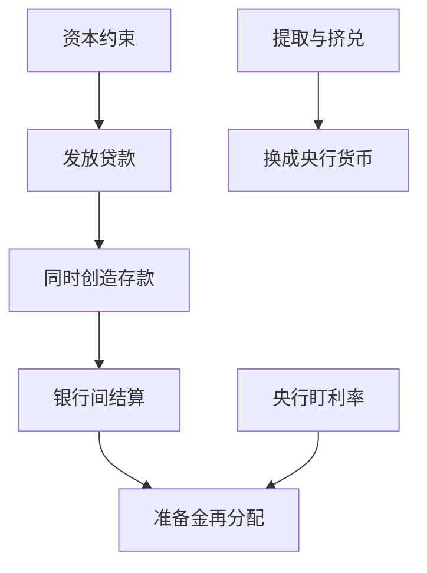

# 准备金、乘数与内生货币

商业银行不是把已有的储蓄「贷出去」；贷款在账上同时创造出存款。

<footer>—— 据 Tobin, Commercial Banks as Creators of Money, 1963；McLeay, Radia and Thomas, Bank of England Quarterly Bulletin 2014 整理</footer>

定位：[Diamond–Dybvig 挤兑](/econ/diamond-dybvig)。挤兑模型是真实技术上的存款合同，没有法定准备金账户。本课缺口是把银行放回货币体系：存款作为[支付](/econ/money-as-medium)手段，如何被创造、准备金在其中约束什么。不重讲数量方程的 $MV=PY$——那是[数量理论](/econ/quantity-theory)的课；本课只补银行账。

## 问题

教科书乘数把故事写成：央行先扔出一笔高能货币 $H$，银行按准备金率 $r$ 留下一块、把 $1-r$ 贷出，存款经过轮转放大为 $D=H/r$。因果箭头是 $H\to D$。若这是全部，上一课的银行只是被动的准备金过滤器，贷款需求、资本、挤兑信念都进不了货币供给。

经验与会计指向相反的箭头。银行先与借款人签订贷款，资产记贷款、负债记借款人存款，广义货币当场增加。准备金是结算用的央行负债，银行可以事后在银行间市场或向央行借。若央行盯的是利率而不是 $H$ 的数量，准备金迁就存款，而不是存款迁就准备金。缺口是：在哪一种政策体制下乘数是会计恒等，在哪一种体制下它是因果理论。

Gurley–Shaw 的 inside money 在这里得到会计实现：贷款与存款是同一笔分录的两侧。Outside money 是央行负债，不在商业银行表内被「创造」。

## 方法

先写两套账，再谈约束。贷款创造：银行 A 向企业贷出 100，A 的资产 +100 贷款，负债 +100 存款。若企业把钱支付到银行 B，A 失去准备金、B 得到准备金与存款；系统内存量仍是那 100 的 inside money，只是准备金在银行间再分配。乘数叙事把「准备金再分配」误写成「贷款来自事先吸收的储蓄」。

约束有三层，乘数只看见第一层的法定准备金率。其一，准备金与结算：日终若 A 准备金不足，必须借，价格是银行间利率；央行若把该利率钉住，就按需提供准备金。其二，资本：贷款消耗风险加权资产，[巴塞尔](/econ/basel-capital)比准备金更硬地限制能创造多少存款。其三，借款人意愿与存款人提取：没有贷款需求，存款不会凭空扩；提取与挤兑把 inside money 要换成 outside money，这才回到 Diamond–Dybvig。

Tobin（1963）强调：银行「创造货币」仍受资产报酬与负债成本约束，不是无限制的印刷机。英格兰银行 2014 年季度公报把当代操作写成：央行设定利率，货币量由银行、借款人与财政共同决定。

## 机制

内生货币的机制是利率规则下的结算弹性。存款转账要求准备金在银行间过户；若央行随时按目标利率提供或吸收准备金，高能货币成为内生，乘数的 $H$ 不再是外生推动力。[数量理论](/econ/quantity-theory)里的 $M$ 若取广义货币，其量就是这张内生过程的结果，不是政策工具本身。政策工具是利率、走廊、以及后课的非常规资产负债表。

挤兑把内生过程打成非弹性。人人要把银行存款变成现金或央行存款时，系统需要 outside money 的净注入；没有[最后贷款人](/econ/lender-of-last-resort)，内生创造会以同样的会计速度逆转：贷款回收、存款消失。因此内生货币与 Diamond–Dybvig 兼容：平时贷款创造存款，慌时存款要求变成准备金，乘数叙事在慌时才看起来像「准备金不够所以要收缩」。

### 乘数何时仍是有用的会计

法定准备金率 $r$ 仍给出一个上界：$D\le H/r$，若窗口关闭且银行不能用其他流动资产代替准备金。上界不是因果：$H$ 增加不一定把 $D$ 推到上界，贷款需求、资本、利率才决定走多远。盯准备金数量的体制（历史上某些货币目标区间）使 $H$ 更像外生，乘数看起来更「真」；盯利率的走廊使 $H$ 迁就，乘数只剩恒等。本课以当代利率操作为默认，与[泰勒规则](/econ/taylor-rule)一致，不把 1950 年代的高能货币实验写成一般理论。

教科书乘数常配「漏出现金」的几何级数。现金漏出改变的是准备金在银行体系内的留存，仍不是贷款的事前来源。来源是信贷合同。

## 边界

不要用「贷款创造存款」否认储蓄–投资核算：那是[恒等式](/econ/saving-investment-id)层面的流量，不决定哪家银行能放哪笔贷。也不要把内生货币读成银行可以无视通胀：价格水平仍受需求、利率与预期约束，只是传导不经由外生 $H$。法定准备金率降到接近零的体制里，乘数作为因果理论已经没有操作对象。

本课不写巴塞尔公式，不写 Bagehot 规则。下一课处理挤兑时谁必须提供 outside money；再下一课才把资本当作硬约束引入。Friedman 的数量重述是附录对照，不在这里重开货币需求函数。

也不要把「银行创造货币」读成财政货币理论或任意名义锚。价格水平如何被利率规则钉住，是 [Woodford 附录](/econ/woodford-interest) 与主干 NK 的事。本课只改因果箭头：$M$ 的广义存量主要是银行账，不是央行事先印好再借出的存货。

## 小结

- 贷款与存款是同一分录；广义货币主要由商业银行创造。
- 乘数在盯利率体制下是会计，不是 $H\to D$ 的因果。
- 真正的约束是利率、资本与提取；挤兑把 inside money 要换成 outside money。
- 出处：Tobin 1963；McLeay, Radia and Thomas, *BoE Quarterly Bulletin* 2014；Gurley and Shaw 1960。
