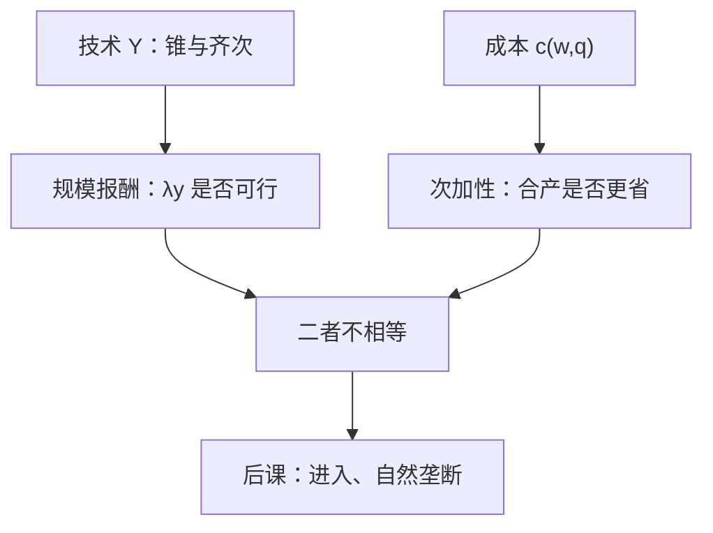

# 规模报酬对规模经济

规模报酬是生产集的锥性质；规模经济是成本函数的次加性。把二者写成同一句话，自然垄断与竞争供给都会接错。

<footer>—— 据 Varian, Microeconomic Analysis；Baumol, On the Proper Cost Tests for Natural Monopoly, AER, 1977 整理</footer>

定位：[上一课](/econ/sunk-cost)。短长期把 $c_{\mathrm{SR}}$ 与包络 $c_{\mathrm{LR}}$ 钉死，停产看 AVC。本课不重讲沉没与包络切点。[技术](/econ/production-technology)已定义 CRS/IRS/DRS 为 $Y$ 的锥，[成本最小化](/econ/cost-minimization)已给出 $c(w,q)$。缺口是后课市场结构会混用两套语言：技术一次齐次，并不等于平均成本下降，更不等于「一家生产更省」。

## 问题

规模报酬问的是：若 $y\in Y$，则 $\lambda y$ 是否仍在 $Y$。它不看要素价格。规模经济问的是既定 $w$ 下，把产量捆在一起是否比拆开更便宜。单产出时常见写法是 AC 随 $q$ 下降；严格的产业组织用法是**次加性**：

$$
c(w,q_1+q_2)\le c(w,q_1)+c(w,q_2).
$$

缺口不是再画一条 U 形 AC，而是：**齐次性推不出次加性，次加性也不回推齐次性。** 要素价格一变，同一套 $f$ 的成本形状可以翻面。上一课的长期包络是「给定 $w$ 选 $z_f$」，本课在包络上再问：这条 $c_{\mathrm{LR}}(w,\cdot)$ 对产量可不可加。

### 下降的 AC 只是次加性的特例

AC 递减 $\Rightarrow$ 次加性，反过来不必：多产出时一种产品的 AC 上升，仍可能整体次加（范围经济）。Baumol 把自然垄断的成本检验写成次加性，而不是「IRS」三个字母。后课[自然垄断](/econ/natural-monopoly-ramsey)默认读的是成本侧，不读锥。

一次齐次的 $f$ 加固定要素价格，给出 $c(w,q)=q\,c(w,1)$，MC$=$AC，谈不上下降的 AC。IRS 常让 AC 下降，但 $w$ 随行业扩张而涨时，局部均衡的 AC 可以不降——那是外部不经济，不是把 DRS 写进 $f$。

## 方法

先写技术：单产出 $f$ 为 $k$ 次齐次，则 CRS 当 $k=1$。再写成本：在 $w$ 冻住时把 $c(w,q)$ 对 $q$ 求导，读 MC 与 AC 的相对位置。比较必须声明 $w$ 是否内生。行业扩张抬高专用要素价格，单家看起来 DRS，其实是外部成本，[完全竞争](/econ/perfect-competition)的长期供给倾斜正用这一层。

次加性是全局陈述，U 形 AC 只在有效规模左侧局部下降。一家工厂过了有效规模之后，复制第二家可能更省——次加性破裂，自然垄断消失。检验对象是整条成本，不是某一点的切线。

本课仍是单家、价格接受。$w$ 当参数。不要把次加性写成限价簿深度「合在一起更厚」——簿是量化栏，这里没有报价。

## 机制

齐次性进入成本的机制是：投入按比例放大、产出按 $k$ 次放大，要素账单同步放大，于是 $c$ 对 $q$ 的次数被 $k$ 钉住。次加性的机制可以完全不同：共享的不可分设备、一次沉没的管网，使两份产量分摊同一笔 $z_f$。上一课刚把沉没从短期 MC 里拿掉；那笔沉没摊进长期 AC 之后，正是规模经济最常见的来源——**成本会计**，不是锥。

反过来：技术 IRS 但要素市场向上倾斜，$w(q)$ 上升可以抵消物理上的节省，观测到的 AC 不必降。故「看见下降的 AC」既不能断定 $f$ 齐次，也不能断定进入之后只该留一家；还要问 $w$ 从哪来。

多产出时必须回到向量次加性，不能按每种产品的 AC 分别检验。铁路的客运与货运共享路网，分产品 AC 可能都上升，合产仍更省——这正是 Baumol 强调「对自然垄断做成本检验要用整条 $c(q)$」的原因。后课自然垄断读的是这一全局陈述，不是某一条下降的平均成本曲线。

范围经济是 $c(q_1,q_2)<c(q_1,0)+c(0,q_2)$，与规模经济并列，同属次加性家族。不要把多产品次加写成霍特林选址，也不要写成订单簿的合并。Varian 教材把 returns to scale 与 economies of scale 分章对照，本课沿这条刀。

## 边界

学习曲线、动态 IRS、网络效应会让「本期 $c(q)$」不再是静态函数，次加性要改成跨期。规制用 AC 还是用增量成本做准入检验，是自然垄断课的对象。本课不引入可竞争性、不引入 Ramsey。

也不要把规模经济写成 CAPM 的规模因子或权重量化——那是别的栏。后课默认：说到「规模报酬」指 $Y$ 的锥；说到「规模经济 / 次加性」指 $c(w,\cdot)$。市场结构先进入价格接受的加总，再用次加性决定要不要只留一家。

## 小结

- 规模报酬是技术齐次；规模经济是成本次加。二者不可互换。
- AC 下降只是次加性的常见特例；要素价格内生可以拆掉这层表象。
- 沉没的共享投入是成本侧规模经济的典型来源，不是把 IRS 再写一遍。
- 下一课把短、长期供给推进价格接受的市场加总。
- 出处：Varian, *Microeconomic Analysis*；Baumol, *AER*, 1977；Mas-Colell, Whinston and Green 第 5 章。
