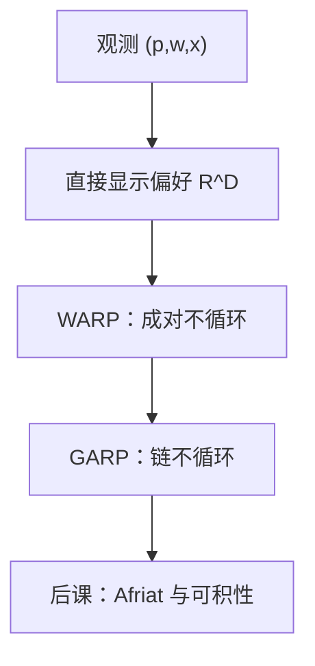

# 显示偏好 WARP

若一束在另一束可买时被选中，则后者不得在前者可买时被选中——选择本身就要遵守这一一致性。

<footer>—— 据 Samuelson, A Note on the Pure Theory of Consumer's Behaviour, Economica, 1938 整理</footer>

上一课[斯勒茨基方程](/econ/slutsky-equation)从已知偏好推出需求的分解与 $S$ 的形状。本课不重讲替代与收入，也不再假设手里已经有 $u$。缺口是：数据往往只有若干组 $(p^t,w^t,x^t)$。若不许先验写出效用，这些选择怎样才算与某一理性偏好相容？第一课说过选择是最大元，方向却一直是「关系 → 选择」。现在要把箭头反过来。

## 问题

马歇尔需求是理论对象。观测是有限次购买。直接估计 $S$ 再检验对称，既要可微单值，又要把噪声当成导数，过强。Samuelson 的弱公理（WARP）只比较成对观测：若 $p^t\cdot x^{s}\le p^t\cdot x^{t}$ 且 $x^{s}\ne x^{t}$，则不得有 $p^{s}\cdot x^{t}\le p^{s}\cdot x^{s}$。白话：选了 $x^t$ 时 $x^s$ 买得起却没选，就不能在另一期反过来。

WARP 是一致性的最低检验。它排除最粗的循环，但不保证存在一个完整的理性偏好能生成全部数据——那需要更强的广义公理（GARP）以及下一课的可积性。本课只把 WARP 钉成显示偏好的第一道筛，并把「直接显示偏好」$x^t\,R^D\,x^s$ 定义为：$x^t$ 被选且 $x^s$ 当时买得起。

### 显示偏好不是心理偏好的照相

$R^D$ 是观测诱导的关系，可能很稀。没被成对比较过的束，模型沉默。从 $R^D$ 取传递闭包得到间接显示偏好 $R$；GARP 说严格显示的循环不允许。WARP 只管两个观测，不管更长的链。后课 Afriat 不等式才把整条链收成一个分段线性效用。

第一课的钱泵是偏好循环。WARP 失败是选择循环：同一套预算数据自己打自己。二者同构，只是原始对象从 $\succsim$ 换成了 $C(B)$。

## 方法

把每期预算超平面画出来。$x^t$ 在 $B^t$ 上。若 $x^s$ 落在 $B^t$ 内部，WARP 要求 $x^t$ 不得落在 $B^s$ 内部或边界上（除二者相等）。几何上，两条预算线不能出现「互相把对方的选择点包在内」的交叉。两商品图上这就是教科书里那张禁止图。

若需求是单值、零次齐次并满足瓦尔拉斯定律，WARP 与「斯勒茨基矩阵负半定」在无穷小处相通：WARP 是有限差分版的负半定。对称性仍缺席——WARP 不强迫交叉替代相等。所以 WARP 过了，仍可能积不出偏好；那是可积性课的缺口。

本课不把选择对应理论整章搬进来。Richter 定理、SAR 与预算之外的菜单，只作为边界：主干仍是价格—数量数据上的 WARP。

## 机制

WARP 把「最大元」改写成可检验语句。无需估计 $u$，也无需假定可微。失败则整套理性加局部非餍足的马歇尔模型被这批数据拒绝——不是某个弹性估错，而是比较关系本身无法嵌进去。通过则只说明这批成对比较没出事，模型尚未被拒绝。

与上一课的分工是：斯勒茨基给光滑需求一个局部形状；WARP 给离散观测一个全局成对约束。二者在正则极限下碰头。经验工作常先做 WARP/GARP 检验，再谈弹性；本课只负责前一半的逻辑。

聚合需求不必满足 WARP。个人 WARP 加总会丢。后课一般均衡用的超额需求另有性质，不要把个人公理直接写到市场上。

## 边界

有限观测使 WARP 的检验力随数据密度而变：预算几乎不相交时，公理很少咬合。测量误差、时间偏好变化、家庭内部加总，都会表现为「失败」，不一定是个人不理性。本栏主干仍用理性作为工作假说；行为偏离是对照。

也不要把显示偏好读成「市场显示了真实价值」。这里没有均衡、没有社会福利，只有一个决策者的预算选择。量化栏的成交与报价是另一套对象。

Afriat 不等式把 GARP 收成可计算的线性约束，下一课才正式写。本课停在 WARP：它是最弱、也最容易在两期图上画出来的筛。家庭作为「一个」决策者已经是加总；若内部谈判不满足 Gorman 条件，WARP 可以对家庭失败而对个人成立。

后课默认：从选择恢复偏好，至少要通过 WARP；完整恢复要 GARP 与可积条件。

## 小结

- 显示偏好把箭头反过来：从 $(p,w,x)$ 约束 $\succsim$。
- WARP 禁止成对循环；GARP 禁止更长的链。
- 它是负半定的有限差分版，但不含对称，故不一定可积。
- 通过只表示未被拒绝，失败则这批数据容不下理性马歇尔需求。
- 出处：Samuelson, *Economica*, 1938；Afriat；Varian, *Microeconomic Analysis*。
