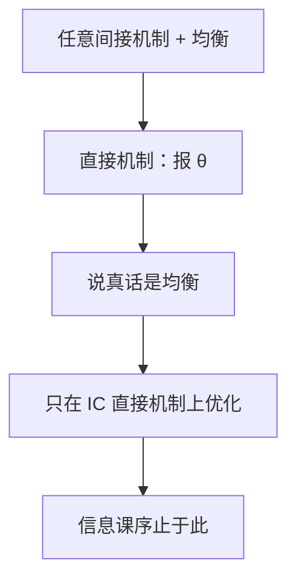

# 显示原理

任何通过博弈实施的激励相容结果，都可以由一个说真话的直接机制复制；设计者只需在直接机制上优化。

<footer>—— Myerson, Incentive Compatibility and the Bargaining Problem, Econometrica, 1979；Gibbard, Econometrica, 1973；Dasgupta, Hammond and Maskin, RES, 1979</footer>

[上一课](/econ/incomplete-contracts)（不完全合同）。在给定的合同形式里写 IC。缺口是：合同可以任意弯——先报价、再抽签、再谈判、再发信号。是否必须在这个大空间里搜？显示原理说不必。把「均衡里人们实际在做的」收成「把类型报给计划者，由计划者执行原均衡结果」，说真话本身是均衡。本课钉这一归约，信息课序结束；下一课程从 GDP 核算另起。

## 问题

机制是一套博弈规则：消息空间 $M_i$，结果函数 $g(m)$。给定先验，BNE 或占优策略均衡给出结果映射 $\theta\mapsto x$。设计者关心的是这个映射（配置、支付），不是消息的名字。[筛选菜单](/econ/screening-rent)、拍卖、公共品的林达尔表，都是某 $M$ 上的机制。

直接机制：$M_i=\Theta_i$，$g$ 直接吃报告。显示原理：若某间接机制有一个均衡实施了映射 $x(\theta)$，则存在直接机制，使说真话是均衡，且实施同一 $x(\theta)$。证明是复制：计划者问类型，模拟各人在原机制均衡里会发的消息，再执行 $g$。偏离直接机制等于在原机制里发了均衡外消息，不会更好。

### 显示不是「人人自动诚实」

原理不说真话是占优，也不说实施无成本。它说搜索可以限在直接、真话 IC 的机制类。真话 IC 仍可能很紧，信息租金、数量扭曲、不可能定理都还在。Gibbard–Satterthwaite 正是在直接机制上证明：非独裁的社会选择，在广泛定义域上无法占优策略实施。

贝叶斯显示原理用 BNE；占优策略显示原理更强，对应优势策略激励相容。拍卖里，Myerson 的最优拍卖在直接机制上对虚拟估值积分，不必枚举所有间接叫价规则。

原理假定设计者能承诺 $g$。若事后可以再谈，代理人会预见到被抽租，间接的分阶段机制可能严格优于一次显示。本课在承诺站住的基准里收束。

## 方法

对象：不完全信息、准线性或一般偏好，共同先验（贝叶斯版）。结论：最优机制 = 在激励相容、可行、参与约束下选直接机制。委托–代理的「合同 $w(x)$」已经是直接的：代理人不报类型（道德风险无类型时），或报类型再配行动（混合模型）。有类型时，先用显示收成 $q(\theta),t(\theta)$，再优化——筛选课其实已经用了本课的结论。

公共品：林达尔价要真实 MRS，显示原理把「任意揭示博弈」收成「报 MRS」，但 IC 会挡住第一最佳（Green–Laffont 等），回到[次优](/econ/theory-of-second-best)与租金。

## 机制

归约能成立，是因为计划者可以内部模拟均衡策略 $\sigma_i(\theta_i)$。代理人没有新的偏离空间：他能对计划者谎报的，不过是假装自己是另一类型，而这正是原均衡里「用另一类型的策略」已经比较过的。故 IC 不等式在直接机制上不多也不少。[筛选](/econ/screening-rent)的菜单、[委托–代理](/econ/principal-agent)的 $w(x)$，其实都已经是直接机制；本课只是把「为什么不必再搜更弯的规则」写成定理。

原理不创造信息。隐藏行动若发生在报告之后，仍要结果合同；显示只收「报告」这一层。动态、多次报告，有动态显示原理，承诺与重新谈判会破坏「一次报完」，本课不展开。信息课序到此工具收齐：BNE、PBE、隐藏类型、隐藏行动、IC 规划。下一课程从核算另起，不再把 GDP 当成某个机制的直接显示。

## 边界

显示原理要求设计者能承诺执行 $g$，不能事后改约。重新谈判、有限承诺，间接机制可能严格优于被显示过的直接机制。多重均衡时，「某一个均衡可显示」不保证所有均衡都说真话；实施理论要更强的条件（Maskin 单调等）。占优策略比贝叶斯更少机制可用。

也不要把显示原理写成宏观或公司金融的资本结构；那些后课程用别的摩擦。本课是博弈与信息主干的最后一课：工具收齐后，配置问题变成带 IC 的规划。

贝叶斯版用 BNE，占优策略版用优势策略 IC。后者更少机制，但执行不依赖先验是否被共同持有。

后课默认：谈机制设计，先写直接机制与真话 IC；再问承诺是否站得住。

### 不可能性不被原理取消

Gibbard–Satterthwaite 在广泛定义域上排除占优策略的非独裁社会选择。贝叶斯 IC 更宽，Myerson 最优拍卖走这一层：先把所有叫价规则收成 IC 的 $Q_i(\theta),t_i(\theta)$，再对虚拟估值优化。选哪一层 IC，是承诺与先验，不是显示原理能决定的。Myerson–Satterthwaite 同样：双边交易不能既有效又自愿又预算平衡；间接机制救不了直接机制做不到的事。柠檬关闭、竞争保险无均衡，都与可行 IC 配置集太小一致。

无承诺、合谋、事后谈判会让间接机制严格优于被显示过的直接机制。下一课程从 GDP 三种算法另起，不再把国民核算当成某个直接机制的真话显示。

筛选菜单、委托–代理的 $w(x)$ 其实都已经是直接机制；本课只把「不必再搜更弯的规则」写成定理。

## 小结

- 间接机制的均衡结果可由说真话的直接机制复制。
- 设计者只在 IC 直接机制上优化；不消除租金与不可能。
- 需要承诺执行；重新谈判可打破归约。
- 信息课序在此收束，核算课序另起。
- 出处：Gibbard, 1973；Dasgupta–Hammond–Maskin, *RES* 1979；Myerson, *Econometrica* 1979。
