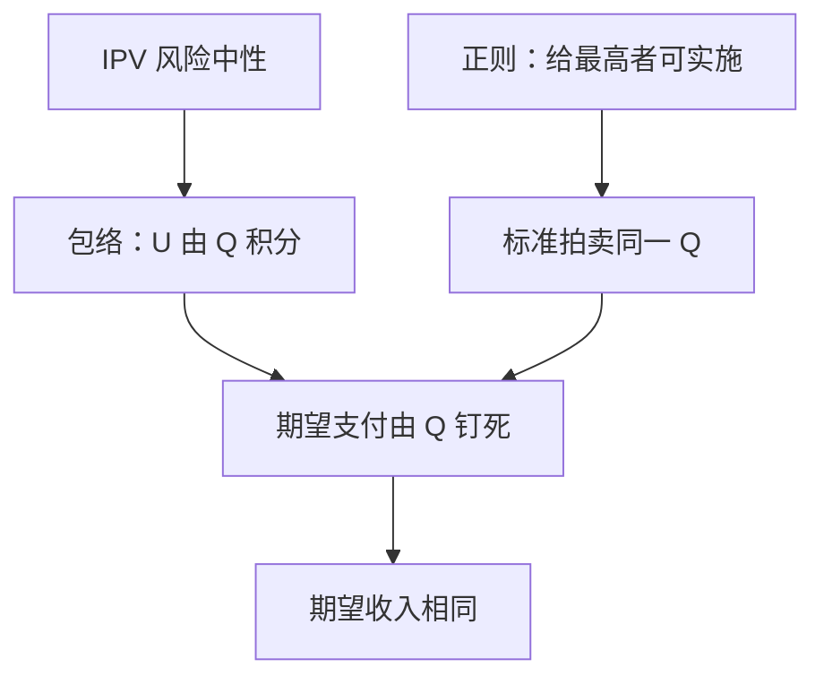

# 收入等价

在独立私人价值与正则条件下，凡把物品交给最高估值、且最低类型期望支付相同的标准拍卖，卖家期望收入相同。

<footer>—— Myerson, Optimal Auction Design, Mathematics of Operations Research, 1981；Riley and Samuelson, Optimal Auctions, AER, 1981</footer>

[上一课](/econ/auction-reserve)（保留价）。钉了二价：占优策略报真值，卖家拿到第二高估值。缺口是一价、荷兰、英式（IPV 下）看起来完全不像，期望收入却可以一样。本课用包络把支付钉死在配置规则上，不把共同价值写成赢家诅咒，也不把最优拍卖写成虚拟价值熨平。

## 问题

独立私人价值（IPV）：$v_i$ 独立同分布，风险中性，拟线性。机制给每人赢得概率 $Q_i(v_i)$（对其余类型取期望）与期望支付 $t_i(v_i)$。激励相容要求类型 $v$ 宁可报自己，不报 $v'$。把间接叫价收成直接机制之后，局部 IC 变成包络：期望租金

$$
U(v)=U(\underline v)+\int_{\underline v}^{v}Q(s)\,ds.
$$

期望支付因此被 $Q$ 与边界 $U(\underline v)$ 钉死：$t(v)=vQ(v)-U(v)$。两套规则若对每个类型给出同一 $Q$、同一 $U(\underline v)$，则每个类型的期望支付相同，卖家期望收入相同。这就是收入等价。

正则：虚拟价值 $\varphi(v)=v-(1-F(v))/f(v)$ 非降。此时「把物品给最高估值」本身可实施，不必熨平。标准拍卖——一价密封、二价、英式、荷兰——在无保留价（或同一保留价）时都把物品给最高 $v$，最低类型支付为零，故期望收入相等。

### 等价的是期望，不是路径

二价路径上付第二高，一价付自己的叫价。路径不同，对 $F$ 取期望后相同。风险厌恶、关联价值、预算约束都会打破这句话。

Riley–Samuelson 把「标准拍卖」写成带保留价的对称规则；Myerson 把同一包络写进任意直接机制。后课虚拟价值要优化 $Q$，本课只先承认：$Q$ 一固定，收入不再有自由度。

保留价相同才比较。提高保留价改变 $Q$（低类型不再赢），收入可以升，那是换了一条配置规则，不是否定等价。
对称 IPV 是关键：非对称分布下，一价与二价的 $Q$ 可以不同，收入不必相等。

## 方法

对象：对称 IPV、风险中性、$n$ 人、单物品。先写直接机制的 IC 积分，再核对四类标准拍卖的 $Q$：对称递增均衡里最高估值者赢。边界条件：不参与者或 $\underline v$ 的期望支付为零。于是收入相等。

计算不必再解一价的微分方程来「验证」二价：包络已经把答案写在 $Q$ 上。一价均衡叫价 $b(v)=\mathbb{E}[v_{(2)}\mid v_{(1)}=v]$，其期望恰好等于二价的期望第二高，这是等价的一条推论，不是另一条定理。

## 机制

IC 只约束「多报一点」的边际收益必须等于多赢的概率。积分之后，水平由最低类型钉住。卖家能选的只剩配置 $Q$ 与保留价（它改 $Q$ 与 $U(\underline v)$）。支付规则只是实施 $Q$ 的一种会计：一价把支付写在自己的叫价上，二价写在对手上，期望对同一 $Q$ 没差别。

这与完全信息伯川德不同：这里竞争的是类型依存策略，收入由估值分布的顺序统计量决定，不是由边际成本。正则保证我们讨论的「标准」配置恰好是有效配置；不规则时有效配置不必可实施，等价仍对「同一 $Q$」成立，只是那条 $Q$ 不再是「总给最高者」。

## 边界

关联或共同价值下，赢本身是坏消息，包络里多了一项条件期望，英式与密封的联动不同，收入等价失败——下一课。风险厌恶时一价通常比二价收入高（买家更怕输）。多人多物品、组合拍卖，等价要对每个数量坐标写包络，本课不写。

也不要把收入等价写成限价簿价差或做市价差：这里没有存货与方向性私人信息，只有 IPV 拍卖的期望会计。

后课默认：IPV 正则下，比较标准拍卖只需看 $Q$ 与保留价；要拉开收入，必须改配置、改信息结构，或离开 IPV。

### 保留价改的是 Q，不是会计花样

同一保留价 $r$ 下，一价与二价仍等价。最优 $r$ 满足 $\varphi(r)=0$，那是后课虚拟价值的一句话，本课只需：改 $r$ 就是改 $Q$。人数 $n$ 进入顺序统计量，收入随 $n$ 升，但一价与二价一起升。

收入等价不说「所有拍卖一样好」。效率、事后方差、合谋难度、风险分担都可以不同；相等的只是风险中性卖家的期望收入。

## 小结

- IPV 下 IC 的包络把期望支付钉在 $Q$ 与边界租金上。
- 正则时标准拍卖实施同一「给最高者」，期望收入相同。
- 等价是期望，不是路径；关联与风险厌恶会打破它。
- 要优化收入，必须改 $Q$，那是虚拟价值课。
- 出处：Myerson, *Math. Oper. Res.* 1981；Riley and Samuelson, *AER* 1981。
