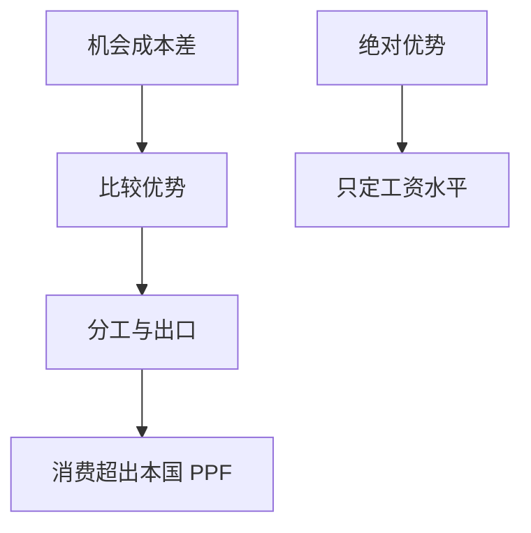
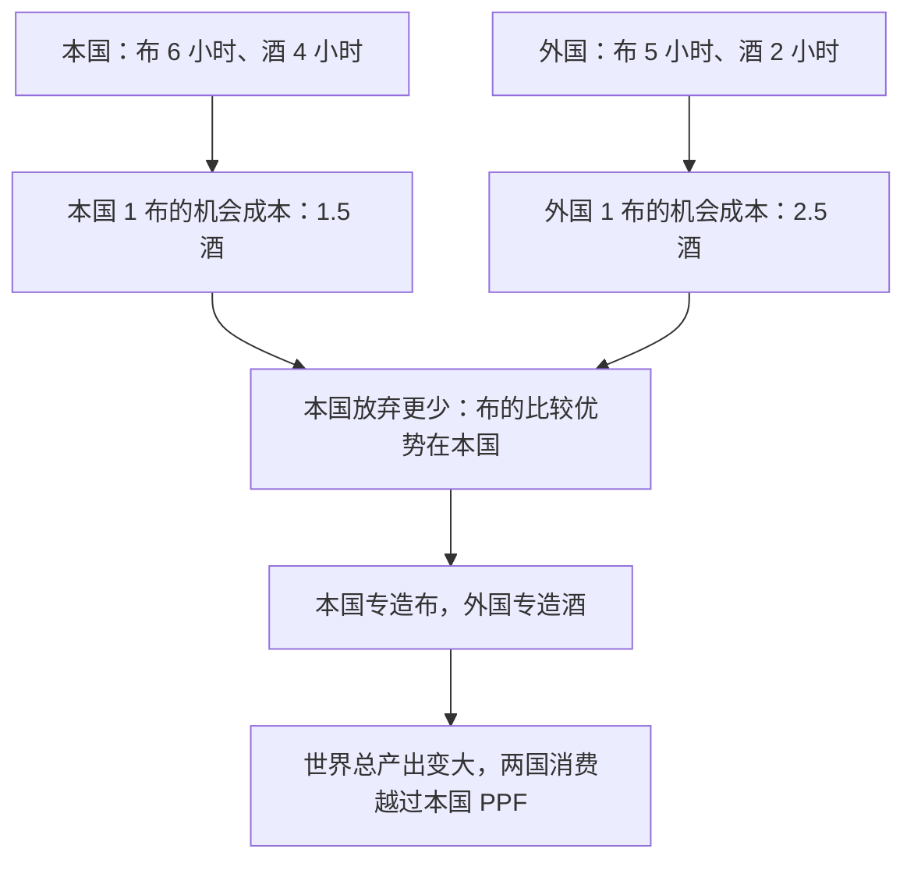

# 李嘉图比较优势

一国可以在所有产品上都更差，仍应出口相对更不差的那种；贸易的增益来自机会成本差，不是绝对成本差。

<footer>—— Ricardo, On the Principles of Political Economy and Taxation, 1817</footer>

[上一课](/econ/multi-period-consumption-portfolio)把消费–组合收回到离散多期，信息、流动性与无套利课程就此收束：信息核、无套利核、摩擦核、组合核已经对齐。本课是「贸易与国际金融」的第一课，换对象：为何交换、资本如何流。开放宏观主干已经有[经常账户](/econ/open-ca)与三角，但没有把**货物如何在两国间分工**写成理论。后课默认已经读完：比较优势是机会成本，不是「谁更勤劳」。

## 问题

两商品、两国家、劳动一种要素、规模报酬不变。本国两种产品的劳动投入 $a_{L1},a_{L2}$，外国 $a_{L1}^*,a_{L2}^*$。绝对优势是 $a_{Li}\lt a_{Li}^*$。比较优势是相对

$$
\frac{a_{L1}}{a_{L2}}\lt \frac{a_{L1}^*}{a_{L2}^*},
$$

即本国产 1 的机会成本更低。即便 $a_{L1}\gt a_{L1}^*$ 且 $a_{L2}\gt a_{L2}^*$，只要不等式成立，本国仍应出口 1。缺口不是再讲开放会计，而是：贸易增益来自**相对**劳动生产率，闭关等于强迫每个经济体按本国消费比例生产，把机会成本差浪费掉。

机会成本翻译成大白话：多造 1 单位布，就得少造多少酒。比较优势问的不是「谁造得快」，而是「谁放弃得少」。两国各盯住自己放弃得少的那样东西去生产，交换后的总盘子比各自硬撑着两样都造要大。

葡萄牙与英格兰的呢绒–葡萄酒是李嘉图的例子。现代写法用单位劳动需求 $a_{Li}$。Dornbusch–Fischer–Samuelson 把连续商品写进同一逻辑，本课先停在两商品。

## 方法

封闭时相对价格钉在机会成本上。开放、零运输成本、完全竞争：世界相对价格夹在两国机会成本之间（大国可影响世界价格，小国接受世界价格）。完全分工（除非世界价格刚好等于某国机会成本）。劳动在国内可流动、国际不可流动——要素下一课才跨境含义。福利：两国消费可能超出本国生产可能集，贸易是一种技术。

```mermaid
flowchart TD
  OC["机会成本差"] --> CA["比较优势"]
  AA["绝对优势"] --> WAGE["只定工资水平"]
  CA --> SPEC["分工与出口"]
  SPEC --> GAIN["消费超出本国 PPF"]
```

计量课的因果语言在此用不上：这是均衡比较静态，不是 ATT。后课 China shock 才会把贸易暴露当处理。

## 机制

机制是相对价格。贸易把本国稀缺的那种机会成本「进口」进来。工资由绝对优势定水平：两国都生产时，工资比等于绝对劳动生产率比；完全分工时工资比落在一个区间。绝对落后的国家工资更低，正是它出口比较优势产品的通道，不是「不该贸易」的理由。

数字实例：设本国造 1 单位布要 6 小时、1 单位酒要 4 小时；外国只要 5 小时与 2 小时。外国样样更快（绝对优势），但 1 单位布在本国相当于放弃 1.5 单位酒，在外国相当于放弃 2.5 单位酒——本国造布「放弃得少」，于是布由本国出口，酒由外国出口。

```mermaid
flowchart TD
  H["本国：布 6 小时、酒 4 小时"] --> HC["本国 1 布的机会成本：1.5 酒"]
  F["外国：布 5 小时、酒 2 小时"] --> FC["外国 1 布的机会成本：2.5 酒"]
  HC --> CMP["本国放弃更少：布的比较优势在本国"]
  FC --> CMP
  CMP --> SPEC["本国专造布，外国专造酒"]
  SPEC --> GAIN["世界总产出变大，两国消费越过本国 PPF"]
```

与[开放经常账户](/econ/open-ca)：李嘉图是实物分工，可以发生在平衡贸易上。$CA\neq 0$ 是跨期，不是比较优势的必要条件。本课默认平衡贸易，把跨期留给国际金融续。

比较成本不是劳动价值论的复活课。现代转述只用机会成本与 PPF。Mill、Marshall 补需求边决定贸易条件；本课供给边先钉住。

## 边界

一种要素解释不了要素密集度与收入分配——那是 Heckscher–Ohlin 与 Stolper–Samuelson。规模报酬与差异产品是 Krugman。异质企业是 Melitz。运输成本一高，分工区间缩小，不必到零贸易。本课不估贸易弹性，不把引力方程提前写完。

直觉类比：一位律师自己修水管可能比水管工还快（绝对优势），但律师的一小时值几百块，修水管要搭进去的时间太贵，所以仍然雇水管工，自己去做案子。每个经济体都在做同样的算账：把劳动放在「放弃最少」的用途上，剩下的靠交换。

后课默认：两国交换的最低理由是机会成本差；绝对劣势不禁止出口。要素禀赋下一课。不要用「我们什么都更贵所以不该开放」当政策句——那是把绝对优势误读成比较优势。

## 小结

- 比较优势是相对机会成本，不是绝对生产率。
- 开放相对价格夹在两国成本之间，导致分工。
- 工资水平跟绝对优势走；贸易增益跟相对优势走。
- 平衡贸易即可；经常账户是另一套跨期。
- 出处：Ricardo, *Principles* 1817；Dornbusch–Fischer–Samuelson 连续商品推广。
