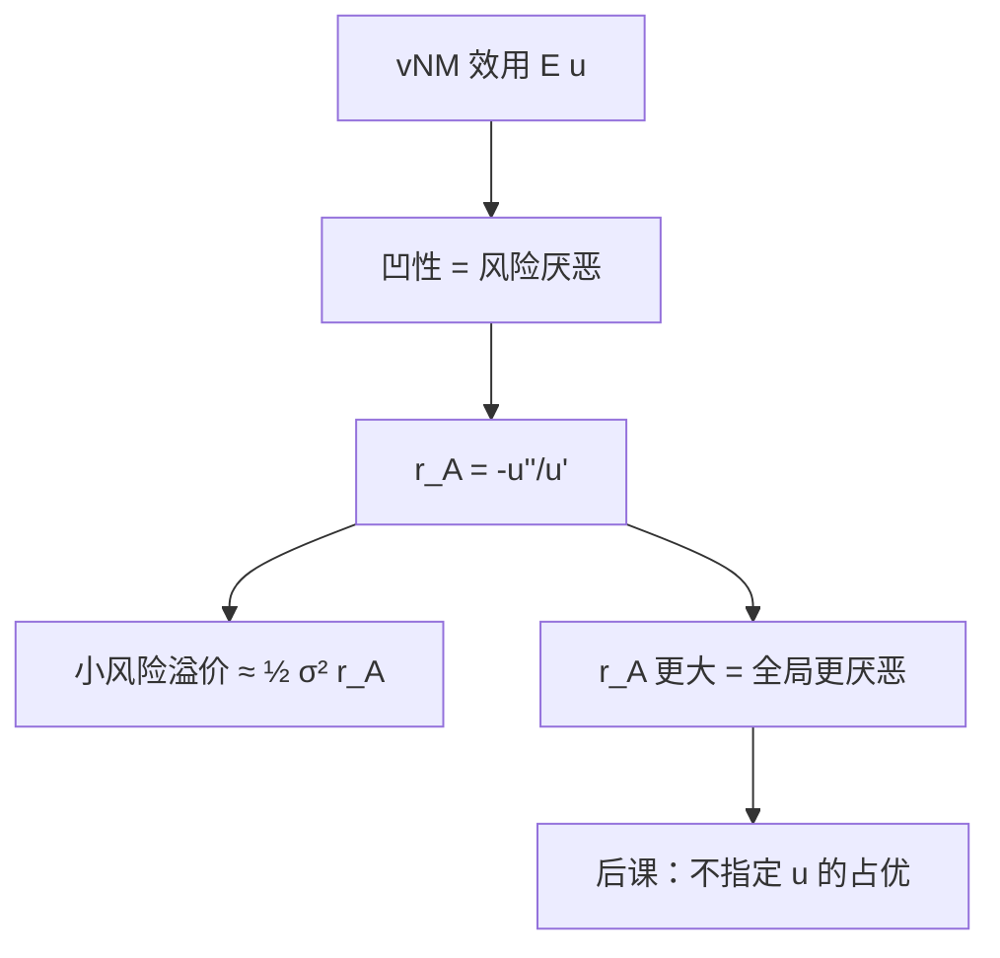

# 风险厌恶与阿罗–普拉特

绝对风险厌恶 $-u''(w)/u'(w)$ 度量为避开无穷小风险所要求的溢价；它在仿射变换下不变。

<footer>—— 据 Pratt, Risk Aversion in the Small and in the Large, Econometrica, 1964；Arrow, Essays in the Theory of Risk-Bearing, 1971 整理</footer>

上一课[阿莱悖论与独立性](/econ/allais-independence)标明独立性在问卷上脆，但主干仍用 $\mathbb{E}u$。本课不重讲阿莱四张彩票，也不再证明 vNM 表示。缺口是：有了伯努利 $u$，怎样比较「更厌恶风险」？仿射变换会改 $u''$，不能直接看二阶导数的数字。必须找出在 $au+b$ 下不变、又能对应风险溢价的局部测度。

## 问题

风险厌恶的定义先不依赖微积分：对一切风险 $\tilde\varepsilon$ 且 $\mathbb{E}\tilde\varepsilon=0$，

$$
\mathbb{E}\,u(w+\tilde\varepsilon)\le u(w).
$$

即确定的期望财富不差于风险本身。Jensen 不等式说这等价于 $u$ 凹。凹是整体性质，后课保险、资产需求还要问「厌恶多少」以及「随财富如何变」。缺口是把凹性量化成一个函数 $r_A(w)$，使小风险的溢价 $\pi$ 满足 $\pi\approx\tfrac12\sigma^2 r_A(w)$。

Pratt 给出绝对风险厌恶 $r_A(w)=-u''(w)/u'(w)$，相对风险厌恶 $r_R(w)=-w u''(w)/u'(w)$。二者在正仿射变换下不变，这正用上了 vNM 的基数性。没有上一课钉死的仿射唯一性，这两个比没有定义。

### 小风险溢价是局部，大风险要整体凹

二阶泰勒把小噪声的确定性等价值写成方差乘 $r_A$。大风险不能只看一点的 $r_A$：Pratt 证明 $r_A$ 处处更大当且仅当对一切风险要求更高溢价。局部测度与全局比较在这个意义上对齐。本课不把各种 $u$ 的函数形式列成表，只钉比较原则。

DARA（$r_A$ 随财富下降）意味着风险资产是正常品：更富则多持绝对风险。CRRA 常作基准，不是经验定律。

## 方法

给定两次可微、严格递增的 $u$，计算 $r_A$、$r_R$。比较两个决策者：若 $r_A^1(w)\ge r_A^2(w)$ 对一切 $w$，则 1 对同一风险的溢价更高，且 1 的 $u$ 是 2 的凹变换。这是 Pratt 的等价刻画，把「更凹」从任意单调凹变换里收成可比的一条。

保险：公平保费下，严格风险厌恶者充分投保。不公平加载下，最优留下正的保留风险，$r_A$ 决定自留多少。本课只写到这个接口；最优保单的形态还要随机占优与状态依存才能说清。

期望值—方差分析只在 $u$ 二次或风险无穷小时与 $r_A$ 一致。二次效用有递增的 $r_A$ 且存在餍足，主干不当成一般风险偏好。

## 机制

$r_A$ 把「弯曲程度」从刻度里抽出来：$u'$ 在分母上抵消仿射因子，$u''$ 的符号给出凹凸。财富进入 $r_R$，因为同一绝对噪声对穷人更重。后课资产定价若写 CRRA，其实是在选一条 $r_R$ 为常数的伯努利函数，以便加总或写欧拉方程；那是宏观课的用法，本课只提供这个函数从哪来。

与阿莱的关系：凹性是 vNM 内部的形状，独立性是表示能否成立。问卷违背独立性时，$r_A$ 随框架变，测到的不是稳定的风险态度。市场与保险理论仍按凹 $u$ 走，是规范与工作假说，不是对阿莱的否定。

不要把 $r_A$ 写成限价簿里的风险限额。微观结构的库存风险是量化栏的对象；这里是状态上的财富效用。

## 边界

$r_A$ 需要二阶可微。折拐的 $u$（例如分段线性）仍可风险厌恶，但局部溢价公式失效，要用超微分。多维风险、背景风险会改变有效 $r_A$，本课不展开。也不处理模糊厌恶：概率未知时没有 $\mathbb{E}u$ 可凹。

随机占优下一课要问：不指定某一个 $u$，只知道一类凹函数，能否给分布排序。那是把本课的「给定 $u$」放宽成「所有风险厌恶者」。

背景风险、不可保的劳动收入，会改变有效 $r_A$：人对可交易风险的态度不再等于实验室里的 $u$。本课只在单一财富风险上定义测度。也不把 $r_A$ 写成做市商的库存惩罚——那是量化栏。

后课默认：风险厌恶即 $u$ 凹，强度用 Arrow–Pratt 比较。

## 小结

- 风险厌恶等价于伯努利函数凹；强度用 $r_A$、$r_R$，仿射不变。
- 小风险溢价由方差与 $r_A$ 决定；全局比较靠 $r_A$ 点点更大。
- 公平保险充分投保；加载下自留风险由 $r_A$ 调节。
- 阿莱打的是独立性，不是凹性本身。
- 出处：Pratt, *Econometrica*, 1964；Arrow, *Essays in the Theory of Risk-Bearing*；Mas-Colell, Whinston and Green 第 6 章。
