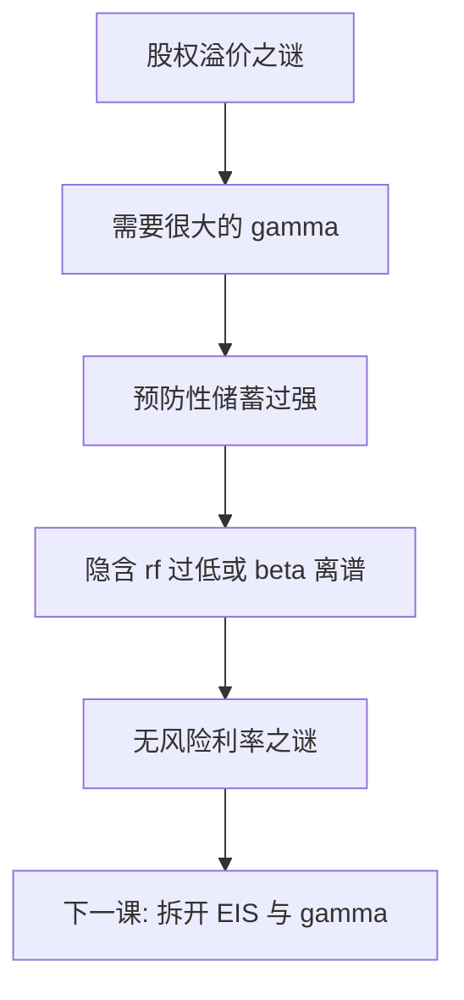

# 无风险利率之谜

为匹配股权溢价而抬高的风险厌恶，会通过预防性储蓄把无风险利率压得过低，除非再把时间偏好调到难以置信的区域。

<footer>—— Weil, The Equity Premium Puzzle and the Risk-Free Rate Puzzle, Journal of Monetary Economics, 1989</footer>

[上一课](/econ/equity-premium-puzzle)用总量 CRRA 核匹配不了股票对国债的超额，除非 $\gamma$ 极大。Mehra–Prescott 已经点过孪生约束。本课缺口是把孪生写死：高 $\gamma$ 如何搞坏 $r_f$。Weil（1989）把两谜并读。不重做 HJ 界，不把谜写成「国债永远贵」。

## 问题

CRRA 且时间可分时，同一 $\gamma$ 既是相对风险厌恶，又是跨期替代弹性（EIS）的倒数。高 $\gamma$ 让 $m$ 对消费波动极敏感：预防性储蓄强，消费者愿意为平滑而接受很低的无风险利率。观测到的平均短期实际利率并不那么低——或者说，要用高 $\gamma$ 配溢价，往往还得 $\beta\gt 1$（负的时间偏好）才能把 $r_f$ 抬回样本。Weil 称之为无风险利率之谜：股权溢价之谜的解在同一偏好里制造新的失败。

缺口不是再校准股票超额的基点，而是：时间可分 CRRA 把两个矩绑在一个参数上，两个矩一起拒绝。下一课 Epstein–Zin 正是为了把 EIS 与 $\gamma$ 拆开。

$r_f\approx -\ln\beta+\gamma\mathrm{E}[\Delta c]-\frac12\gamma(\gamma+1)\sigma^2(\Delta c)$ 一类对数近似：均值增长抬高 $r_f$，预防性项压低 $r_f$。高 $\gamma$ 让第三项主导，与样本 $r_f$ 冲突。

## 方法

代表性主体、完全市场、总量消费。欧拉同时定价股票与无风险债券。Mehra–Prescott 已经显示常规 $\gamma$ 给不出溢价。Weil 加上：把 $\gamma$ 顶到能配溢价的区域，则 $r_f$ 的水平（或 $\beta$ 的隐含值）不可接受。两谜是同一 $m=\beta(c_{t+1}/c_t)^{-\gamma}$ 的两道矩。

候选出路若仍用时间可分 CRRA，只是在两个矩之间挪椅子。真正换椅子的是改偏好（递归、习惯）或改消费过程（长期风险、灾难）。本课不展开修补，只把绑死写清。

### 不是「国债便利收益」综述

观测 $r_f$ 还可以含流动性、安全资产便利、管制。那些是后补摩擦，可以改变谜的量级。Weil 的靶子是纯消费核：即便把债券当净无风险的消费要求权，CRRA 已经 internally inconsistent。本课禁止用便利收益表改写 1989 年的并读。

## 机制

机制是预防性储蓄与增长之间的拔河。消费者厌恶消费波动，愿意买保险（无风险债券），压低 $r_f$。经济增长使未来更富，想把消费提前，抬高 $r_f$。CRRA 让厌恶越强，保险动机越强，而且 EIS 越低（越不愿跨期替代），增长项与预防项的相对力量被同一 $\gamma$ 锁死。样本里增长温和、消费平滑、溢价却大——三件事在一个参数下不能同时真。

HJ 会计仍然成立：$\sigma(m)$ 必须大。Weil 说的是：用 $\gamma\sigma(\Delta c)$ 去造这个 $\sigma(m)$ 时，$E[m]$（即 $r_f$）会被一起造坏。

Weil, *JME* 1989。样本起点与事前溢价会改「离谱」的程度；定性结论对时间可分 CRRA 足够稳。本课不争论基点。

## 边界

不要把谜写成「快空国债」或「股票被永久误定价」。它可以是偏好错、测量错、或样本里缺少灾难。也不要把高 $\gamma$ 当成已接受——微观风险厌恶与本课的 $r_f$ 一起拒绝它。下一课 [递归效用](/econ/recursive-utility)拆 EIS 与 $\gamma$；拆开并不自动同时解决两谜，但不再用一个旋钮拧两道矩。

后课默认：股权溢价与无风险利率是同一 CRRA 核的孪生拒绝。存在 $m$ 仍成立；失败的是 $m\propto c^{-\gamma}$ 且 EIS$=1/\gamma$。

因子实证、期限溢价估计换栏。本课不到限价簿上读隔夜利率。

安全资产便利、监管对国债的强制持有，会把观测 $r_f$ 再压一截，谜的定量更刺或更模糊，取决于你把便利放进不放进「无风险」。Weil 的逻辑在抽出便利之前已经内部不一致。本课不把便利收益做成主线。

递归效用下一课拆开 EIS 与 $\gamma$。拆开之后仍可能配不齐两个矩，但不再是同一个旋钮的算术失败。

## 小结

- 高 $\gamma$ 配溢价会经预防性储蓄压坏 $r_f$，或迫使 $\beta$ 离谱。
- 两谜源自时间可分 CRRA 把风险厌恶与 EIS 绑死。
- 出路是改偏好形状或改消费过程，不是把 HJ 会计作废。
- 安全资产便利可以改变量级，但不取消 1989 年的内部不一致。
- 下一课 Epstein–Zin 把 EIS 与 $\gamma$ 拆开。
- 出处：Weil, *JME* 1989；对照 Mehra and Prescott 1985。
