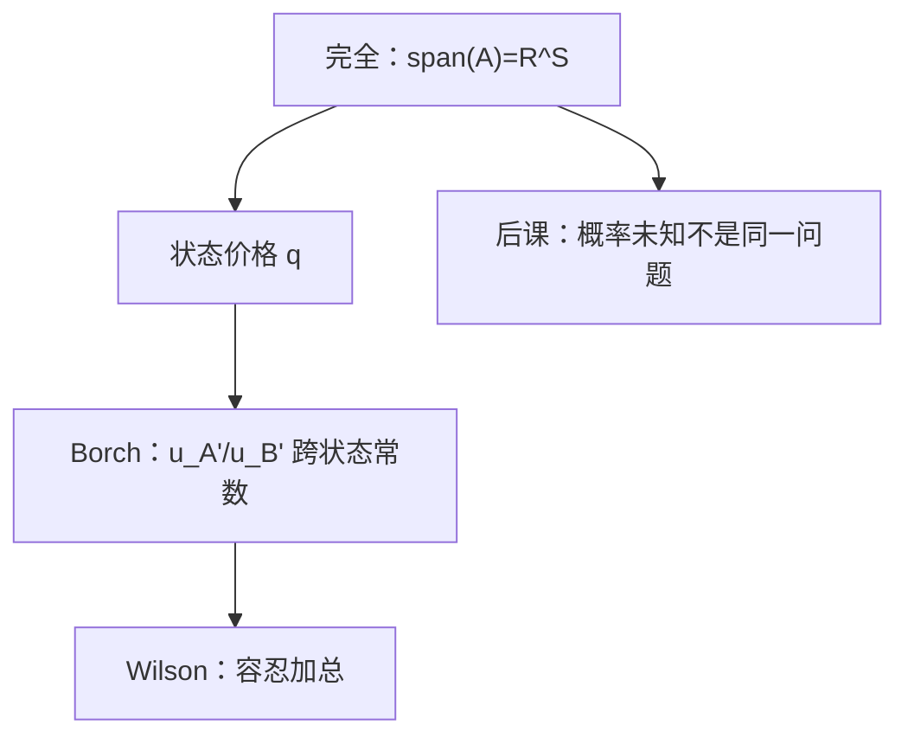

# 风险分担

    
帕累托最优的保险，是让每个人的边际效用在同一状态下成比例——再保险市场把这条规则标成价格。

    <footer>—— 据 Borch, Equilibrium in a Reinsurance Market, Econometrica, 1962；Wilson, The Theory of Syndicates, Econometrica, 1968 整理</footer>

[上一课](/econ/complete-span)把完全市场收成 $\mathrm{span}(A)=\mathbb{R}^S$。本课不重写秩与无套利，也不把收益矩阵再排一遍。缺口是：张成只保证任意或有束买得到，没有说出**谁在哪个状态吃多少**才是帕累托。状态依存课已经出现 MRS 对齐；本课把对齐收成 Borch 规则，并标明它依赖完全市场。

## 问题

两人、有限状态、共同信念 $\pi$，合计禀赋 $\omega_s=x_s^A+x_s^B$。帕累托要求不存在再分配使一人严格更好、另一人不更差。在期望效用下，这不是「每人各买各的保险」，而是状态之间的共同承担。缺口是 Borch 的一阶条件：存在权重 $\lambda>0$，使对一切 $s$，

$$
\frac{u_A'(x_s^A)}{u_B'(x_s^B)}=\lambda,
$$

即状态间的边际效用比是常数。等价地，两人的 MRS 对齐，且等于完全市场上的状态价格比 $q_s/q_t$——上一课的 $q$ 在这里第一次被用来执行分担，而不是只用来定价证券。

Wilson 的辛迪加：许多风险厌恶者合成一个代表人，$u_*$ 的绝对风险容忍 $1/r_A$ 在加总上等于各人容忍之和（权重合适时）。本课只取这条加总含义，不把代表人写成宏观完整理论。

### 公平保险全额投保是 Borch 的特例

单人对公平定价的可保风险充分投保，来自[风险厌恶](/econ/risk-aversion)的凹性。那是「把风险全部交给风险中性的保险人」。Borch 覆盖双方都凹：风险不消失，按 $1/r_A$ 分摊。不要把「最优分担」读成「每人方差最小」——那是均值方差刀刃，不是本课。

共同信念下，Borch 不要求每人持有同一数量。更厌恶的人（$r_A$ 更大）在总量波动里承担更小的份额。异质信念会把分担与投机缠在一起，本课不走。

## 方法

完全市场上，每人解 $\max\mathbb{E}u_i(x^i)$ s.t. $q\cdot x^i=q\cdot\omega^i$。一阶条件 $\pi_s u_i'(x_s^i)=\mu_i q_s$。消去 $\mu_i$ 即 Borch。市场出清 $\sum_i x_s^i=\omega_s$ 把总量风险留给加总；个人风险在可保的方向上被对冲掉。

不完全时，上一课的正交补无法交易，Borch 只在 $\mathrm{span}(A)$ 的坐标上成立，未张成的冲击各人吞下自己的禀赋。本课主干写完全这一端，把不完全当刀刃。

本课不引入道德风险。隐藏行动会让「按状态支付」写不成，分担规则改成信息课的次优合同。也不把再保险写成限价簿上的合约清单。

## 机制

为什么边际效用成比例：若某状态里 $A$ 的 $u'$ 相对 $B$ 过高，把一单位消费从 $B$ 挪到 $A$ 可帕累托改进。完全市场提供挪动的工具（复制任意方向）。价格 $q_s$ 高的状态是总量穷的状态：所有凹 $u$ 一起收紧，这与 SOSD/MPS 一致——总量展形伤害所有风险厌恶者，分担改变的是**谁承担多少**，不是展形本身。

CARA 给出线性分担：每人拿总量的固定份额加一笔状态无关的转移。CRRA 给出对总量的常弹性分担。形状课的函数形式在这里第一次变成可加总的规则。

Borch 1962 的对象是再保险：保险人之间交换风险。规则与 Arrow 证券上的帕累托最优是同一套一阶条件，不必另起「保险哲学」。

## 边界

异质概率、背景不可保风险、参与约束，都会打断简单的 Borch 常数。模糊下一课会说：没有 $\pi$ 则没有 $\mathbb{E}u$ 可分担。主干仍用客观 $\pi$ 与完全市场。

加总代表人需要财富分配与形状配合（如 Gorman、CRRA 同权）。Wilson 不是无条件的「市场有一个 $u$」。也不要把最优分担写成限价簿两边量能匹配——那是微观结构，这里是或有商品的帕累托。

后课默认：完全市场下的帕累托风险分担即 Borch 规则；不完全则规则只在张成子空间上成立。

## 小结

- 张成保证能买到；Borch 说出帕累托时各状态如何分。
- 共同信念下 $u_A'/u_B'$ 跨状态为常数，并由 $q$ 执行。
- 双方都凹则风险按容忍分摊，不是消灭风险。
- 下一课标明：未知概率不是本课这种风险。
- 出处：Borch, *Econometrica*, 1962；Wilson, *Econometrica*, 1968。
