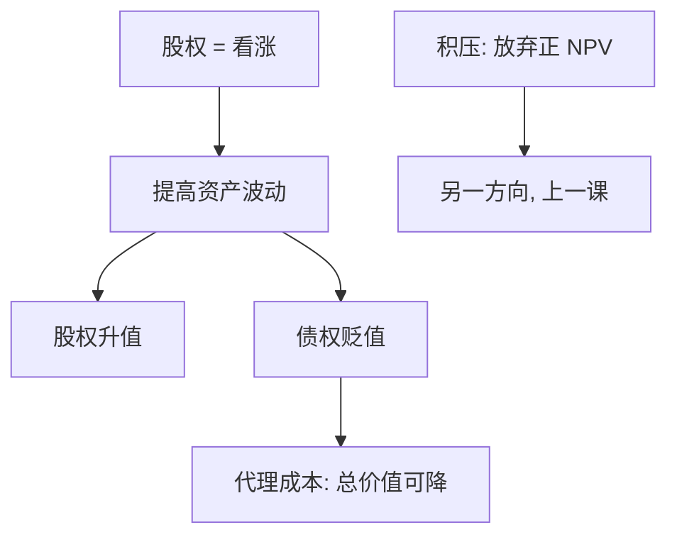

# 风险转移

股权是对企业资产的看涨期权；加大资产波动，期权更贵，债权人承担下行——这是资产替代，不是投资不足。

<footer>—— Jensen and Meckling, Theory of the Firm: Managerial Behavior, Agency Costs and Ownership Structure, Journal of Financial Economics, 1976</footer>

[上一课](/econ/debt-overhang)给出股东放弃正 NPV 的积压。同一张看涨期权还有另一面：不放弃行权，而是改项目分布，把方差加大。本课缺口是 Jensen–Meckling 的资产替代（风险转移）。不重推 Myers 的增长期权税，不把优序提前。

## 问题

积压是「好项目也不做」。观察上杠杆企业也可以做得更险：合并风险业务、减少对冲、把安全资产换成彩票。Jensen 与 Meckling（1976）把股权写成看涨：面值是执行价，资产是标的。期权对波动升值，债权对波动贬值。经理若代表股东，就有激励在债务已定价之后把资产变险——风险从债转移到股。

缺口是把权衡右边的事前间接再补一条，方向与积压相反：一个是投资过少，一个是风险过多。债权人若预期到替代，会在事前利率里收费，杠杆的好处再被削一截。下一课优序换信息不对称下的发行顺序，不再增加代理扭曲的品种。

资产替代、风险转移、赌大的：同一机制。对象是已有债的持有期里改变资产方差，不是发行时的柠檬折价。

## 方法

把杠杆企业的股权价值当看涨期权（Merton 结构模型的精神，本课不估信用利差）。波动上升，股权升、债降，企业总价值可以因错误项目而下降，但股权仍升——转移成功。约束：债契约、保护性条款、短期滚动、可转债，都能削弱激励。Jensen–Meckling 同时写经理–股东冲突（在职消费）；本课只取股东–债权人这一刀，以免与自由现金流课抢定义。

积压与转移可以共存：安全的正 NPV 被放弃，彩票项目被接受。权衡若只盯立案费用，两条都漏。

### 保险期权与本课同构

存款保险课会把看跌写在保险基金上。这里看跌的对手是私人债权人。机制同构：下行外包，上行留下。不要把两课合成一句「杠杆总是赌」——对手方不同，约束不同。

## 机制

机制是有限责任加不可签约的投资分布。合同很难写死「方差上限」：项目选择、对冲、会计科目都可以改风险。债一旦借出，再谈判成本高，股东的最优是把财富从债口袋挪到股口袋。事前，债权人要求更高利息或更严条款，把预期转移写进价格，于是 $V_L$ 相对无摩擦下降——这是代理成本，不是税收。

与 Myers 积压的对照：积压发生在需要**新股权**去执行好期权时；转移发生在**已有资产**可被替换时。一个要股东掏钱，一个要股东换彩票。条款设计对两者的药不同：缩短期限、抵押、可转债（后课 Stein）对转移更直接。

Jensen and Meckling, *JFE* 1976。看涨类比是教学装置；不必在此校准隐含波动。信用利差的结构模型实证换栏或不做，本课只要激励方向。

## 边界

不要把所有高风险企业都叫风险转移：成长企业方差大可以是技术，不是为了掏债权人。也不要把资产替代写成交易员的限价簿策略。下一课 [优序融资](/econ/pecking-order)换柠檬：经理相对市场的信息，而不是股东相对债权人的期权。

后课默认：杠杆股权有激励加大资产风险；债权人事前收费。积压与转移是间接困境成本的两个方向，直接律师费仍往往不够挡税盾。

MM 无摩擦世界里没有转移：条款可无成本写死，或再谈判到第一最佳。本课的对象是写不完、谈不成的分布。

可转债、认股权证让债权人分享上行，转移的好处变小；这是后课 Stein 的旁支，本课先把看涨激励钉在普通债上。抵押把方差锁在特定资产上，替代空间变窄，却把火线出售的对象写得更清楚。

优序下一课换的是经理对市场的柠檬，不是股东对债权人的期权。两套信息不对称不要写成一句。

## 小结

- 风险转移：股权作为看涨，激励在债已定价后加大资产波动。
- 与债务积压方向相反：一个放弃好项目，一个接受更险的项目。
- 条款与期限是约束，不是把代理成本从权衡里删掉。
- 下一课优序换经理对市场的柠檬，不再增加股东–债权人扭曲的品种。
- 可转债分享上行，是后课对转移的合同补丁，不是本课主线。
- 出处：Jensen and Meckling, *JFE* 1976；对照 Myers 1977。
