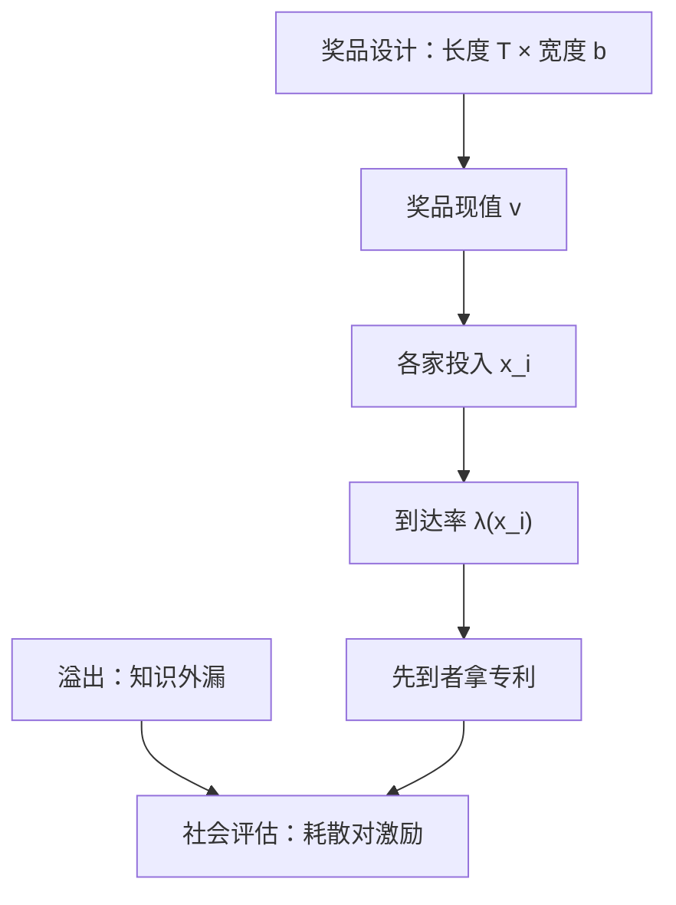

# 研发竞赛与专利

专利用一段暂时的排他权买持续的发明；竞赛里烧掉的是所有参赛者的投入，留下的只有一个赢家和一纸排他。

<footer>—— 据 Dasgupta and Stiglitz, Bell Journal 1980；Gilbert and Shapiro, AER 1990 整理</footer>

[上一课](/econ/predation-exclusion)把产业组织主干收束在「谁在场」上：完全资本市场、单市场下补偿往往不可信，摩擦把它打开；合并改所有权，掠夺与排他改谁在场，反事实更长。本课起是加深层「创新与纵向」的第一课，不换课程，只把主干的两条静维打开：产品会换代，于是有竞赛与奖品设计——本课；供给有上下游，边界与控制权留给本单元后三课。增长主干已把创造性破坏收进总量的 $g$（[AK、种类与熊彼特](/econ/ak-variety-schumpeter)，引擎是 Aghion–Howitt 1992）；本课给竞赛季度的产业组织：谁投入、何时抢跑、奖品多宽。

## 问题

竞赛的结构：$n$ 家投入 $x_i$，创新按泊松到达率 $\lambda(x_i)$ 随机降临，先到者拿专利。投入全部沉没，赢家只有一个——这正是[全支付拍卖](/econ/all-pay-auction)在时间维的版本，烧钱注定收不回。缺口不是把拍卖再讲一遍，而是两个制度问题的叠加：竞赛的投入总量是否恰当（耗散问题）；专利作为奖品怎么定价（长度与宽度）。Arrow 1962 的替代效应补一刀：在位者创新只是自己换自己，激励天然弱于挑战者。

个体的一阶条件：边际投入提高自身到达率 $\lambda_i'(x_i)$，乘上赢的概率与奖品现值 $v$，等于边际成本。把 $n$ 家加总与社会的比较，两股力反向：商业窃取效应——每家只算自己赢，不算挤掉对手本可共享的租，推**过度**投入；溢出效应——没有排他时知识外漏，后来者白捡，推**投入不足**。净号不定，是竞赛文献的总判断。

耗散的量级：奖品 $v$ 给定、到达率对投入足够敏感时，对称均衡的总投入可以逼近 $v$ 本身——预期的垄断租几乎全部烧进竞赛。缓解它的是到达率的凸性递减与边际成本上升，不是制度的善意。

## 方法

奖品设计写成两个旋钮。长度 $T$：专利期的垄断租流量，Nordhaus 1969 的经典权衡——越长激励越足，静态垄断损失越久。宽度 $b$：后来的改进产品离多远才算侵权。Gilbert–Shapiro 1990 论证两者可以互换：窄而长的专利近似于按使用收费的激励，静态损失小；Klemperer 1990 补充：宽度管的是**后续创新者的自由**，产品替代性越强的市场，宽度的代价越高。于是专利制度不是「保护或不保护」的开关，而是 $(T,b)$ 平面上的一个点，替代品结构与技术阶梯的形状决定哪个点最不坏。

抢跑是竞赛的动态层。Reinganum 1981 的先行采用与扩散：在位者与新进入者谁先换代，取决于租的算术——在位者换代会自我蚕食（Arrow 效应），于是往往**等**；Fudenberg–Gilbert–Stiglitz–Tirole 1983 把抢跑与跳蛙写成正式博弈：领先者稍有松懈，挑战者就加足投入反超。沉睡专利是抢跑的静态残迹，未必是低效，也可能是竞赛均衡的一部分。

## 机制

为什么用竞赛而不是补贴：信息不对称。全社会不知道哪个技术方向值得多少，竞赛让厂商用自己的钱投票， DARPA 与奖励奖金是另两种奖品形态，专利的相对优势是把定价权交给事后的市场销售额。耗散不一定是坏事：烧掉的租若不设竞赛，也会以垄断定价从消费者手里收走——两种去向，看生产率收益落在哪边。

与增长主干的分工再钉一次：[AK、种类与熊彼特](/econ/ak-variety-schumpeter)把创新率收进 $\dot A/A$ 的总量参数；本课把同一件事拆到季度——进入决策、投入强度、抢跑时序。错在哪：把专利制度的福利写成「垄断坏，所以越短越好」，没有奖品就没有竞赛；或反过来「激励越强越好」，无视全支付耗散与对后续创新的封锁。政策辩论里两个方向的口号都很响，机制上它们是同一个权衡的两端。

## 边界

本课不估专利制度改革的实证弹性，不写侵权诉讼与标准必要专利的法律要件。长度与宽度的互换在替代结构复杂的行业失灵：宽度太细，诉讼成本本身就是耗散。竞赛模型假设到达率只随投入动；组合式创新的「堵路」（反公地）问题超出本课的单奖品框架。创新补贴与研发税式支出的接力留给树序。

后课默认：产品的时间维已经打开，下一课处理需求侧的人造变量——广告——为什么它不是营销学。

## 小结

- 专利竞赛是时间维的全支付拍卖：投入沉没，赢家通吃。
- 商业窃取推过度投入，溢出推投入不足，净号不定。
- 奖品设计是长度与宽度的二维权衡（Nordhaus；Gilbert–Shapiro；Klemperer）。
- 抢跑、跳蛙与在位者的自我蚕食（Arrow 效应）定竞赛的时序。
- 出处：Dasgupta–Stiglitz 1980；Reinganum 1981；Aghion–Howitt 1992；Gilbert–Shapiro 1990。
