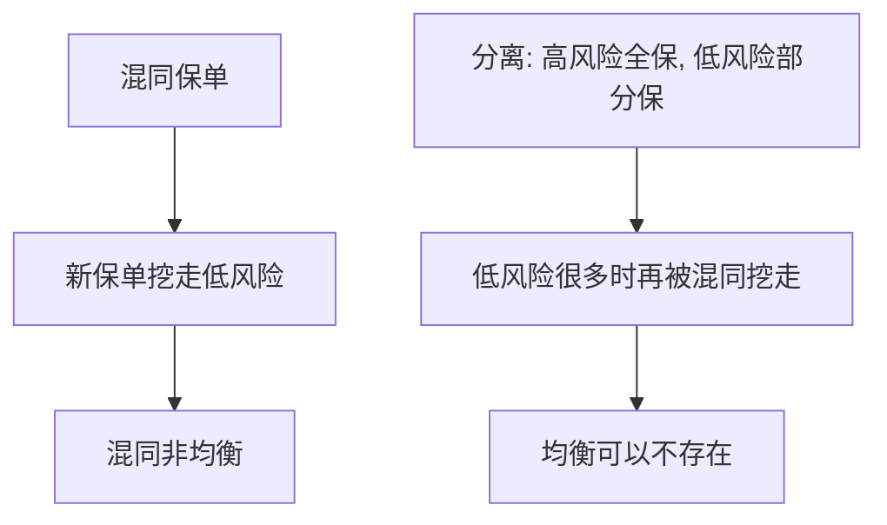

# Rothschild–Stiglitz 保险筛选

竞争保险市场上，混同不是均衡；分离均衡可以不存在。

<footer>—— Rothschild and Stiglitz, Equilibrium in Competitive Insurance Markets, Quarterly Journal of Economics 1976</footer>

附录对照。主干[筛选与信息租金](/econ/screening-rent)已用合同菜单与激励相容。本篇对照 **Rothschild–Stiglitz 1976 原文** 在保险市场上的尖锐结论：与 [Spence](/econ/spence-1973) 的发送者信号不同，这里是保险公司（不知情方）先推出保单，知情的投保人自选；竞争加上逆向选择，均衡可能根本没有。不重写柠檬螺旋。

## 问题

两类风险（高事故概率、低事故概率），每类有同一凹效用。保险公司风险中性、自由进入，只观察投保人选择的保单（保费、赔付），不观察类型。若只卖一张平均精算的混同保单，低风险等于补贴高风险。原文问：有没有一套保单，在竞争下既不亏损、又没有另一家公司能用新保单把它的客户挖走？

答案分两截。混同不是均衡：总能设计一份对低风险更有吸引力、对高风险无吸引力的偏离保单，把好风险挖走，留下高风险让原公司亏损。分离候选是：高风险拿全保险（其最优），低风险拿部分保险，刚好让高风险不愿假装低风险。但若低风险足够多，又会有人愿意提供接近混同的合同把低风险再挖走——于是分离也撑不住。均衡可以空。

Wilson、Riley、Miyazaki 等后来用不同的均衡概念（预期性、反应）恢复存在性。原文用的是「没有新合同能赚正利润」的静态竞争，结论以不存在闻名。

## 方法

保单是 $( \alpha,\beta )$：保费与出事时净赔付。无差异曲线在赔偿–保费平面上，单交叉：高风险更愿意为额外保险付钱。零利润线按类型分两条。竞争均衡定义为：每张被选的保单零利润，且不存在新保单在现有合同旁边能赚正利润。

与 Spence 的对照：信号博弈里发送者负担教育成本；筛选博弈里扭曲落在低风险的保险数量上（信息租金 / 向下扭曲）。竞争把垄断筛选的利润削到零，却把存在性也削掉。

## 机制

机制是合同的奶油撇脂。价格（保费）与数量（保障）必须绑在一起才能分离；只调价格会回到 Akerlof 的平均定价。自由进入使任何留下正利润或交叉补贴的菜单都被攻击。因此「竞争性」与「有均衡」在逆向选择下不再是同一句话——这是原文相对 Debreu 竞争的决裂处。

政府或行业可以强制混同（社会保障、社区定价），用存在性换效率：低风险被迫补贴。原文把这一点写成政策含义，不是附录外的道德。

### 竞争筛选 vs 垄断筛选

主干[筛选](/econ/screening-rent)在委托人框架下谈信息租金。RS 把委托人换成自由进入的保险公司，利润削到零，存在性也可以空。显示原理仍适用，但自由进入不是一个委托人。Wilson / Riley 的反应均衡是后继概念，不写进 1976 年定理。

Rothschild and Stiglitz, *QJE* 90(4), 1976, 629–649。事故概率是类型，不是隐藏努力。

## 边界

不要把「RS 均衡不存在」说成保险市场经验上崩溃。现实有强制投保、分类定价、长期合同与资本监管，均衡概念也已替换。附录对照的是 1976 年那套定义下的定理。也不要把本文写成道德风险：事故概率是类型，不是隐藏努力；隐藏努力是 Holmström 一线，主干道德风险课另写。

微观信息附录到此为止。下一篇转到宏观：Keynes《通论》的问题设定。

混同不是均衡，因为可被只吸引低风险的合同打破。分离在高风险足够多时可以站住。

无均衡不是「保险市场经验上不存在」。原文是特定均衡概念下的逻辑可能性。强制混同、社区评级是制度回应。

隐藏类型不是隐藏努力。道德风险保险（免赔额、努力）是 Holmström 一线，主干另写。

竞争把垄断筛选的利润削到零，也可以把存在性削掉。这是相对 Debreu 竞争的决裂，不是技术故障。

## 小结

- 附录对照 Rothschild–Stiglitz 1976：竞争保险里混同非均衡，分离可空。
- 筛选用保障数量扭曲来分离；自由进入可破坏存在。
- 与 Spence 分工：接收者菜单 vs 发送者信号。
- 出处：Rothschild and Stiglitz, *QJE* 1976。
