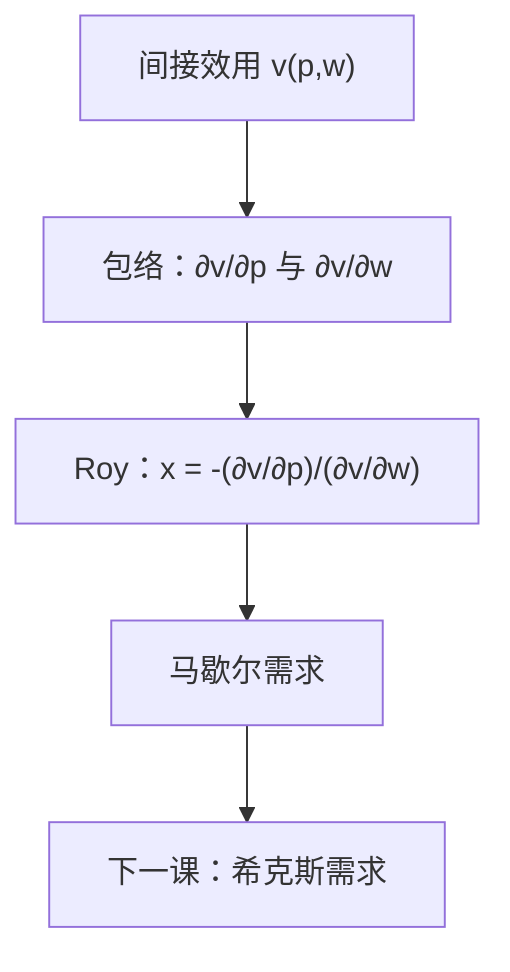

# Roy 恒等式

间接效用对价格的偏导，除以它对财富的偏导并改号，就是马歇尔需求。

<footer>—— 据 Roy, La distribution du revenu entre les divers biens, Econometrica, 1947；Mas-Colell, Whinston and Green 第 3 章整理</footer>

上一课[间接效用与支出函数](/econ/indirect-utility)钉死了值函数 $v(p,w)$ 与 $e(p,u)$ 互逆。本课不重讲二者的定义，也不把支出最小化再写一遍。缺口是：间接效用对价格的导数如何恢复马歇尔需求。上一课把罗伊恒等式列为对偶接口；本课只把这一条公式钉成可操作的恢复。

## 问题

$v(p,w)=u\bigl(x(p,w)\bigr)$ 是已经达到的效用。观测与计算里，有时更容易摸到 $v$——作为值函数、作为估计出的福利指标——而摸不到 $x$ 的每一个坐标。缺口不是再解一次 $\arg\max$，而是从 $v$ 的斜率读回选择。

Roy（1947）的恒等式说：在可微内点，

$$
x_i(p,w)=-\frac{\partial v/\partial p_i}{\partial v/\partial w}.
$$

直观：涨 $p_i$ 造成的效用损失，按财富的边际效用折成商品单位，就是必须减掉的 $x_i$。分母 $\partial v/\partial w$ 在局部非饱和下为正，否则除法没有定义。本课不把希克斯需求拉进来；补偿需求是下一课的缺口。

### 包络，不是把 $x$ 再全微分

$v$ 随 $p$ 变，有两条通道：最优束移动，以及同一束变得更贵。包络定理说，最优束移动的一阶贡献是零。剩下的是直接项 $-\lambda x_i$，而 $\lambda=\partial v/\partial w$。相除即得上式。不必把雅可比 $D_p x$ 先求出来。

$v$ 随 $u$ 的单调变换而变，分子分母同乘一个正的变换导数，比值 $x_i$ 不变。需求仍是序数对象。

## 方法

从拉格朗日 $u(x)+\lambda(w-p\cdot x)$ 对参数求导，或从恒等式 $v(p,w)=u\bigl(x(p,w)\bigr)$ 用包络。得到 $\nabla_p v=-\lambda x$，$\partial v/\partial w=\lambda$。消去 $\lambda$ 即 Roy。零次齐次的 $v$ 还给出欧拉关系：$\sum_i p_i\partial v/\partial p_i+w\partial v/\partial w=0$，与瓦尔拉斯定律互证。

经验上，若估计的是间接效用（或对数支出份额对价格的导数），Roy 把需求份额读出来，而不必先写 Marshallian 的闭式。本课不讨论估计，只锁定：对偶值函数的梯度就是需求的恢复。

角点上 $v$ 对某些 $p_i$ 不可微，恒等式改成超梯度包含：$x$ 属于 $-\partial_p v\big/\partial_w v$ 的对应。可微公式只在上一课说的正则内点用。

## 机制

Roy 把「偏好 → 需求」的箭头在值函数上接了一段短路。不必每次改价格都重新求解 $\arg\max$；只要 $v$ 可微，斜率比就是 $x$。这与谢泼德引理对称：那边从 $e$ 读希克斯需求，这边从 $v$ 读马歇尔需求。斯勒茨基分解要把两条需求焊在一起，所以两条导数接口都要。本课只交马歇尔这一头。

福利语言里，$-\partial v/\partial p_i$ 是涨价的效用损失，还不是钱。除以 $\partial v/\partial w$ 才换成商品或货币单位。补偿变化仍用 $e$ 来写，因为那是钱；Roy 不替代支出函数，只替代「从 $v$ 找回 $x$」。

拟线性下 $\partial v/\partial w$ 为常数（计价物内点），Roy 退化成 $x_i=-\partial v/\partial p_i$ 的尺度。一般情形分母随 $(p,w)$ 变。

## 边界

恒等式要求 $v$ 在所论的 $(p,w)$ 可微，需求单值。集值时只能写包含。价格为零或饱和使 $\partial v/\partial w=0$，公式停用——上一课的局部非饱和在这里是除法的前提。

也不要把 Roy 读成「观测到了间接效用」。观测仍是 $(p,w,x)$；$v$ 是模型对象。显示偏好课从 $x$ 约束偏好，方向相反。本课仍走「已知 $v$ → 读出 $x$」。

后课默认：可以随时用 Roy 从 $v$ 恢复 $x(p,w)$。补偿需求 $h(p,u)$ 下一课才作为独立对象出场。

## 小结

- 间接效用的价格斜率，按财富斜率折成商品，就是马歇尔需求。
- 依据是包络：最优束移动的一阶项消失。
- 角点改成超梯度；$\partial v/\partial w>0$ 靠局部非饱和。
- 希克斯需求尚未作为本课对象。
- 出处：Roy, *Econometrica*, 1947；Mas-Colell, Whinston and Green 第 3 章。
