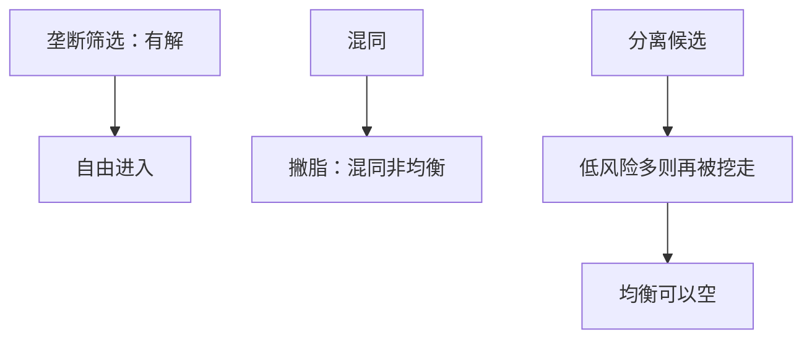

# Rothschild–Stiglitz 崩溃

竞争性保险筛选下，混同不是均衡；分离候选也可以被新合同挖走。自由进入加上逆向选择，均衡可以空。

<footer>—— Rothschild and Stiglitz, Equilibrium in Competitive Insurance Markets, QJE, 1976</footer>

[上一课](/econ/screening-rent)在单个委托人下写出菜单、信息租金与「扭曲低类型」。缺口是把委托人换成自由进入的保险公司：利润被削到零之后，那份刚好分离的菜单未必站得住。本课钉竞争筛选的存在性崩溃，不重写垄断下租金公式，也不把事故概率写成隐藏努力。

## 问题

两类型风险，不知情的保险公司先出保单，知情投保人自选。竞争：自由进入，被选中的保单零利润，且不存在新保单能在现有保单旁边赚正利润。筛选课的垄断解靠利润（或福利）目标压住菜单；这里任何人都可以再丢一张合同进场。

混同先垮：平均精算的全保险（或任何混同点）上，总可以画一张对低风险更甜、对高风险不够甜的偏离保单，把低风险撇走，留下高风险让原保单亏损。分离候选：高风险拿其完全信息全保险，低风险拿部分保险，IC 刚好绑住高风险。零利润要求各保单按自身类型定价。但若低风险足够多，再丢一张接近混同、略亏高风险但大赚低风险的合同，可以把低风险再挖走——分离也垮。于是均衡空。

### 崩溃不是柠檬的切断

柠檬只有一个价格，好车退出。RS 有数量（保障额度）可以分离，按理比柠檬多一件工具。崩溃来自第三件东西：自由进入。工具够分离，却不够同时挡住撇脂与零利润。垄断委托人不会自己撇自己的油，所以筛选课有解。

Wilson 预期均衡、Riley 反应均衡、Miyazaki–Wilson 交叉补贴，后来用不同的「别人会怎么反应」恢复存在性。1976 年的定义是静态「新合同赚正利润」，结论以不存在闻名。本课钉这一定义，不把后继概念写进定理。

高风险足够多时，挖走低风险的那张混同式合同自己会亏，分离可以站住。
崩溃因此是参数区域：低风险太多，撇脂太甜。
存在性空不是保险市场经验上消失；强制投保、社区定价是制度回应。

## 方法

对象：两类型、单交叉无差异曲线、风险中性公司、自由进入。先排除混同（撇脂偏离），再写分离候选的零利润 + IC，再检查是否存在有利可图的「再混同」偏离。低风险比例过阈值则分离被破。

## 机制

竞争把交叉补贴定为攻击对象：任何「低风险补贴高风险」的包，都可以被只面向低风险的包拆开。分离把补贴拆掉了，却给低风险留下未吃尽的剩余（相对于混同全保险）。人一多，这份剩余大到值得再开一张接近混同的单，分离被自己的竞争逻辑吃掉。筛选课的租金在垄断那里是委托人付给高类型的；竞争里租金被进入拆光，连配置一起拆空。

这与[存在性](/econ/ge-existence)的对照：Arrow–Debreu 的商品是给定的，价格在单纯形上；这里策略是合同，偏离是创造新商品。凸性帮不上。显示原理仍适用，但「设计者」不是一个人，而是任何一家可以进入的公司。柠檬只有价格切断；RS 有保障数量，本可以分离，崩溃来自进入把交叉补贴与未吃尽的低风险剩余都变成攻击面。垄断委托人不会对自己撇油，所以[筛选](/econ/screening-rent)有解、竞争可以无解。

低风险足够多，未吃尽的剩余才大到值得再开接近混同的单；高风险多时分离可以站住。
崩溃因此是参数区域，不是保险市场经验上消失。

## 边界

不要把「均衡空」读成道德风险：类型是事故概率，签约前已存在。隐藏努力是 Holmström 一线。也不要重算一遍 Mussa–Rosen 的数量扭曲：垄断下那份扭曲在竞争里先被零利润改写，再被进入打掉。附录对照原文细节见 Rothschild–Stiglitz 附录课；主干只记崩溃机制。

后课默认：竞争出菜单可以没有均衡；要存在，须换均衡概念、限制进入，或回到垄断委托人。隐藏行动的合同竞争是另一棵树。

### 强制混同是用存在性换效率

社会保障、社区评级强迫低风险留在池里，撇脂被禁止，均衡回来，效率不必是分离有效。RS 把这一点写成政策含义：竞争在逆向选择下不是自动好事。Wilson 预期若成立，公司不敢出撇脂单，因为预见到剩下的全是高风险——那是另一均衡概念下的逐级退出，与柠檬顶部退出同构，对象换成保单。

筛选课已经警告「菜单竞争不必有均衡」。本课把那句警告收成定理：混同必垮，分离可空。

## 小结

- 竞争筛选：混同必被撇脂；分离在低风险多时也可被挖走。
- 自由进入把垄断筛选的解拆空，存在性可以失败。
- 这是隐藏类型 + 合同进入，不是隐藏努力。
- 强制混同、反应均衡是后继补丁，不是 1976 年定理内部的解。
- 出处：Rothschild and Stiglitz, *QJE* 1976。
