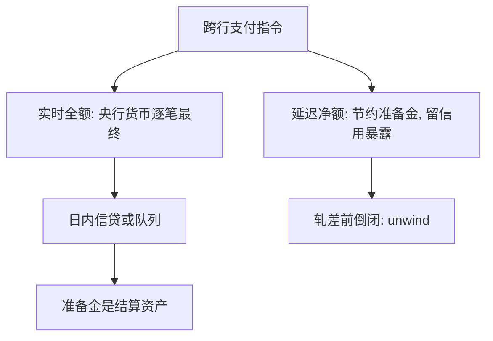

# 支付系统与 RTGS

大额支付的最终性，取决于用哪一种结算资产、在哪一个时点解除暴露。

<footer>—— 据 BIS Committee on Payment and Settlement Systems, Real-Time Gross Settlement Systems, 1997；Core Principles for Systemically Important Payment Systems, 2001 整理</footer>

定位：[上一课](/econ/reserve-endogenous-money)。贷款创造存款之后，存款转账仍要在银行之间过户一笔结算资产。本课缺口是这笔过户的协议：准备金作为支付结算资产，实时全额（RTGS）与延迟净额（DNS）如何改变日内暴露。不重写「贷款同时创造存款」，不把支付系统写成挤兑博弈。

## 问题

内生货币已经说明：企业把存款从银行 A 付到银行 B，系统内广义货币不变，变的是准备金在 A 与 B 之间的分配。若结算日终才轧差，A 在日内对 B（或对清算所）持有未覆盖的信用暴露——这正是传染课里那种银行间债权，只是寿命以小时计。若每笔支付当时就用央行货币全额结算，暴露被压到结算间隔之内，但银行必须在日内持有或借入准备金。

缺口不是再讲乘数，而是：盯利率体制下准备金迁就的是**结算需求**，支付系统的规则决定需求以何种峰值出现。BIS 的大额支付报告把选择收成 RTGS 对 DNS。

最终性（finality）：支付不可撤销、不可被清盘人追回。RTGS 用央行货币逐笔达到最终性。DNS 的最终性推迟到轧差时点，此前是参与者之间的信用。

## 方法

DNS：一日（或一周期）内支付对冲，净额用结算资产交割。节约准备金，制造未结算头寸。一家在轧差前倒闭，未完成的净额要unwind，对手突然出现流动性缺口——支付系统自己就是传染边。RTGS：每笔全额、实时、用央行准备金（或央行保证的账户）结算。信用暴露被设计掉，换成流动性管理： outgoing 支付要先有准备金或日内信贷。

央行通常配套日内透支或抵押信贷，使 RTGS 不至于因为准备金存量过小而锁死队列。盯利率时，这些日内便利按需提供，正是上一课「准备金迁就结算」的操作面。法定准备金率可以很低甚至为零，结算仍需要央行负债当轨道。

与[货币层次](/econ/money-as-medium)的衔接：公众的 $M1$ 是银行存款；银行之间不拿存款结清，拿准备金。层次图上的 $H$ 在这里不是乘数的种子，是轨道上的车。

## 机制

机制是结算资产的排他性。只有被所有参与者按面值接受、且其发行人不在参与者之中的负债，才能在倒闭时仍当最终货币。这就是央行准备金。商业银行存款是 inside money，对公众是支付手段，对银行同业不是最终结算。RTGS 把这一区分写成时刻表：每一笔大额，当时就换成 outside money。

队列与流动性节约算法（排队、对冲、部分净额）是在 RTGS 内部再省准备金，不回到「日终才最终」。省的是峰值，不是最终性定义。若把这些算法写成「其实还是 DNS」，会把暴露重新藏进队列规则。

### 准备金约束在日内，不在乘数

上一课的因果箭头是：盯利率则 $H$ 迁就 $D$。本课补上频率：迁就发生在支付高峰，而不是在月度货币统计里。走廊或地板利率决定日内信贷的价格；抵押与限额决定谁能把结算需求变成央行资产。没有这条，内生货币会听起来像银行可以在真空里转账。

证券结算的 DVP（券款对付）把「钱」与「券」的最终性绑在同一时点，避免光脚的本金风险。逻辑与 RTGS 同构，对象换成券。本课不展开 CSD 的法律结构。

## 边界

不要把 RTGS 叫成货币政策工具：它是结算规则，利率规则才是工具。也不要把支付系统写成[最后贷款人](/econ/lender-of-last-resort)——窗口是恐慌时对 outside money 的弹性；RTGS 是平时每一笔用哪种资产达到最终。恐慌中支付系统停摆，两者才叠在同一张表上。

本课不写 LCR 的流出假设，不写影子银行的批发结算。后课 Bagehot 处理挤兑时谁必须提供 $H$；本课只钉：$H$ 首先是结算资产。

后课默认：跨行支付用准备金最终；RTGS 用流动性换掉 DNS 的信用暴露。内生货币的「迁就」是迁就这条轨道，不是否认结算需要央行负债。

法定准备金率接近零，不取消结算对 $H$ 的需求。需求的形状由支付规则决定。

不要用「贷款创造存款」跳过同业过户。创造发生在单家账上；最终发生在央行账上。

## 小结

- 准备金是银行间支付的结算资产，不是贷款的事前原料。
- DNS 省准备金、留日内信用；RTGS 逐笔最终、把问题改成日内流动性。
- 盯利率时央行按需提供结算用 $H$，与内生货币兼容。
- 出处：BIS CPSS, *RTGS Systems* 1997；*Core Principles* 2001。
