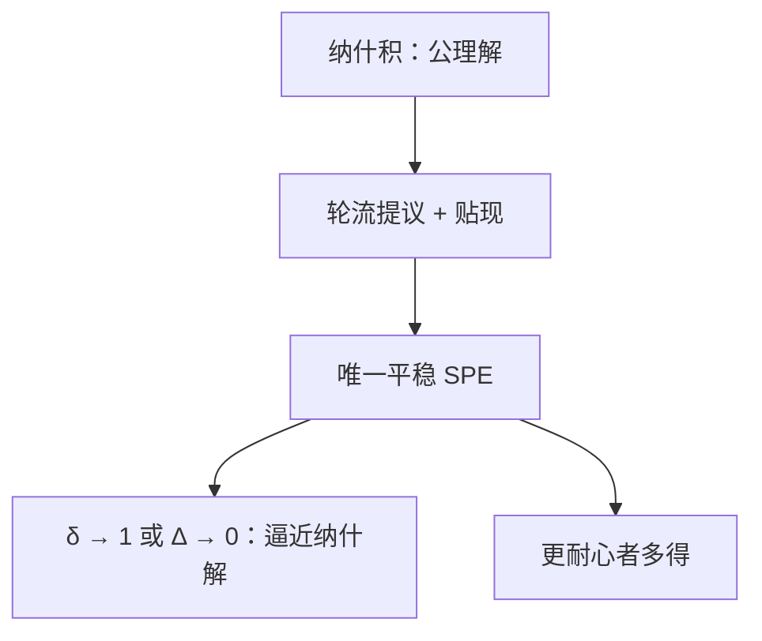

# 鲁宾斯坦轮流出价

无限期轮流出价、共同贴现的唯一子博弈完美均衡，在回合间隔趋于零时逼近纳什讨价还价解。

<footer>—— Rubinstein, Perfect Equilibrium in a Bargaining Model, Econometrica, 1982</footer>

[上一课](/econ/nash-bargaining)用公理钉住纳什积，但没有出价程序，$d$ 从哪来也不回答。缺口是非合作实施：两人轮流提议分割，拒则过一期、贴现，SPE 是什么？Rubinstein 1982 给出唯一 SPE，耐心接近时逼近纳什解。本课钉这条程序，不重写四条公理。

## 问题

一块大小为 $1$ 的剩余，无限期。奇数期玩家 1 提议 $(x,1-x)$，2 接受则结束，拒绝则进入下一期由 2 提议。共同贴现因子 $\delta\in(0,1)$（或每人 $\delta_i$）。每过一期，饼乘 $\delta$。

平稳 SPE：提议者总出同一分割，回应者接受当且仅当份额不少于自己当提议者时的贴现值。解出提议者所得

$$
x^*=\frac{1-\delta_2}{1-\delta_1\delta_2}
$$

（对称 $\delta_1=\delta_2=\delta$ 时 $x^*=1/(1+\delta)$）。先手优势随 $\delta\to 1$ 消失，$x^*\to 1/2$，正是 $d=0$、对称可行集上的纳什解。$\delta_1\neq\delta_2$ 时，更耐心者多得，对应广义纳什积的权。

### 不是有限期从尾部拆掉的那一个

有限期轮流出价也可以逆向归纳，最后一期提议者拿全部，往前折。期限 $T\to\infty$ 时收敛到同一平稳 SPE。无限期的要点是：没有「最后通牒」当终点，唯一性靠平稳猜测加 SPE，而不是蜈蚣式的终点。上一课[逆向归纳的限度](/econ/backward-induction-limits)在有限完美信息上发脆；这里无限加贴现，归纳换成「每一截子博弈仍是同一结构」。

Binmore–Rubinstein–Wolinsky 把回合间隔写成 $\Delta$，贴现 $e^{-r_i\Delta}$。$\Delta\to 0$ 时 SPE 分割趋于广义纳什积，权等于 $r_j$（对方更急则自己多得）。公理解得到非合作基础。

## 方法

对象：完全信息、完美监测、不可撤回的提议、共同知识贴现。先猜平稳策略，用两方程（各人无差异于「拒然后自己提议」）解出 $(x^*,y^*)$，再验证任何偏离——开出更贪的价会被拒，开出更让的价自己吃亏，拒绝该接受的价损失贴现。这是 SPE，不是仅仅根上的纳什。

外部选择 $d$ 可以写进「拒绝后去外面」；无外部选择时 $d=0$ 是延迟的机会成本。本课主钉 $d=0$ 的饼。

## 机制

等待有成本，所以「永远拒绝」不可信：拖延伤害双方。提议者必须刚好让回应者无差异于再等一期——回应者的 SPE 续值被贴现，剩下的归提议者。这把时间偏好直接写成分割，不必另设威胁点上的效用积。$\delta$ 高，等得起，先手只能少拿一点；$\delta_i$ 相对更大，等于对方等不起，自己的续值高。

与无名氏的对照：重复博弈有许多 SPE 分赃；轮流出价的树加上贴现，SPE 瘦到一个点。结构差异是「谈的是一次性分割」而不是「每期再玩阶段博弈」。同一套 SPE 定义，树不同，肥瘦不同。

### 不完全信息会重新变肥

估值私有时，出价成为信号，延迟可以分离，效率损失（谈太久）是信息租金的另一种形式。那是类型，不是本课。有限 $T$ 的最后通牒实验常偏离归纳（提议者拿不到全部），与蜈蚣同类：认知与公平参照，不是 Rubinstein 无限期公式算错。

 Stahl 有限期模型是教学台阶：从最后一期往前，分割振荡并收敛到无限期点。Rubinstein 直接在无限树上做。两者极限一致，不必当成两个理论。

## 边界

多边、蛋糕缩水方式非几何贴现、可同时提议，唯一性会掉。重新谈判若允许「推翻已接受的分割」，那是另一棵树。也不要把轮流出价写成限价簿的买卖价差收敛；本栏没有队列。

后课离开完全信息讨价还价，进入类型未知：贝叶斯纳什把「不知道对方支付」写成自然抽类型。本课默认：完全信息轮流出价的 SPE 分割由贴现决定，连续时间极限对接纳什积。

## 小结

- 公理解没有程序；轮流出价给出唯一 SPE 分割。
- 对称时提议者得 $1/(1+\delta)$；$\delta\to 1$ 均分。
- 更耐心者多得；$\Delta\to 0$ 逼近广义纳什积。
- 一次性分饼的树把 SPE 削瘦，与无名氏的肥集合不同构。
- 出处：Rubinstein, *Econometrica*, 1982；Binmore, Rubinstein and Wolinsky, *Rand*, 1986。
