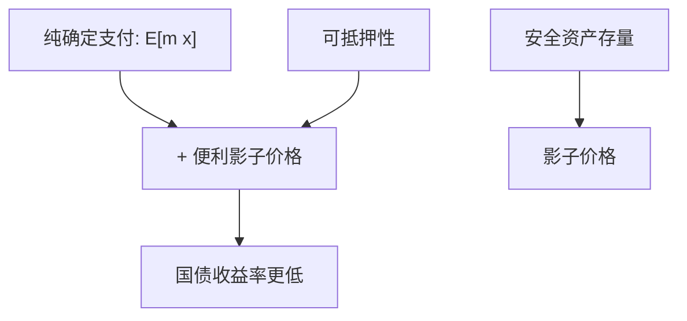

# 安全资产与便利收益

国债不只是或有支付：它还提供货币性服务。价格里有一块便利收益，收益率可以低于「纯」无风险折现。

<footer>—— Krishnamurthy and Vissing-Jørgensen, The Aggregate Demand for Treasury Debt, Journal of Political Economy, 2012</footer>

[上一课](/econ/funding-constraints-capm)用资金约束扭曲风险资产的相对溢价。本课缺口是**安全资产本身**：同一确定支付，若附带抵押、交易、监管的便利，其价格高于纯 Arrow 式折现，收益率出现便利收益（convenience yield）。不重写 CAPM 偏离的 beta 形状，不把公开市场操作写成制度史。

## 问题

FTAP 给「确定支付」的价格是 $\mathrm{E}[m]\times\text{面额}$（适当折现）。若该证券还能当抵押、当交易媒介、满足监管权重，持有它省下中介约束或省下 BP 的保证金，等于多了一股非货币红利。Krishnamurthy–Vissing-Jørgensen（2012）把国债需求写成对这一便利的向下倾斜需求：国债存量相对 GDP 低时，便利高，国债相对安全公司债的利差宽。缺口是：无风险利率之谜、安全资产短缺、便利，可以不改 $u'(c)$ 而改支付的定义——国债不是纯 $x$。

与货币主干的 CIA/MIU 同族：货币性进入效用或约束。本课落在资产定价：便利是对 $m$ 定价之外的服务流。Caballero–Farhi–Gourinchas 的安全资产短缺是宏观版本；本课只要定价含义。

Krishnamurthy and Vissing-Jørgensen, *JPE* 120(2), 2012。对照 Greenwood–Vayanos 的久期供给、Longstaff 的飞行至质量。便利随存量与危机状态变。

## 方法

把国债价格写成 $\mathrm{E}[m x]+\text{便利的影子价值}$。利差：安全但不便利的要求权（某些高评级公司债）按 $m$ 定价；国债多一块。存量冲击改变影子价值，利差与价格变动可以在 $c$ 几乎不变时发生——又一条不靠消费波动的折现率通道。杠杆周期里，可抵押性正是便利的来源：haircut 低的资产被当作准货币。

不要把便利估计成某利差回归的系数表。本课只钉会计：同一 $x$，不同服务，不同价格——严格说 LOP 的「同一支付」已经把服务算进去；服务不同则不是同一商品。状态价格课的商品空间其实允许这样做：便利是额外的状态依存服务。

## 机制

机制是稀缺的货币性。危机中中介约束紧、可抵押资产被追逐，便利升，国债涨、收益率跌，风险资产的溢价升——看起来像 $m$ 抖，部分其实是相对便利在抖。Lucas 树没有这种商品。信息课序的「安全」若来自透明，是另一通道：揭示深的资产不利选择 $\lambda$ 低，也可以被当成准货币。两通道：信息透明 vs 可抵押存量，危机里通常同向。

负利率、便利可以大到把名义收益率压过零的下界讨论，本课不进入。只要承认服务流，收益率不必等于纯时间偏好加预防性储蓄。

## 边界

下一课把「谁持有、持有多少」写成需求系统：机构投资者的份额成为价格的自变量，而不先经过一个代表性 $m$。便利与约束是需求的微观基础；需求系统是加总的计量理论。本课不估计份额弹性。

后课默认：安全可抵押资产携带便利收益，价格可以偏离纯 $E[mx]$。存量与危机状态移动这块偏离。不是限价簿流动性，虽然两者都叫流动性——市场微观结构是协议，便利是服务流。

## 小结

- 国债等安全资产 = 确定支付 + 货币性服务；后者有影子价格。
- 便利随存量与约束状态变，提供不靠 $\sigma(\Delta c)$ 的折现率通道。
- LOP 比较的是含服务的商品；纯 $x$ 与带便利的 $x$ 不是同一商品。
- 出处：Krishnamurthy and Vissing-Jørgensen, *JPE* 2012。
