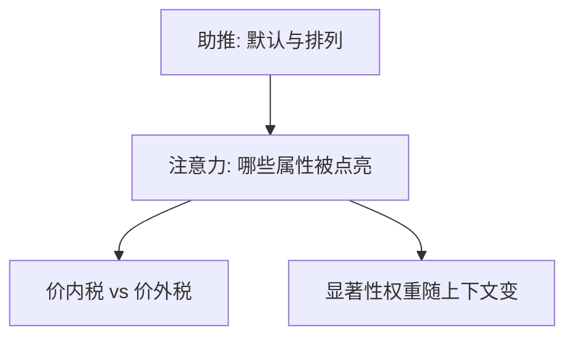

# 显著性与注意力

属性被注意到才进入 $v$；税若印在价签上与若在收银台再加，需求弹性不是同一个数。

<footer>—— Bordalo, Gennaioli and Shleifer 的显著性理论；Chetty, Looney and Kroft, AER 2009</footer>

[上一课](/econ/nudge-choice-architecture)把默认当架构。本课缺口是注意力：即使没有默认切换，哪些属性被点亮也会改选择。不重写助推清单。

## 问题

标准消费者对所有价格与税同等反应。Chetty、Looney 与 Kroft（2009）：价外销售税几乎不进入需求，价内则进入——不是偏好变了，是税的显著性变了。Bordalo、Gennaioli 与 Shleifer 的显著性理论：注意力被吸引到相对突出的属性（对比上下文中特别高或特别低的维度），决策权重跟显著性走，而不是跟客观重要性走。缺口是给有限理性一个可写成权重的注意力技术，而不是再列启发式名称。

资产侧：新闻标题、涨停板、彩票型股票的偏度被点亮，平均收益可以低。定价模型后单元用有限注意力写 PEAD；本课先给微观。

显著性依赖上下文：同一属性在另一菜单里可以不再突出。这与框架近亲，但操作化是相对对比，不是收益/损失措辞。

## 方法

把价值写成显著性加权的属性之和。上下文（可选菜单、近期历史）决定哪些维度突出。经验：改变税的显示、改变费用的字体与位置、改变收益率的年化与月化。预测：被点亮的弹性上升，未被点亮的接近零。

## 机制

机制是稀疏编码。决策者不能对所有维度求梯度，只对突出维度求。显示偏好看起来菜单依赖，因为显著性是菜单的函数。家庭金融：费用比率用小字印刷时，需求对费用不敏感，对过往回报（显著）敏感——参与后的基金选择偏差。这与素养不同：素养是会不会算，显著性是算不算这一项。

不把注意力写成限价簿上的队列位置。屏幕上的盘口显著性是微观结构，本栏不写。

Chetty–Looney–Kroft 的识别是显示方式：同一法定税率，印在标价上则弹性接近价内，到收银台再加则接近忽略。BGS 把「突出」写成相对对比：菜单里特别高的属性吸走权重。基金费用用小字、过往回报用大图，需求对费用的弹性接近零——与素养不足可叠加：会算的人若没看见，仍等于没算。后课更新偏差假定信号已被看见。

## 边界

理性疏忽（Sims）用信息成本选择信号，与心理学显著性不同：前者优化互信息，后者用对比启发式。本课以 BGS 与税收现场为主。也不能把所有低弹性归因于没看见：搜寻成本、转换成本同样存在。

后课默认：信念更新的偏差，有一部分来自只更新被注意到的新闻。

同一法定税，价内进入需求、价外被忽略——弹性跟显著性走，不跟法定税率走。

会算但没看见，仍等于没算；与素养不足可叠加。

## 小结

- 注意力把客观属性变成进入 $v$ 的子集；显著性随上下文变。
- 价内/价外税是同一相对价格、不同显著。
- 与助推分工：默认改停点，显著性改权重。
- 显著性依赖上下文，同一属性可不再突出。
- 理性疏忽优化互信息，本课以对比启发式为主。
- 出处：Chetty, Looney and Kroft, *AER* 2009；Bordalo, Gennaioli and Shleifer 显著性理论。
