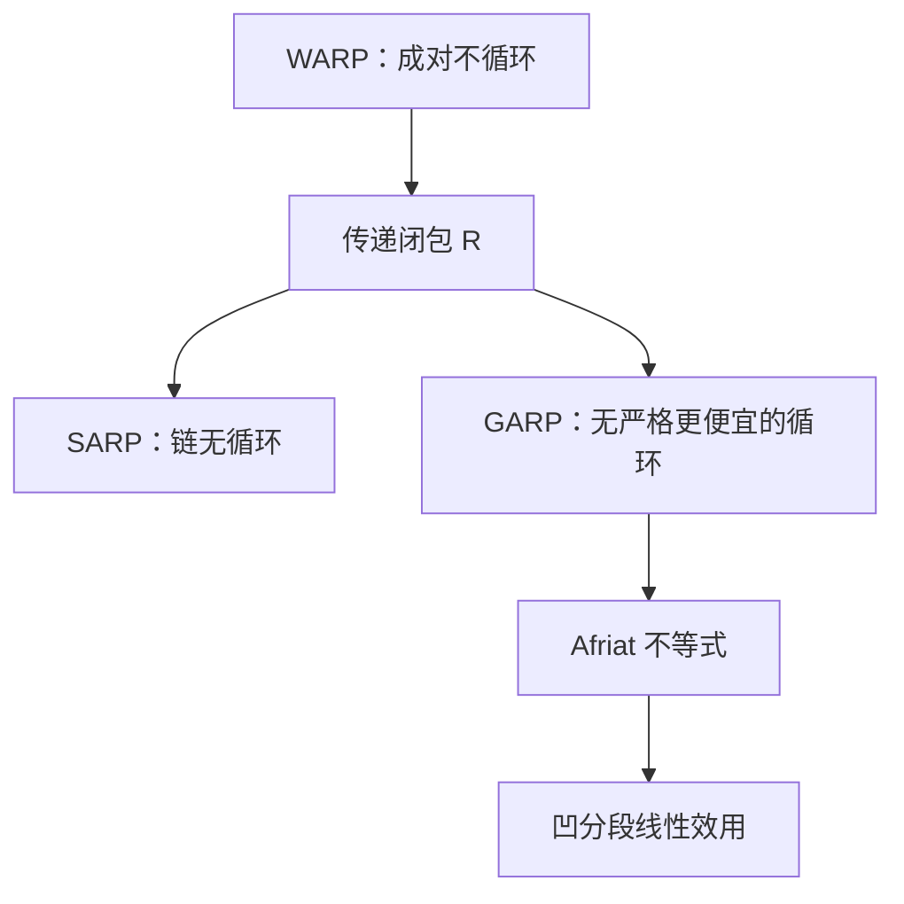

# SARP 与 GARP

成对不循环还不够。要把整条显示偏好链收成一个效用，需要强公理或广义公理，以及 Afriat 不等式。

<footer>—— 据 Afriat, The construction of utility functions from expenditure data, 1967；Varian, The nonparametric approach to demand analysis, Econometrica, 1982 整理</footer>

上一课[显示偏好 WARP](/econ/revealed-preference)钉死了成对一致性：选了 $x^t$ 时 $x^s$ 买得起却没选，就不能在另一期反过来。本课不重画两条预算互相吞掉的图，也不再定义 $R^D$。缺口是：WARP 不够循环一致性。三条以上的链可以成环，成对却都通过；要恢复一个完整的理性偏好，需要 SARP / GARP，以及 Afriat 的可计算版本。

## 问题

直接显示 $x^t\,R^D\,x^s$：当期选 $x^t$ 且 $p^t\cdot x^s\le p^t\cdot x^t$。WARP 禁止 $x^t\,R^D\,x^s\,R^D\,x^t$ 且二者不等。三个观测可以 $x^1\,R^D\,x^2\,R^D\,x^3\,R^D\,x^1$，两两检查都不触发 WARP。钱泵在链上，不在成对上。缺口是把传递闭包管起来。

强公理 SARP：间接显示偏好 $R$（$R^D$ 的传递闭包）无循环——若 $x^1 R x^k$ 且诸束不全相等，则不能 $x^k R^D x^1$。广义公理 GARP（Varian, 1982）：若 $x R y$，则不能 $p_y\cdot x<p_y\cdot y$。GARP 允许无差异造成的「平的」集值需求；SARP 更适合单值需求。有限观测上，GARP 才是「存在凹效用合理化」的恰条件。

### Afriat 把公理收成线性不等式

Afriat（1967）：GARP 成立当且仅当存在数 $u^t$、$\lambda^t>0$ 使

$$
u^s\le u^t+\lambda^t p^t\cdot(x^s-x^t).
$$

这些数是一个凹的分段线性效用在观测点上的值与梯度。通过则样本可被理性化；失败则不存在局部非饱和的连续凹偏好能生成这批选择。

WARP 是两期图上的筛；GARP 是多期链上的筛。光滑极限里，GARP 对应斯勒茨基对称加负半定的离散版，WARP 只对应负半定的成对版。

## 方法

先构造显示偏好图：节点是观测束，有向边是 $R^D$。检查是否存在严格更便宜的循环（GARP）或任何循环（SARP，单值时）。通过则解 Afriat 不等式，得到样本上精确、样本外以凹包络延拓的 $u$。这是非参数需求的可操作核，Varian 1982 把它写成可计算的检验。

本课不把 Hurwicz–Uzawa 的光滑可积再推一遍。那是[可积性与恢复偏好](/econ/integrability)在函数 $x(p,w)$ 上的缺口。这里对象是有限 $(p^t,w^t,x^t)$。WARP 过而 GARP 不过，说明成对干净、链上有环——不能已经宣称「恢复了效用」。

单值需求下 SARP 与「严格凸理性化」接近；集值、无差异平台要用 GARP。家庭数据常有平段，检验默认走 GARP。

## 机制

GARP 把第一课的「最大元不循环」改写成数据语句。无需指定 Cobb–Douglas 或拟线性，也无需可微。失败则这批预算选择容不下凹理性偏好——不是某个弹性的符号估错。通过只表示尚未被拒绝：观测稀疏时公理很少咬合，效力随预算交叉密度上升。

与 WARP 的分工：成对筛便宜、可画图；链筛才对应存在性。Afriat 数不唯一，与序数效用同一警告。恢复成功不是测出了幸福，是存在某一 $u$ 嵌得进去。

聚合需求不必满足 GARP。个人通过、市场失败，只说明加总不是一个消费者。不要把个人公理写到市场上。

## 边界

测量误差、口味漂移、家庭内部谈判，都会表现为 GARP 失败，不一定是「个人不理性」。本栏主干仍用理性作工作假说；检验失败先问对象是否切错。不可分商品、离散选择，Afriat 的凹连续版本过强，要另写整数版本。

也不要把 GARP 读成均衡或社会福利。这里没有市场出清，只有一个决策者的预算表。光滑可积、期望效用，都是后课另加的结构：确定消费上的 Afriat $u$ 不能直接拿去对彩票取期望。

后课默认：从有限选择恢复偏好，检验 GARP、解 Afriat；完整函数上的恢复，交给可积性课的 $S$ 对称。

## 小结

- WARP 管成对；SARP / GARP 管链。循环一致性在这里才闭合。
- GARP 允许集值无差异；SARP 更贴单值需求。
- Afriat 1967：GARP 等价于凹分段线性效用的存在。
- 通过尚未证实「真实 $u$」，只表示模型未被这批数据拒绝。
- 出处：Afriat, 1967；Varian, *Econometrica*, 1982；Houthakker 的 SARP 传统。
