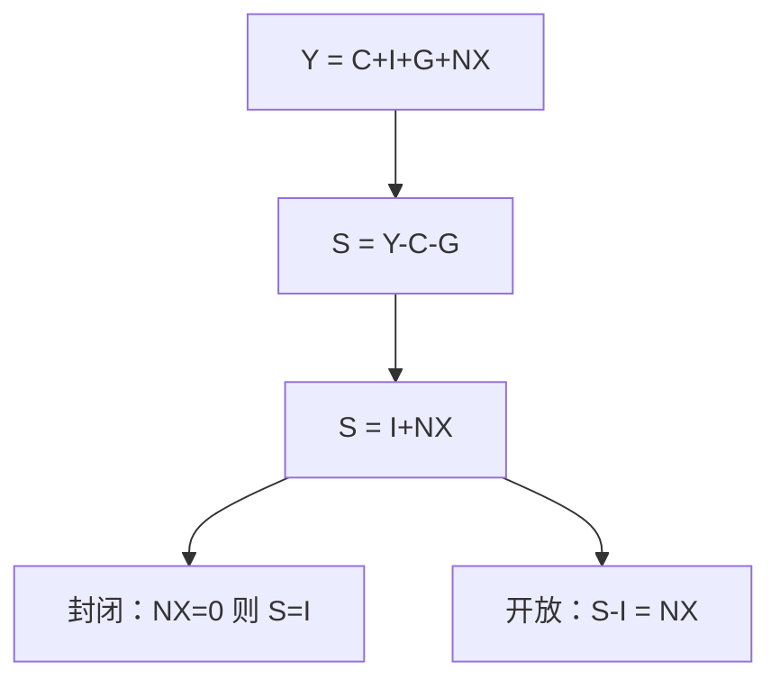

# 储蓄–投资恒等式

储蓄等于投资，首先是把同一笔未消费产出换了名字；把它读成「储蓄决定投资」或反过来，已经是理论，不再是账户。

<footer>—— 据 SNA 资本账户与 Keynes《通论》中储蓄–投资语言的分叉整理</footer>

[上一课](/econ/gdp-accounts)把 $Y$ 钉成生产、支出、收入三本相等的账。支出里已经出现资本形成 $I$，收入里出现未被消费的部分。本课的缺口不是再解释 GDP，而是：这两段如何改写成 $S$ 与 $I$ 的关系，以及开放时差额去了哪里。后课的价格指数仍在名义账上；本课先把恒等写完。

## 问题

从收入法看，家庭和政府「没花掉」的叫储蓄；从支出法看，未消费的产出表现为资本形成或净出口。若把两句话当成两个独立的市场，就会问「谁先谁后」。SNA 里它们不是两个市场，是同一恒等的两边。缺口是把部门口径写清：私人、公共、国外，各自的储蓄与投资如何对上，而不是先讲可贷资金或动物精神。

封闭且无政府时，$Y=C+I$ 立刻给出 $S\equiv Y-C=I$。有了政府与国外，恒等变长，但仍然是恒等。Keynes 后来用同一组符号谈均衡决定，Hicks 的 IS 把 $I=S$ 读成商品市场均衡。那些是后课；本课禁止把恒等写成斜率。

存货投资使事后 $I$ 包含非自愿积累。事后恒等永远成立；「计划投资等于计划储蓄」才是均衡陈述。混用事后与事前，是把会计读成理论最常见的一步。

## 方法

记净税 $T$（含经常转移的简化），私人储蓄 $S^p=Y-T-C$，公共储蓄 $S^g=T-G$，国民储蓄 $S=S^p+S^g$。支出恒等 $Y=C+I+G+NX$ 代入得

$$
S \equiv I + NX.
$$

更仔细的对外口径是经常账户 $CA$，含货物服务净出口与要素、经常转移。本课先用 $NX$ 作代理，完整 $CA$ 在[开放经济会计](/econ/open-ca)展开。资本账户与储备是金融账户的对应，不在本课写 CIP，也不重写量化栏的[利率平价](/quant/irp)。

部门缺口：财政赤字 $G-T$ 与私人 $S^p-I$ 之和等于 $NX$ 的相反数。这是「孪生赤字」的会计骨架，还不是因果。

### 总储蓄与净储蓄

SNA 区分总额与净额：折旧进入资本消耗，净储蓄对应净投资。增长模型里的 $sY$ 常常是总储蓄率。符号从本课起要声明是总是净；后课索洛用总额加折旧 $\delta K$。

## 机制

恒等成立，因为任何未进入 $C$ 与 $G$ 的国内产出，要么变成国内资本形成，要么变成对国外的净要求权。金融工具只是把要求权记在谁的表上：家庭买国债，公共储蓄下降、私人储蓄上升，国民 $S$ 不变。李嘉图等价要到财政课才问「私人是否把国债当成未来税」；本课只说账上如何对冲。

开放时，$S>I$ 不是美德本身，只表示经常账户顺差：本国吸收少于产出。逆差则是吸收超过产出，靠国外净储蓄弥补。谁「提供」资本，是金融账户的故事，不是本课的价格理论。

Hicks 把 $I=S$ 读成商品市场均衡，那是计划量。本课的等号含非自愿存货，永远真。后课 IS 必须改口，否则会计与理论用同一符号互相取消。财政课的孪生赤字也只是这句恒等的部门展开，还没有乘数。

家庭买国债：私人储蓄升、公共储蓄降，国民 $S$ 不变。账上的对冲先于李嘉图：李嘉图问的是私人会不会把国债的未来税也记进财富。

## 边界

恒等不判断充分就业，也不判断 $I$ 是否合意。把 $S=I$ 当成政策目标（强迫储蓄、压制消费）是把会计当成工具。也不要把本国 $S$ 与企业融资混为一谈：公司金融的优序与 MM 是后课，微观结构的订单是量化栏。可贷资金图若把事后恒等画成两条独立供给需求，已经把本课读错。

后课默认：写下封闭经济时 $S=I$ 是事后恒等；讨论短期决定时必须改口说计划量。下一课的缺口是：名义 $Y$ 与 $I$ 还没有「实际」含义。

## 小结

- $S=I+NX$ 是 SNA 恒等，事前均衡是另一句话。
- 国民储蓄 = 私人 + 公共；部门缺口对上对外差额。
- 存货使事后投资包含非自愿积累。
- 国债在部门间对冲国民储蓄，不等于李嘉图已经成立。
- 经常账户的完整分录、实际变量，是后课缺口。
- 出处：SNA 资本与国外账户；Keynes《通论》中事后恒等与均衡语言的分叉。
