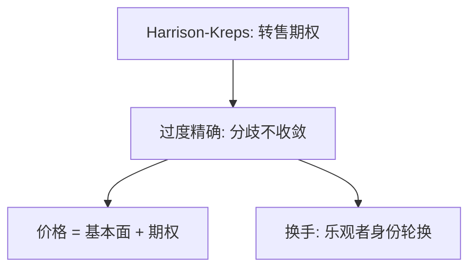

# Scheinkman–Xiong 换手与泡沫

过度自信让人不断以为自己比别人准，于是不停地换手；泡沫的体积和成交量是同一枚转售期权的两面。

<footer>—— Scheinkman and Xiong, Overconfidence and Speculative Bubbles, Journal of Political Economy, 2003</footer>

[上一课](/econ/harrison-kreps-speculation)给出转售期权。本课缺口是把期权的燃料写成[过度自信](/econ/overconfidence)：连续时间里两组人各自高估私有信号，信念持续分歧，换手与泡沫同时出现。不重导 Harrison–Kreps 的离散期权。

## 问题

Harrison–Kreps 的信念异质可以是外生的。Scheinkman 与 Xiong（2003）让异质来自过度精确：两组观察带噪声的同一基本面，每组低估自己的噪声、相对高估对方的噪声，后验不收敛。禁止卖空。当前持有者总把资产标上「卖给另一组」的期权，价格 = 基本面（在自己信念下）+ 期权。成交在两组轮流成为更乐观者时发生。缺口是同时解释**泡沫与换手**，而不是只解释价格水平。

共同先验下，仅有不同信息通常会通过价格学习而收敛。过度自信切断这条学习：人把价格里对方的信息当成更噪。

## 方法

连续时间滤波，两组过度自信，卖空约束，风险中性或近似。资产价格有闭式期权解释。比较静态：过度自信越强，期权越贵，换手越高，波动越大。与 DHS 的差别：DHS 强调动量与反转的时间序列；SX 强调成交量与泡沫共存。

本课仍不进入簿的撮合。换手是持有权在两组间转移，不是队列几何。

## 机制

机制是信念的持续错位。每组的卡尔曼增益太大，把对方推动的价格变动当成噪声，不充分更新。卖空限制阻止悲观仓位，期权保持正值。价格可以长期高于「正确滤波」的基本面，同时成交活跃——这与「没有成交的死泡沫」不同，也与理性泡沫（下一课）的低换手潜在对照。

套利限制仍在：若允许卖空并有无限资本，期权被压掉。SX 把 SV 的融资摩擦当成背景，焦点在信念。

共同先验加正确滤波，两组后验应收敛，转售期权趋于零。过度精确切断学习：对方推动的价格被当成噪声，分歧是稳态。卖空一关，悲观组无法把负仓拿满，期权保持正。换手是「谁更乐观」的轮换频率，不是噪声交易者的随机需求。与 DHS 的时间序列故事分工：这里强调成交量与泡沫水平同时高。仍不写簿上的撮合。

## 边界

两组是简化；多组、连续异质更接近现场，定性类似。风险厌恶会削弱期权价值。基本面若可完全合同化，投机动机下降。本课不把 1990 年代科技股的换手当成证明，只给可对照的符号：泡沫期换手应高。

后课默认：理性泡沫可以在共同信念下存在，不需要过度自信，但通常对换手沉默。

过度精确让分歧不收敛，转售期权保持正值；乐观者身份轮换同时给出换手。

泡沫体积与成交量是同一机制。理性泡沫下一课对换手沉默，形成对照。

## 小结

- 过度自信维持分歧，转售期权给出泡沫，轮换给出换手。
- 价格与成交量是同一机制，不是两则轶事。
- 卖空限制仍是必要约束。
- 对方推动的价格被当成噪声，学习被切断。
- 允许卖空并有无限资本则期权被压掉。
- 出处：Scheinkman and Xiong, *JPE* 2003。
