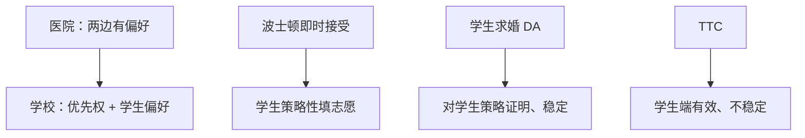

# 学校选择

学校有的是法定优先权，不是自身福利；波士顿即时接受可操纵，学生求婚延迟接受把诚实变成占优，纽约与波士顿的改革按此换算法。

<footer>—— Abdulkadiroğlu and Sönmez, School Choice: A Mechanism Design Approach, American Economic Review, 2003；Abdulkadiroğlu, Pathak and Roth, The New York City High School Match, American Economic Review P&amp;P, 2005</footer>

[上一课](/econ/many-to-one-matching)把医院写成有偏好、有名额的一方。缺口是公立学校：座位是公共资源，学校通常**不**最大化「分到哪些学生」的私利，只有法律与政策写成的优先权（步行区、兄姐、考试档）。学生有真偏好。此时「稳定」要对优先权来定义，机制选的是学生激励与公正，不是医院最优。本课钉学校选择，不重写农村医院，也不把显示原理的货币转移搬进来。

## 问题

学生报志愿，每校有名额与优先序。波士顿机制（即时接受）：第一志愿先录满，落空者进第二志愿——但第二志愿学校可能已被第一志愿学生占满。最优反应是把「录取概率高的安全校」报在前面，真话不是占优。Abdulkadiroğlu–Sönmez 把可选机制收成三件：波士顿、学生求婚 DA、Gale 的 TTC（顶层交易循环）。

学生求婚 DA：按真名单从上到下申请，学校按优先序暂持，拒绝后再向下。对学生策略证明；相对优先权稳定（没有学生与学校互相打破：学生更想去、学校按优先序也更该收他）。TTC：学生指向最想去的学校，学校指向优先序最高的学生，沿循环换「权利」，帕累托有效对学生，但不稳定（可牺牲优先权）。

### 优先权不是学院偏好

医院课里两边都有福利，稳定是核。学校选择里学校没有要最大化的支付，优先序是规范约束（谁更有权坐这个位）。「稳定」读成：不违反优先权地抢座位。政策可以故意放弃稳定，换学生端的效率（TTC）或透明度。

Abdulkadiroğlu–Pathak–Roth 记录纽约市高中与波士顿小学的换算法：从可操纵的即时代替到学生求婚 DA。Pathak–Sönmez 后来比较各城「可操纵程度」。本课只钉机制比较，不写学区政治过程。

## 方法

对象：严格学生偏好、学校优先序、配额、无货币。先给波士顿一个三人教具：真实第一志愿热门、第二安全，诚实反而进更差的学校。再证 DA 对学生占优策略诚实（沿用上一课求婚方定理，学校当接收方、优先序当「偏好」）。最后对照 TTC：有效但可阻塞优先权。

政策选 DA 还是 TTC，是在「尊重优先权」与「学生帕累托」之间取舍，不是算法快慢。波士顿即时接受两项都差：既可操纵，又不必有效。

没有一边是「学校福利最优」需要保护；设计者选 DA 是为了学生诚实与优先权，选 TTC 是为了学生帕累托。稳定在学校选择里常叫「无正当嫉妒」：不存在学生 $i$ 更想去学校 $s$，且 $i$ 的优先序高于某个被 $s$ 录取的学生。DA 消掉正当嫉妒；波士顿与 TTC 一般不能。

## 机制

即时接受把「第 $k$ 志愿」变成劣质权利：学校在第 $k$ 轮才看你时，位子可能已没。于是名单的排序本身成为稀缺品，家庭为信息与胆识付租金——与占优策略设计相反。DA 把申请变成「按真顺序消耗拒绝」，与住院医师医生求婚同一逻辑；学校一侧的「操纵」若只是行政优先序、不能谎报，则双边不可能定理的接收方问题被政策关掉。

TTC 把座位当可交易的权利，循环清掉帕累托改进，但会让高优先权学生被循环到低志愿、低优先权学生占热门校——稳定失败。是否可接受，是公正观，不是激励理论单独决定。

### 大规模与近似诚实

偏好足够随机、市场足够大时，波士顿里一个人的操纵收益可以变小，但「该不该诚实」仍依赖别人怎么填；DA 的占优不依赖。这是选算法的理由，不是极限定理取消波士顿的操纵。

兄姐优先、步行区、多校联盟、转学中途插入，会破坏光秃 DA 的策略证明。合同匹配与名额预留是后继修补，本课只钉「优先权 vs 偏好」这一层。

## 边界

考试分数既当偏好又当优先，会回到双边都有排序的医院模型。私立学校有自身偏好，不是本课。也不要把志愿填报写成限价簿。货币学费若进入，机制变成带转移的匹配，AGV / VCG 那一套才重新有接口。

波士顿改革把「即时接受」换成 DA，不是因为计算更快，而是把诚实变成占优，降低对信息与胆识的租金。纽约高中匹配同期换算法，证据写在 Abdulkadiroğlu–Pathak–Roth 的田野记录里，不是新的存在性定理。

后课默认：学校选择用优先权代替机构福利；学生求婚 DA 对学生策略证明且稳定，波士顿可操纵，TTC 有效但不稳定。信息课序下一支从柠檬另起，不再填志愿。

## 小结

- 医院有偏好；公立学校通常只有优先权。
- 波士顿即时接受逼学生策略性填报。
- 学生求婚 DA：诚实占优，尊重优先权稳定。
- TTC 对学生有效，可牺牲优先权。
- 出处：Abdulkadiroğlu and Sönmez, *AER*, 2003；Abdulkadiroğlu, Pathak and Roth, *AER* P&P, 2005。
