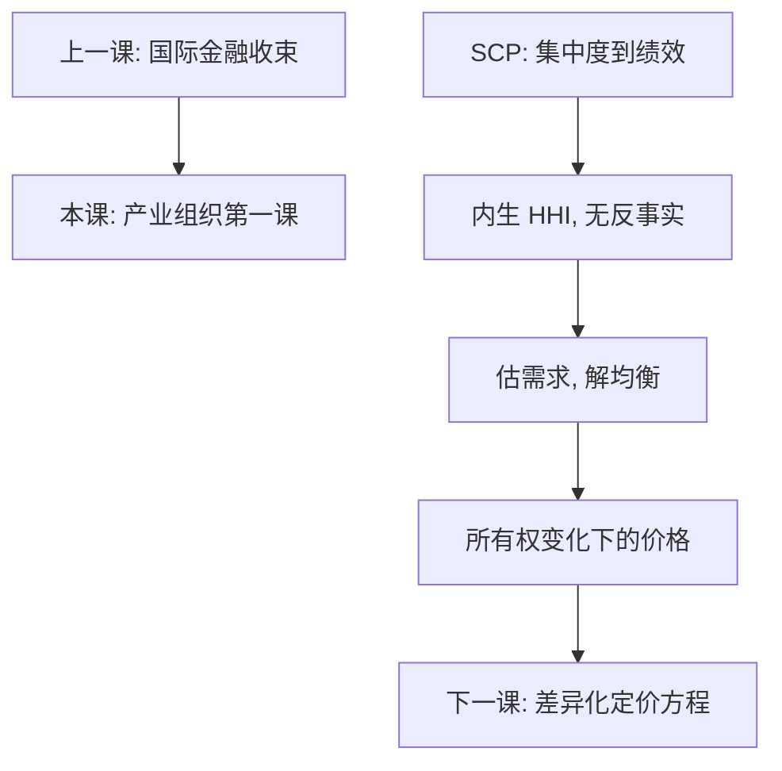

# SCP 与新实证 IO

结构—行为—绩效把集中度当成绩效的输入；新实证 IO 先估需求、再解均衡，把「若所有权变了，价格会怎样」写成可计算的反事实。

<footer>—— Bain 的产业组织传统；Tirole, The Theory of Industrial Organization, 1988；Berry, Levinsohn and Pakes, Automobile Prices in Market Equilibrium, Econometrica 1995</footer>

[上一课](/econ/dollar-swap-lines)收束国际金融续：全球银行的美元批发与互换线。本课是**产业组织**领域课的第一课；后课默认已经读完：从市场结构往下走，问的是品种级需求与策略，不是再写三角或原罪。微观主干已有[垄断与勒纳](/econ/monopoly-lerner)、[可竞争市场](/econ/contestable-markets)，本课不重推 $\mathrm{MR}=\mathrm{MC}$。缺口是：行业表上的 $HHI$ 与「这次合并会不会涨价」之间，缺一条可检验的均衡映射。

## 问题

SCP 的减式：$P-\mathrm{MC}$ 或利润率对集中度、广告、研发回归。句子好听，识别坏：$HHI$ 与成本、需求一起被效率差异决定，高集中可能是低成本厂商胜出，而不是「集中导致加价」。缺口不是再背一次勒纳公式，而是把比较静态换成结构：需求系统给出弹性矩阵，供给给出 Nash 一阶条件，合并改的是所有权，从而改加价，再重解价格。Tirole 提供垄断、寡头、纵向结构的理论地图；BLP 提供可估的差异化需求。本课是这张地图的入口，不把 Cournot 导数再写一遍。

### 高 HHI 不是势力的证明

执法里常用集中度阈值当筛子，那是行政方便。经济上，同质品 Cournot 的 $HHI$ 可以进入加价公式，差异化市场里真正进入定价的是交叉弹性，不是企业个数的平方和。两个几乎不相替的品牌合并，份额加总很大，涨价压力仍可很小。反过来，紧密替代的双寡头即使 $HHI$ 中等，加价可以很高。SCP 回归读不到这种矩阵。

SCP 不是「错了所以扔掉」，是减式。相关可以当描述；政策反事实要结构或可信的准实验。NEIO 贵在数据与计算，问的是合并审查真正要的那个导数。

## 方法

NEIO 三步。(1) 需求：品种份额 $s_j(p,\xi_j)$，$\xi_j$ 为需求侧不可观测，常用特征与成本移动变量作 IV。(2) 供给：在估好的需求下写 Bertrand–Nash 或数量竞争的一阶条件，反推边际成本或行为参数。(3) 反事实：改所有权矩阵，重解均衡价格与福利。与 SCP 对照：SCP 看「集中度高的行业利润高」；NEIO 看「在这组弹性下，去掉一个独立定价者，均衡 $p$ 移动多少」。

静态 Nash 省略合谋、进入、动态学习。进入留给[进入、退出与沉没成本](/econ/entry-exit-sunk)；本课只要求：没有需求系统，合并模拟无处落脚。

## 机制

差异化下，每个品种有一群更近的替代。合并把两系交叉弹性从「对手」改成「内部」，多产品厂商会把外部损失内部化，倾向于涨价——幅度由弹性矩阵决定，不由 $HHI$ 数字决定。同质 Cournot 更干净，也更不现实。NEIO 把 IO 从行业平均表接到品种级对象，这是后课每一课的共同语法。

与微观勒纳的分工：单产品垄断 $L=1/|\varepsilon|$；多产品多厂商要把整块 $\Omega$ 放进加价向量。本课点出这块矩阵存在，下一课才写定价方程。

Berry–Levinsohn–Pakes 1995 用随机系数把替代模式从「对数线性弹性常数」里解放出来。后课会用到它的逻辑，不必在此估计积分。

## 边界

结构需求要有效的成本或特征 IV；弱 IV 时反事实价格不可信，与计量栏弱工具是同一病。本课不写反垄断法条、相关市场定义的法律测试，也不把量化栏并购套利的公告窗搬进来。不要进限价簿。后课默认已经接受：描述性 SCP 与结构性反事实是两句话；产业组织主干从需求矩阵往下，而不是从 $HHI$ 回归往下。

## 小结

- 本课是产业组织第一课；后课默认结构反事实，而不是 SCP 回归。
- SCP 把集中度当输入，内生于效率与需求。
- NEIO：估需求、解均衡、改所有权再解一次。
- $HHI$ 不是差异化市场里的势力充分统计。
- 出处：Bain；Tirole, *The Theory of Industrial Organization*；Berry, Levinsohn and Pakes, *Econometrica* 1995。
