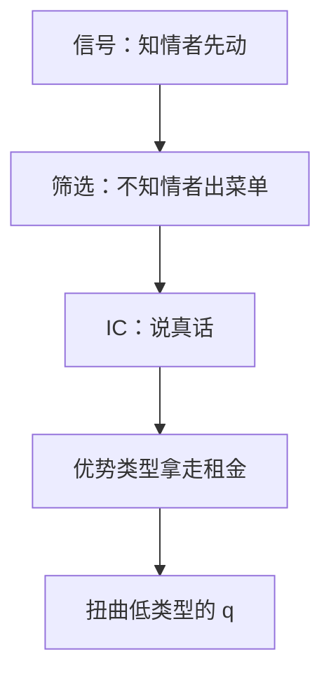

# 筛选与信息租金

不知情的一方提供合同菜单；为让高风险（或低成本）类型说真话，必须留给他们信息租金，并扭曲低类型的数量。

<footer>—— 据 Rothschild and Stiglitz, QJE, 1976；Mirrlees, RES, 1971 整理</footer>

[上一课](/econ/spence-signaling)是知情者先烧信号。缺口是时序反过来：不知情者先设计一组合同，类型自己选。保险、非线性定价、最优所得税都是这张菜单。本课钉激励相容、信息租金与「只扭曲低类型」，不把隐藏行动写成道德风险。

## 问题

类型 $\theta$ 仍是私信息，但合同由不知情者（或竞争中的保险公司、垄断卖方）提出。直接机制：对每个报出的 $\hat\theta$ 给一包 $(q(\hat\theta),t(\hat\theta))$。激励相容（IC）要求真类型愿意报自己。单交叉下，局部 IC 变成单调性加积分条件；高类型的租金由其「模仿低类型能得到的好处」决定，通常严格为正——否则他会假装成低类型，吃更便宜的合同。

效率对照：完全信息应对每类提供其第一最佳 $q^*(\theta)$。隐藏类型后，给低类型提供 $q^*(\theta_L)$ 会让高类型的模仿太甜，只好把 $q(\theta_L)$ 向下扭曲，降低模仿价值，从而少付租金。高类型的 $q$ 往往仍第一最佳（无扭曲在上）。租金是效率代价的来源：计划者或企业拿租金换配置。

### 竞争筛选可以没有均衡

Rothschild–Stiglitz：竞争保险各出一份合同，分离的候选是低风险全保险、高风险部分保险。但可能有一份新合同把低风险撇走，均衡空。这与[存在性](/econ/ge-existence)的凸连续不同：策略空间是合同，偏离是引入新菜单。信号时序下 Riley 等精炼可救；本课记下「菜单竞争不必有均衡」。

信息租金不是寻租的骂名。它是 IC 的影子价格：你无法既让人说真话，又不让优势类型分走一块剩余。Mirrlees 所得税里，高能力的边际税在顶上为零，正是「无扭曲在上」。

参与约束通常只绑低类型：高类型拿到租金后，更愿意进来。
若把高类型的 IR 也抽干，IC 会破。这与道德风险里「事前 IR 绑紧、无事前租金」不是同一句话。

## 方法

对象：两类型、拟线性、单交叉。不知情者最大化利润或社会剩余，约束是 IC 与参与（IR）。绑紧的通常是：低类型 IR、高类型相对低类型的 IC。由此解出租金公式与 $q(\theta_L)<q^*(\theta_L)$。

垄断卖方对消费者类型筛选（Maskin–Riley、Mussa–Rosen）同一骨架：数量或质量对低类型扭曲，高类型留下租金。公共品与[次优](/econ/theory-of-second-best)的交汇：不能用总额税抽走租金时，扭曲税与数量扭曲一起出现。

## 机制

为什么必须留租金：完全抽干高类型，会使他的支付与低类型合同一样好，他改选低类型合同。要把他按住，要么给他更好的包（租金），要么把低类型的包改得对他更无吸引力（扭曲 $q_L$）。最优是两者搭配，直到多留一块租金的成本等于多扭曲一点 $q_L$ 的收益。这与[次优](/econ/theory-of-second-best)同一逻辑：IC 是锁死的约束，第一最佳的 $q^*(\theta_L)$ 不再可欲。

与柠檬、信号的分工：柠檬几乎没有工具；信号由知情者承担耗散成本；筛选由不知情者承担配置扭曲与租金。同一隐藏类型，时序与工具不同，福利账不同。后课若把「类型」换成「签约后才选的努力」，租金故事要改写成风险补偿，约束从报类型换成选行动。

## 边界

连续类型用积分 IC，哈密顿方法，本课不写。多维类型，单交叉不够，铁幕条件复杂。竞争筛选的存在性是开放结构，Wilson 预期均衡、Miyazaki–Wilson 交叉补贴是不同解。隐藏行动加隐藏类型是混合模型，下一课先把行动藏起来。

拟线性把租金写成货币，收入效应不搅数量。没有拟线性，扭曲公式还要加收入项，本课不写。

后课默认：筛选 = 菜单 + IC + 租金；效率损失来自为省租金而扭曲低类型。

### 无扭曲在上，竞争却可能无均衡

高类型的 $q$ 停在第一最佳，不是因为更值得，而是再扭曲他省不下模仿租金。连续类型时只有顶上无扭曲；中间类型仍被扭。Mirrlees 顶层边际税为零，是这句的税率版。竞争出菜单时这份租金可能被撇脂竞争掉，均衡也可以空，那是 Rothschild–Stiglitz 的存在性缺口：自由进入加一份合同一份利润，分离候选会被新合同把低风险撇走。垄断委托人承诺菜单，通常有解。

拟线性把租金写成货币，收入效应不搅数量。没有拟线性，扭曲公式还要加收入项，本课不写。

信息租金是 IC 的影子价格。你无法既让人说真话，又不让优势类型分走一块剩余。

## 小结

- 不知情者先动，用菜单筛选；IC 迫使留下信息租金。
- 典型：低类型数量扭曲，高类型无扭曲。
- 竞争出菜单可能无均衡（Rothschild–Stiglitz）。
- 信号耗散成本，筛选扭曲配置，时序决定哪一种。
- 出处：Rothschild and Stiglitz, *QJE* 1976；Mirrlees, *RES* 1971。
