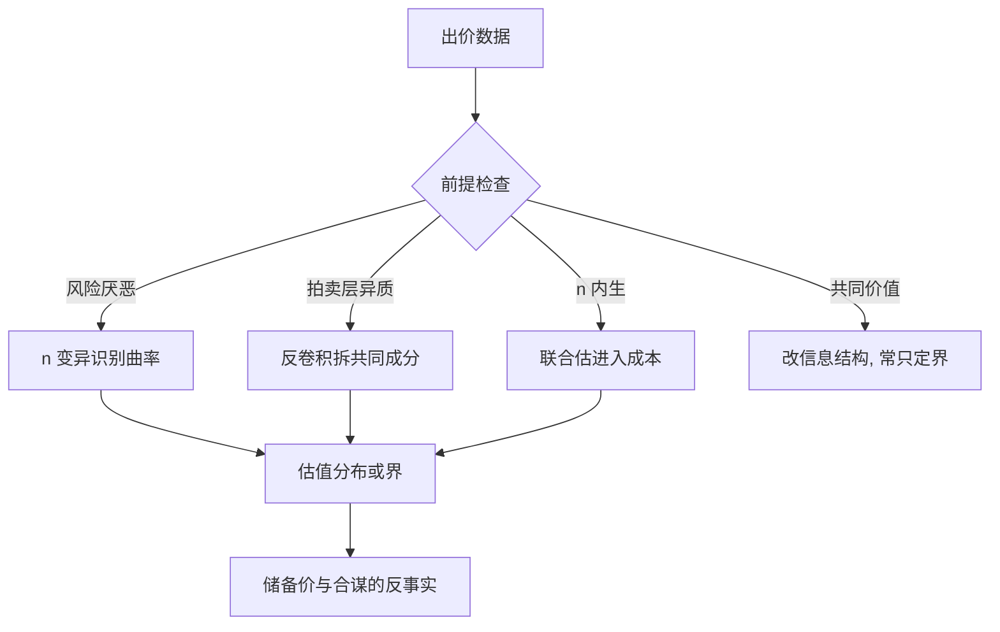
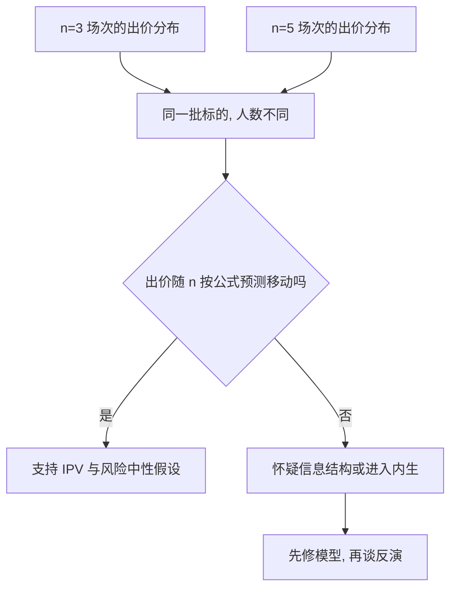

# 拍卖的结构估计深入

一阶条件只在私人价值、风险中性、人数外生时把出价反演成估值；三个前提动一个，反演公式就得跟着动，否则估出来的是策略的影子，不是需求的来源。

<footer>—— 据 Guerre, Perrigne and Vuong, Econometrica 2000；Haile and Tamer, JPE 2003 整理</footer>

[上一课](/econ/se-production-deep)把技术边的反演推到动态矩与加成。本课回到博弈场。[主干的拍卖课](/econ/auction-structural-estimation)在一阶条件 $v=b+G(b)/[(n-1)g(b)]$ 上把 IPV 第一价格估完，但那道反演有四个旋钮：风险态度、不可观测异质、参与内生、信息结构。本课逐个拧。储备价与采购招标的反事实在最后一步重解。

## 问题

四个缺口各有出处。风险厌恶：出价抬高可以来自估值高，也可以来自怕输——反演公式少一个效用曲率参数，估值分布 $F$ 与风险态度纠缠。异质性：标的地基、许可范围这些拍卖层面观测不到的变量进估值，边缘密度 $g$ 是混合，直接核估把异质当成了策略。参与：$n$ 对储备价与预期利润有反应，把 $n$ 当外生，反事实储备价系统性错。信息结构：[共同价值](/econ/winner-curse)下出价还要过滤「赢得意味着别人也觉得值」，IPV 公式把诅咒写进了估值。

术语翻译：「反演」就是倒着用均衡公式：理论说「估值越高出价越狠」，于是观测到出价分布后往回推估值分布。前提是公式里的其他量（人数、风险态度、信息结构）都已知；少一个已知量，倒推就是欠定的，估出来的东西没有唯一定义。

### 逐个修的反演

风险厌恶：一阶条件多出 $u'$ 的比率，Guerre–Perrigne–Vuong 2009 用不同 $n$ 的场次把它与 $F$ 分开——人数变，策略变的方式识别曲率。异质：若 $v=u\cdot e$（共同乘数加独立噪声），观测密度是卷积，用反卷积把共同成分拆出来。参与：进入成本进估值，$n$ 的分布对政策变量的反应变成矩的一部分。共同价值与不对称：识别弱得多，Athey–Haile 2002 列出哪些结构在哪些数据下可识别、哪些只能定界。

Haile–Tamer 2003 的出路是部分识别：不假设英式拍卖行为精确最优，只假设出价不超过估值、不会输给愿意付更高价的对手，由此给估值分布与最优储备价定上下界。假设不齐时，界比点更诚实。

## 方法

估计流程：先验数据类型——单次出价、入场记录、成交价。IPV 风险中性时直接 GPV 反演（主干课）；加风险曲率时用「不同 $n$」的变异；有共同乘数嫌疑时反卷积；$n$ 内生时联合估进入。所有路径的下游一致：得到 $F$（或它的界）后，储备价、合谋、准入的反事实在均衡上重解。[合谋](/econ/collusion-cartel)不是废物数据：轮流压价与让标模式在策略上可检验，硬当竞争反演会把合谋报价读成低估值。

## 机制

机制还是「策略与分布的耦合」。$g$ 在反演公式的分母：出价在边界堆积或双峰，多半不是估值如此，而是 $n$ 混了样本或策略在边界拐弯。人数变异是最贵的识别资产——$n$ 变，策略的整条曲线按公式预测地动；动得对，IPV 与风险中性才立得住，动不对，先怀疑信息结构与进入。这与[上一课](/econ/se-production-deep)的退出同构：参与本身是选择，反演前先把选择层钉住。

数字实例：同样观察到 0.80 元的出价，若出价者风险中性，反演出估值约 0.85；若他因怕输而把出价抬高了一成，真估值可能只有 0.77。风险曲率不确定时，同一份出价分布能倒推出两套方向相反的估值——这就是「估出的是策略的影子」的具体含义。

部分识别的逻辑与主干[弱工具](/econ/iv-weak-instruments)课的诚实原则同源：假设供给不足时，报告「数据排除掉什么」比硬给点估计更可信。界可以窄到足以否掉某个储备价方案，这已经够用。

## 边界

本课不重推[收入等价](/econ/revenue-equivalence)，也不给采购市场的数字。荷式与英式的按钮模型差异不在本课调和。石油租约的共同价值结构只指路[赢家诅咒](/econ/winner-curse)课，不展开估。秘密储备、再转售与事后谈判都改反演，遇到要先改模型再估。

常见误区：初学者容易把出价分布的双峰当成「人群天然有两类估值」。更常见的真相是样本里混了不同人数 $n$ 的场次，或出价在储备价边界堆积。先查数据是怎么构造的，再谈异质性。

后课默认：拍卖反演前先过四道前提检查，过了才用主干公式；过不了就走定界。下一课换估计原则：目标函数不光滑、不动点嵌套时，贝叶斯与模拟估计进场。

## 小结

- 风险厌恶、不可观测异质、内生参与、共同价值，逐一改变反演公式。
- $n$ 的跨场变异同时检验 IPV 并识别风险曲率。
- 合谋报价不能当竞争策略反演；假设不足时部分识别优于硬点估。
- 反事实储备价在修好的 $F$（或界）上重解。
- 出处：Guerre, Perrigne and Vuong, *Econometrica* 2000 与 2009；Haile and Tamer, *JPE* 2003；Athey and Haile, *Econometrica* 2002；Krasnokutskaya, *REStud* 2011。
