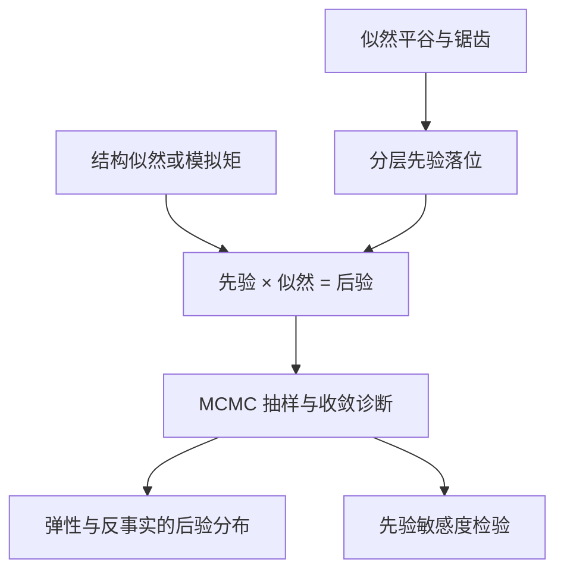
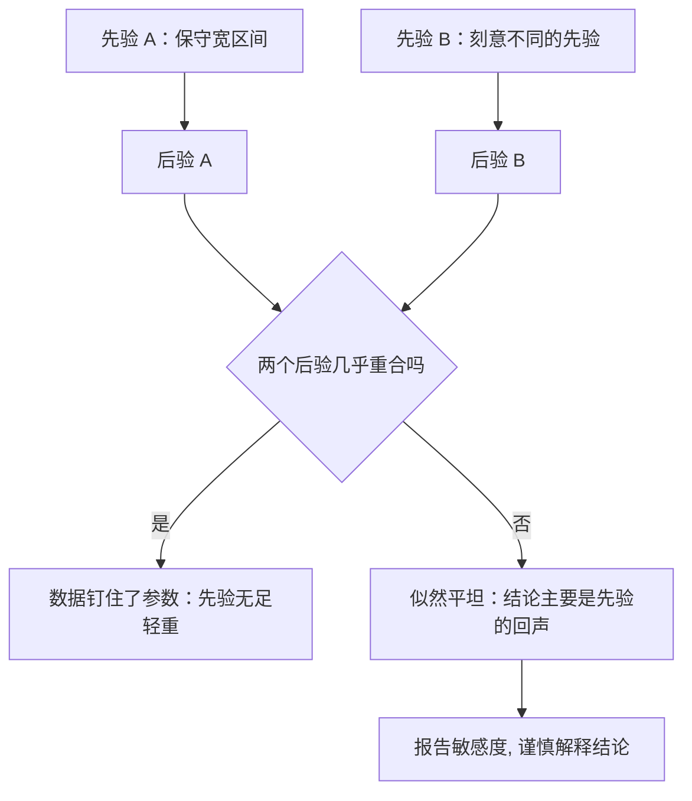

# 贝叶斯结构估计

MCMC 不是把识别算出来的机器：先验落在似然平坦的地方，后验对先验的敏感度会告诉你，哪些参数本来就没被数据钉住。

<footer>—— 据 Berry, Levinsohn and Pakes, JPE 2004；Geweke, Contemporary Bayesian Econometrics, 2005 整理</footer>

[上一课](/econ/se-auction-deep)修好拍卖反演的前提。到此四课装置的估计量都是频率派最优化——GMM 或 MLE，目标函数不光滑（反演迭代、核估计、模拟误差）时优化器最脆弱。本课进入「方法」单元，先换估计原则：把参数当随机，先验乘似然得后验，MCMC 抽样。[极大似然与贝叶斯](/econ/mle-bayesian-econ)主干课已立原则——识别不来自计算、先验必须公开；本课把原则落到结构模型的四个具体部位：随机系数分布、动态不动点、模拟似然、反事实的后验分布。

## 问题

结构模型的似然有两个常见病：局部极大值成群——反演迭代把目标函数刻出锯齿；以及「平谷」——参数组合大片区域似然几乎不动，随机系数的高阶矩、动态模型的折现因子常在此列。MLE 在平谷里乱跳，渐近标准误也不敢信。频率派的回答是加识别约束；贝叶斯的回答是承认先验在说话，并把它写成可审的对象。缺口是：先验进哪个部位、以什么形式，才能既稳住计算又不把结论变成先验的回声。

术语翻译：先验是你在看数据之前对参数的怀疑（如「价格系数几乎肯定是负的」）；似然是数据给每种参数值打的分；后验是两者相乘——被数据改写过的怀疑。MCMC 就是在后验这片地形里随机游走，停留时间越长的区域，参数取那里的值越可信。

### 先验落位与抽样器

落位三处。其一，随机系数需求：对 $\beta_i$ 的分布参数给分层先验，微观二次选择数据进来时似然变陡，先验只管无数据支撑的尾。其二，动态模型：对折现因子给区间先验，平谷被压成可抽样的脊。其三，模型比较：嵌套 logit 与随机系数的边际似然给出后验模型概率。抽样器：Metropolis–Hastings 主干，块内 Gibbs；后验预测分布直接给弹性与反事实的区间，不再点估计加 delta 法。

BLP 2004 用 MCMC 估新车市场，调查微观数据与份额数据一起进似然：二次选择的「曾考虑清单」把 $\beta_i$ 分布的尾直接钉住。换先验重抽一遍的敏感度检验是随附义务，不是附录装饰。

## 方法

流程：写出结构似然或矩（矩也行，后验可定义在模拟矩上）；声明先验并逐条辩护——价格系数为负是结构事前知识，写进先验要说明理由；MCMC 抽样，收敛诊断（多链对照、超量混合统计）照[DSGE 贝叶斯估计](/econ/dsge-bayesian-estimation)课的规程；报告后验区间、后验预测的反事实分布、以及先验敏感度。与频率派的对照写成同一问题两种口径：GMM 点估计对应后验众数附近，$J$ 检验的拒绝在贝叶斯侧表现为拟合与先验的张力。

数字实例：似然在 $\rho\in[0.90,0.99]$ 内几乎一样高（平谷），MLE 只能报一个点 0.934 加一个虚假地很小的标准误；给区间先验后，后验把这整段摊成一条平缓山脊，宽度是诚实的。平谷不是计算失败，是数据本来就没说话。

## 机制

机制是先验显式化。频率派的约束常藏在估计量的构造里（例如只搜负系数区域），贝叶斯把同样的信息写成密度并公开，好处是可以被替换与压力测试：换先验重抽，后验若搬家，说明数据本没钉住它——这是诊断，不是失败。大样本正则时后验收缩到 MLE 附近（Bernstein–von Mises），但结构 IO 的数据量与模型复杂度常常到不了那里，所以敏感度报告在结构语境下是常态义务。

与[上一课](/econ/se-auction-deep)的界对照：部分识别说「数据排除不掉」，贝叶斯说「先验替你选了点」；两法结合最好——后验落在界内、且贴住哪一侧，一眼可见。

常见误区：初学者容易以为「后验收窄 = 数据更有信息」。若先验本身很窄，后验收窄可能只是先验的回声。判断办法就是换先验重抽一遍：后验搬家说明数据没钉住它，不搬家才说明是数据在说话。

## 边界

本课不教 MCMC 调参，也不把「贝叶斯 = 更多假设」或「贝叶斯 = 更科学」当口号。先验救不了错误的结构：排除限制错了，后验只是给错误结构一个光滑分布。宏观 DSGE 的先验传统与本课同源，但对象的动态结构不同，不互相搬参数。模拟矩上的后验要与下一课 SMM 的频率派推断对照口径。

后课默认：结构估计可以后验口径报区间，但先验逐条辩护、敏感度必附；计算换来的平滑不是识别。下一课模拟矩方法：积分数值化之后，模拟误差如何进点估计与标准误。

## 小结

- 目标函数锯齿与平谷时，MCMC 比逐点优化稳。
- 先验落位三处：随机系数尾、折现因子、模型比较的边际似然。
- 先验敏感度是识别诊断，必须随附。
- 反事实报后验分布，不再点估计加 delta。
- 出处：Berry, Levinsohn and Pakes, *JPE* 2004；Geweke 2005；Sims 的贝叶斯宏观先验传统。
