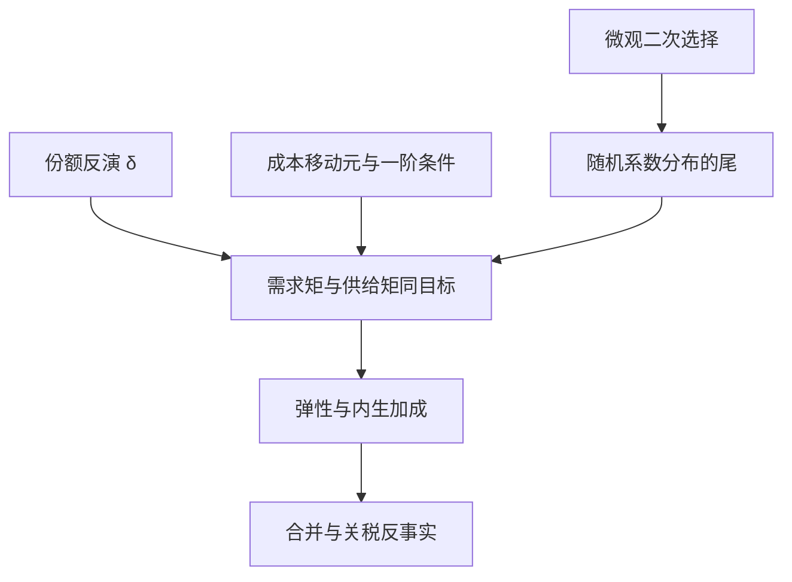
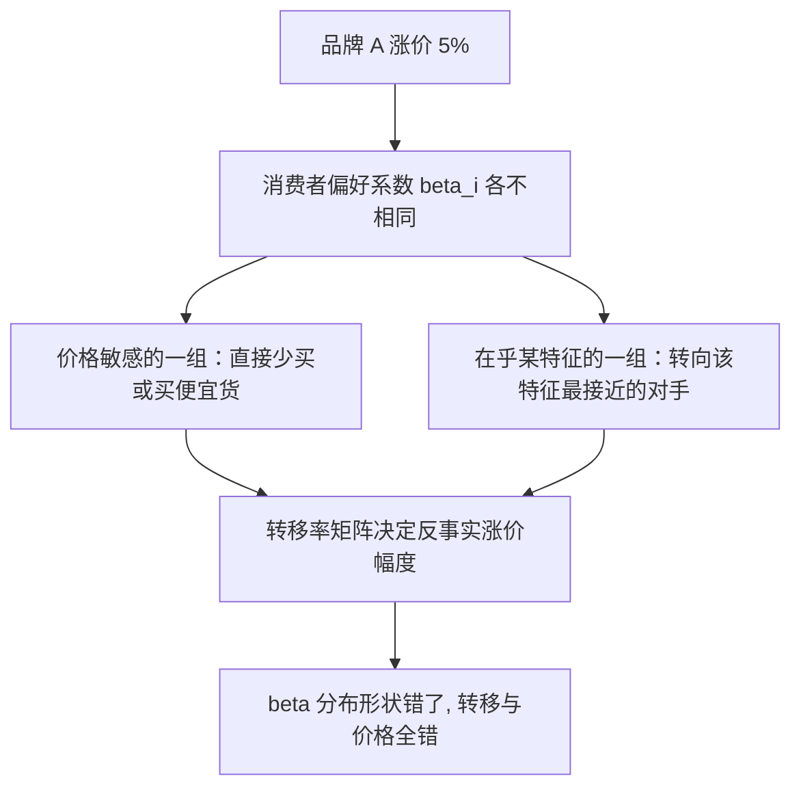

# BLP 需求估计的深入

随机系数给替代形状，份额给需求位置；但把弹性估对的是工具背后的经济学论证——工具错了，再聪明的数值与抽法都救不回反事实。

<footer>—— 据 Berry, Levinsohn and Pakes, Econometrica 1995；Nevo, Econometrica 2001 整理</footer>

[上一课](/econ/pe-case-map)把政策评估的案例收成一张图：设计是契约、推断对准目标、证据是组合物，估计量只是设计的兑现。本课是「结构估计深化」的第一课，单元「需求与供给」随后依次处理动态选择、生产技术与拍卖。从主干课的「能估出来」到「敢拿弹性做反事实」，还差四步：工具怎么构造与诊断、替代模式的识别靠什么变异、需求与供给矩如何联合、微观数据何时必须进来。本课写这四步，不重推 Berry 反演与收缩映射。

## 问题

缺口在矩条件 $\mathbb{E}[Z'\xi]=0$ 的两端。工具一端：$\xi_{jt}$ 与价格相关，特征工具若只是「自己与他者的特征」，弱与伪居其一——新车型的高 $\xi$ 常与广告、渠道投入同涨，而这些恰是可观测特征。矩一端：随机系数 $\beta_i$ 分布的维度靠矩钉住，市场里只有「两个产品、两个特征」时，份额变动填不满矩。更深一层：估出的弹性要送进[合并模拟](/econ/merger-simulation)的一阶条件，供给边若完全没进估计，加成只能事后假设，方向可能错。

直觉类比：普通 logit 假设所有人用同一把尺子量价格；随机系数让每人的尺子刻度不同——有人对价格迟钝、有人极敏感。市场份额只是全体量完后的总票数，要从票数倒推出「尺子怎么分布」，靠的是市场之间、产品之间特征与价格的变异。

### 工具的谱系与诊断

工具分两族。需求侧：同一市场内其他产品的特征、其他市场的同产品特征——若 $\xi$ 是产品与市场效应，跨市场变异被排除出来。供给侧：成本移动元（投入价格、关税、运费）经均衡进价格而不进需求误差。构造后诊断：第一阶段强度按[弱工具](/econ/iv-weak-instruments)课的规程查；再进一步用 $\widehat{\mathbb{E}}[\xi\mid X]$ 的非线性投影逼近最优工具，并以 $J$ 检验矩的内部一致。

Nevo 的麦片文把特征工具写实：用其他城市同一品牌的价格当工具，辩护是品牌质量全国同、成本冲击城市异。工具故事每篇重写，弱工具与 $J$ 的诊断一样不能少。

## 方法

联合估计：需求矩 $\mathbb{E}[Z^d\xi]=0$ 与供给矩同进目标函数。多产品 Bertrand 的一阶条件把 $p-mc$ 与弹性连起来，有可观测成本数据时一并放进来，加成内生。随机系数的识别靠变异的「位置」：价格与特征在市场间的截面变异撬动 $\beta_i$ 分布的各阶矩，市场定义（城市、年份、渠道）因此是识别声明，不是数据清洗选择。

微观数据是第二把钳子：家庭面板的第二选择或「曾考虑清单」直接钉住 $\beta_i$ 分布的尾。代价是权重对齐：微观样本来自谁，宏观份额就来自谁，抽样层与市场层错位会把「谁被抽到」写成偏好。BLP 2004 的新车市场把调查微观数据与份额一起进似然，是这一步的原型。

## 机制

机制是识别的变异从哪来。反演 $\delta$ 只用份额，关于 $\beta_i$ 分布的信息全部藏在份额如何随协变量变；特征工具的排除限制说的是对手特征经竞争进价格、不直接进本产品的 $\xi$——这句辩护写不出机制，工具就只是回归惯例。供给矩是第二重钳制：弹性若有偏，观测价格在给定成本下不再被复现，拟合会暴露它。

术语翻译：工具的「排除限制」就是「这个变量只能通过价格这一条管道影响份额，不能抄近道」。对手产品的特征满足它：它们抬高对手定价、间接抬高自己的价格，但不直接改变本产品在消费者心里的品质。若还能抄近道，工具就是伪的。

替代模式同理。随机系数只在若干特征维度上转动，替代就只在那些维度上活络；合并模拟问「A 涨价流向谁」，答案由 $\beta_i$ 分布的形状决定。维度选少，交叉弹性矩阵退化，转移率错，$\Delta p$ 错——不是数值误差，是模型说错话。

常见误区：初学者容易把「换个样本弹性就翻倍」当成数值误差去调算法。更可能的原因是市场定义换了——城市、年份或渠道的划法一变，撬动随机系数的变异就变。该做的是把两种划法都报出来当敏感性，而不是挑一个顺手的。

## 边界

本课不重推 Berry 1994 的闭式反演，不展开最优工具的渐近理论。嵌套 logit 可作廉价对照放进敏感性，但其组内 IIA 仍在。市场定义换一下弹性就翻倍时，报敏感性，不挑顺手的那个。动态耐用品需求（前向购买）留给下一课，本课的购买都是当期决策。

后课默认：弹性报数必带工具诊断与市场定义敏感性；供给矩能联合就联合；尾部有微观数据就别只靠间接矩。下一课动态离散选择把前向选择请进来。

## 小结

- 工具两族：跨市场与对手特征进需求矩，成本移动元进供给矩，诊断沿用弱工具规程。
- 随机系数的识别藏在份额对协变量的变异里，市场定义是识别声明。
- 供给矩联合估计让加成内生，拟合有检验。
- 微观数据钉住分布的尾，权重须与份额来源对齐。
- 出处：Berry, Levinsohn and Pakes, *Econometrica* 1995；Berry, *RAND* 1994；Nevo, *Econometrica* 2001；Berry, Levinsohn and Pakes, *JPE* 2004。
