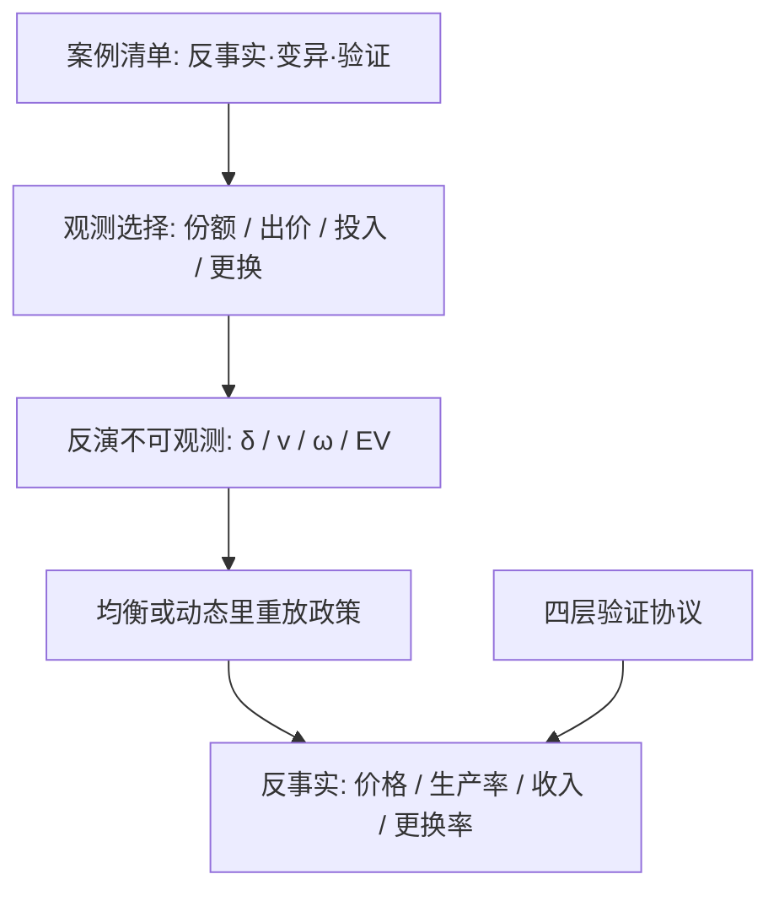

# 结构估计案例与收束

每篇结构估计是同一出戏：观测选择，反演不可观测，在均衡与动态里重放未发生的政策；换的只是舞台——产品市场、厂商技术、拍卖场或一台公交车的维修单。

<footer>—— 据 Berry, Levinsohn and Pakes 1995；Rust 1987；Olley and Pakes 1996；Guerre, Perrigne and Vuong 2000 整理</footer>

[上一课](/econ/se-validation)给了四层验证协议。本课是「结构估计深化」的最后一课，把七课装置放回它们真正回答过的问题，看哪些环节在案例里反复出现、哪些假设一旦松动就换答案；本课程到此收束。读案例用同一份清单：反事实是什么、不可观测是什么、靠什么变异识别、验证做到哪层。结构估计不是一门技术，是一组可拼装的装置；收束的目的是装回工具箱时知道每个部件的承重。

## 问题

装置混用或假设漂移时，出错的从来不是数学，是清单缺项。本课以六个经典案例为轴，把「需求与供给」四课与「方法」四课各归各位：每个案例都该能报出反事实、不可观测、变异来源、验证层数四项；报不出的环节，就是它后来挨批评的位置。

### 案例走读

汽车（BLP 1995）：随机系数需求、特征工具、Bertrand 供给矩，反事实是合并与贸易冲击对车型与价格的重排；验证靠弹性与加成对表行业常识。麦片（Nevo 2001）：同一装置放到多城市面板回答「市场势力多大」，工具故事重写为跨城市变异——[深入课](/econ/se-blp-deep)那句「工具每篇重写」的出处，装置谱系见[BLP 需求估计](/econ/blp-demand)。微型面包车（Petrin 2002）：微观二次选择进似然，新品福利不再全靠间接矩——微观数据钳位的原型。公交维护（Rust 1987）：状态是里程，反事实是维护政策，不动点与 CCP 两条算法同答一问。电信设备（Olley–Pakes 1996）：投资反演生产率，退出修正，行业生产率变化拆出再配置——技术边的原型。第一价格拍卖（GPV 2000 及其后续）：出价反演估值，储备价反事实，风险厌恶与内生参与靠 $n$ 的变异钉住。

专利续期（Pakes 1986）是最早的动态结构之一：续费决策反演出专利价值分布，方法上正是动态离散选择，比公交引擎还早一年。案例时间线说明装置是渐进化装出来的，不是一次发明。

## 方法

把收束写成一页判据。何时用结构：反事实区域在观测支持外（新政策、新规则、未发生过的合并），或对象本身是不可观测的原语（估值、生产率、折现）。何时用设计：问题在支撑内、可信对照存在时，[潜在结果](/econ/potential-outcomes)框架下的准实验答案更便宜也更少争议。两者的接口在[结构对约化形式](/econ/structural-vs-reduced)：结构解释设计为何失效，设计给结构提供伪反事实的对表锚点。方法四课是工程件：贝叶斯换估计原则，SMM 管积分，验证管外推的口气，任何一个需求与供给装置都能拆下来换装。

## 机制

六案例的公共机制有三条。其一，「变异换识别」：需求靠市场截面与微观数据，动态靠转移与跨期变异，技术靠投入对生产率的单调反应，拍卖靠人数与规则变异。其二，「选择层先行」：退出、进入、参与，先钉住选择层再反演，反演对象才不混策略。其三，「验证约束外推」：案例的说服力从拟合优度移到伪反事实与样本外——这是三十年方法演化的主线，也是下一阶段结构研究的入场券。

## 边界

收束不宣称结构普适：设计能答的别上结构；结构能答的别用设计硬凑。案例数字依赖当时的数据与环境，搬用前重验装置。深钻层到此收口，知识树随后进入附录；五栏主干在各自课程里继续延伸。

后课默认（本课程到此收束）：遇到反事实问题，先过案例清单——反事实、不可观测、变异、验证四项写得清，再挑装置；清单写不清的问题，结构估计救不了。

## 小结

- 案例公共骨架：观测选择 → 反演不可观测 → 均衡与动态重放 → 验证。
- BLP、Nevo、Petrin 管需求；Rust、Pakes 管动态；Olley–Pakes 管技术；GPV 管博弈场。
- 变异换识别，选择层先行，验证约束外推。
- 支撑内的问题优先找设计，支撑外的问题才动结构。
- 本课程「结构估计深化」到此收束：八课一具工具箱，部件承重各记其账。
- 出处：BLP, *Econometrica* 1995；Nevo, *Econometrica* 2001；Petrin, *Econometrica* 2002；Rust, *Econometrica* 1987；Pakes, *Econometrica* 1986；Olley and Pakes, *Econometrica* 1996；Guerre, Perrigne and Vuong, *Econometrica* 2000。
